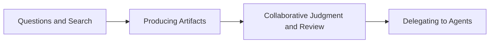

> The essence of AI adoption is not bolting on a new tool. It is changing the very way an organization creates customer value, faster and more accurately.



---

Meetings about adopting AI tend to start from the same question. "Our competitors are already using it, so when should we start?" Tool comparisons, license budgets, and training schedules follow soon after. That much is easy. The genuinely hard part comes next. It's common for the way people work not to change fundamentally even after months, or for only a fraction of the organization to use it before it fizzles out. At some point AI stops being an "innovation project" and becomes "one more subscription fee."

The problem this article addresses is not "which AI tool should we choose." It's a more fundamental question. Why do some organizations see performance rise as soon as they adopt AI, while in others nothing happens even with the same tools? The difference comes from structure, not technology. AI is a tool, but the results a tool produces ultimately come from human behavior. And behavior doesn't change because of slogans. It changes when evidence is visible, and it persists when rewards are aligned.

So AI adoption has to be organizational design that combines measurement, incentives, psychological safety, and minimal governance, before it is "training" or a "guide."

---

## TL;DR

- Whether AI adoption succeeds depends less on tool selection than on designing structures that change organizational behavior.
- Mandated usage, absent measurement, wrong KPIs, and individual competition all tend to turn AI adoption into a box-ticking project.
- Successful adoption requires evidence-based dashboards, shared rewards, psychological safety, and minimal governance, together.

---

## 1. Failure Patterns: Why So Many AI Adoptions End Without Effect

AI adoption fails not because "AI isn't very good," but because the way organizations handle AI runs against the principles of human behavior. Most failures aren't a matter of tool performance. They occur the moment the adoption approach pushes the people doing the work into "defense" rather than "learning."

The most common starting point is a company-wide blanket rollout. Declaring "everyone will use it" looks like fast execution, but from an employee's point of view it's easily read as control and surveillance. People then work to reduce risk rather than to produce results. Outwardly they switch the tool on; inwardly they go back to their old ways. The organization takes comfort in the illusion called "adoption rate," while the people doing the work secure their safety through "formal compliance." What's left in the end is the license cost and a collective memory that "AI doesn't do much."

The second failure is adoption that starts without measurement. Early on, the expectation that "things will get better" is widely shared, but over time the question changes. "So what got better, and by how much?" If you can't answer that, AI becomes a matter of taste rather than strategy, and the budget loses its justification. Even the people who supported the adoption turn defensive. Adoption without measurement only raises the cost of internal persuasion as time passes, and it ends up filed away as an "unprovable investment."

The third is choosing the wrong metrics. Quantity KPIs are easy to build and easy to explain. But metrics like commit counts and ticket counts make people find ways to raise the numbers. Meaningless changes, splitting work up, and padding follow. The organization thinks its data has grown, while customer value and quality stay flat or actually get worse. At that moment AI stops being "a tool that raises performance" and becomes "a tool that dresses performance up," and the metrics distort the organization instead of promoting learning.

The fourth is a framework of individual competition. "Rewards for the top AI users" looks like motivation, but in practice it removes any reason to share know-how. Information becomes scarce, the people who are good get better, and the majority can't keep up. The organization gains an island of "a few experts" but never gains the continent of "company-wide productivity."

These four failures can be summed up in a single sentence. Mandates produce formal compliance, the absence of measurement removes the justification for investment, wrong KPIs distort behavior, and a competitive framework isolates learning.
So this article does not list tools. Instead it redesigns AI adoption around the structures that successful organizations have in common: dashboards that create evidence, rewards that make cooperation profitable, psychological safety that lowers anxiety, and minimal governance that prevents accidents.

---

## 2. Principles of Success: "Evidence" Instead of "Mandates," "Cooperation" Instead of "Competition"

The force that keeps AI adoption rolling comes from observation, not from directives. This is because of what psychology calls social proof and descriptive norms. People change their behavior less on "you should" than on seeing that "other people are actually doing this, and the results are good." What an organization needs to do is not to repeat "please use AI," but to make the results and the process of teams and individuals who use AI well visible.

Dashboards and case sharing are not mere promotion; they send employees a normative signal that "this is how things work in this organization right now." People move more readily when the basis for comparison is not an "absolute target" but "colleagues in similar roles and similar situations" (the reference group effect). That's because it generates the self-efficacy of "I could probably do that much too."

But evidence alone isn't enough. What an organization really wants is not "a few experts" but "collective learning," and collective learning doesn't happen automatically. In behavioral economics, sharing is a classic public good. Everyone benefits, but contributing feels like a cost to the individual, so free riders appear. That's why moral appeals like "please share" don't last long. To create cooperation, you have to change the choice architecture. That is, you have to make sharing a rational choice rather than an act of goodwill.

The key here is not designing incentives around "individual competition." "Rewards for the top 10%" may look motivating in the short term, but in practice it triggers the defensive psychology that relative evaluation creates. People hide information to preserve their advantage, and know-how gets privatized. What's more, among people with similar performance, even a small gap becomes a sensitive matter and cooperation breaks down (perceptions of fairness).

To create cooperation, rewards have to be based on "propagation" rather than "ranking." You need a structure where, when a tip I shared is applied by someone else and its effect is confirmed, part of that effect comes back to me. In that case people are moved by reciprocity. Once the sense that "what I give comes back to me" takes hold, knowledge starts to be exchanged.

Another important mechanism is immediacy. People respond better to a small piece of feedback now than to a large reward in the future (present bias). So recognition for sharing should be designed as a fast feedback loop, colleagues saying "I applied this" or "this helped," rather than a line in the year-end review. When small recognition repeats often, behavior becomes habit. At the same time, it should be designed in a direction that satisfies autonomy, competence, and relatedness (self-determination theory). When the message shifts from "share" to "if you make what you discovered something the team uses together, your influence grows," sharing becomes a matter of identity (I am someone who contributes) rather than control.

Finally, cooperation isn't a matter of gathering "good people." It depends on how you set defaults and friction. If sharing is cumbersome and recognition for it is slow, nobody keeps at it. Conversely, if there's a sharing template (reducing friction), if 10 to 15 minutes of "this week's discoveries" is a default part of the team meeting (default design), and if sharing is connected to actual application and reflected in the score (incentive alignment), then the organization rolls toward cooperation without effort. In the end, "cooperation" is not a culture but the result of design.

---

## 3. The Adoption Approach: Empowerment and Role-Specific Usage Design

The most common mistake when adopting AI is "distributing the tool equally." If you hand every developer an identical Copilot license and tell them to "figure out how to use it," seniors will use it only for simple repetitive work while juniors stay busy copying and pasting code. Empowerment comes not from issuing a tool but from defining what that tool is supposed to solve.

Organizations have to design a "winning scenario" for each role. For juniors, for instance, AI should be a "24-hour mentor." Interpreting error logs they don't understand, summarizing library documentation, and cutting down time spent flailing are the core value. For seniors, on the other hand, AI is a "design partner." Productivity explodes when it's used to find holes in a complex system architecture, or to predict the side effects of refactoring legacy code. For QA, the goal should be reducing the time spent writing test cases to nearly zero, and for PMs and POs, removing bottlenecks in organizing meeting notes and fleshing out requirements specifications.

AI becomes a weapon rather than homework when people are given a specific playbook saying "in your role, here is how this tool can save you time," instead of "just use it." What matters is not "getting people to use AI" but "getting people to win by using AI."

---

## 4. The Maturity Model: Designing the Organization's Learning Path

The ability to use AI doesn't appear overnight. Like learning to ride a bicycle, it has stages. Yet many organizations ignore these stages and expect "coding automation" from day one. Just as telling someone to run before they can walk makes them fall, demanding advanced capabilities without a maturity model leads organizations to give up on AI. We should define an organization's AI maturity in four stages and set learning goals appropriate to each.

Stage 1 is "questions and search." Asking AI instead of Googling, and getting a grip on basic concepts.
Stage 2 is "producing artifacts." Having it generate unit test code, document drafts, and simple functions. This is where you get a taste of productivity.
Stage 3 is "collaborative judgment and review." A stage of mutual verification, where I review the code AI wrote and hand my code to AI for review. Quality starts rising from here.
Stage 4 is "delegating to agents." A stage where you say "implement this feature" and AI carries out planning, coding, testing, and fixing.

This maturity model is not a report card for ranking people. It's a map that shows each person "where I am now, and what I need to practice to reach the next stage." With a map you don't get lost, and learning becomes a clear quest rather than a vague effort.

---

## 5. Measuring Performance: Not "a Lot," but "the Important Things, Well"

"You can't manage what you can't measure" holds for AI adoption too. But you should also keep in mind that "measure the wrong thing and you're finished." In the early days of AI adoption, many organizations look at metrics like "lines of code generated" or "number of AI tool invocations." This is the worst option. When producing lots of code becomes the goal, the system bloats and maintenance costs explode. Fixate on invocation counts and you just get more meaningless questions.

Proper performance measurement has to focus on "value," not "speed." What we should be measuring is not "how fast we wrote the code" but "how much the lead time for delivering value to the customer has fallen." We should also look at "how much the change failure rate after deployment has dropped."

More precisely, "customer impact" should be used as a weight. Catching a security vulnerability quickly with AI should score high; fixing a simple typo should score low. The goal is not "doing a lot of work with AI" but "solving important problems faster and more safely with AI." When metrics are set this way, the organization naturally reduces pointless coding and concentrates on solving core problems.

---

## 6. Dashboards: Turning Correlations into the Organization's Language

Data has no meaning if it lives only inside an Excel file. The heart that determines whether AI adoption succeeds is a transparently published dashboard. But the dashboard must not become a surveillance tool for executives. It has to be a feedback mirror for the people doing the work.

Three things should be visible on the dashboard at a glance. First, my position. I should be able to see objectively where my productivity and quality metrics stand. Second, correlations. The AI usage patterns of the top performers should be visible. When facts like "wait, that team uses the AI review feature a lot and their failure rate is 0%?" show up in the data, people copy that approach without being told to. Third, the organization's direction. The trend that our whole organization is currently moving from stage 1 to stage 2 should be visible.

At this point the dashboard becomes an instrument of persuasion. One piece of data showing that "colleagues who use AI well leave work earlier and perform better too" is more powerful than a hundred speeches. The organization communicates through data, with "evidence" rather than "gut feel," and corrects the direction of its own learning.

---

## 7. Rewarding Sharing: Designing Know-How into "Performance"

In the world of knowledge work, "know-how" is power. So instinctively, people want to keep it to themselves. To work against this instinct, you have to build "a structure in which sharing pays better than hoarding." A campaign that simply says "let's share" doesn't come close.

You need a system that recognizes sharing as a "knowledge asset." If a colleague used a prompt tip I posted and saved time, part of that saved value should be recognized as my performance. If an AI guide I put on the internal wiki is widely read and adopted as the team's standard process, that should be evaluated as a contribution just as important as writing code.

Once this structure is in place, sharing know-how stops being "volunteer work" and becomes "the most efficient means of producing results." The thought "I should keep this to myself" turns into "I should share this and grow my influence." That's the moment the entire organization becomes a vast knowledge factory. A culture of cooperation comes not from good intentions but from smart reward design.

---

## 8. Psychological Safety: The Moment AI Becomes a Fear, Innovation Stops

Resistance to AI adoption comes less from "it's a hassle" than from "I'm anxious." In particular, once worries like "if I can't use AI, will I be pushed out?" or "will this end up being the grounds for laying me off?" spread through an organization, people move defensively rather than learn. Defensiveness reduces experimentation, and when experimentation drops, learning stops too. So organizations have to put psychological safeguards in place first.

The important declaration here is not simple reassurance but an operating principle. Whether or not someone uses AI will not be used as grounds for dismissal or disadvantage. A defined period is set aside as a learning period, and mistakes made while getting to grips with the tools are treated as material for growth rather than blame. The anxiety seniors feel, "is my experience becoming meaningless?", also has to be addressed head-on. Domain knowledge, architectural judgment, and review capability are hard for AI to replace entirely, and AI is closer to an amplifier that helps those abilities be exercised faster and more accurately.

At the same time, though, the organization has to make one more thing clear. It isn't about whether you use AI; evaluation of the performance you actually produce stays exactly as it was. In other words, it isn't "I didn't use AI, so it's fine." Customer value, quality, and contribution to collaboration are evaluated by the same standards as before, and the resulting rewards, promotions, and adjustments continue as usual. What the organization guarantees is "no mandated AI usage," not "exemption from accountability for results." With this balance in place, people can experiment safely while continuing to learn in a direction that produces results.

---

## 9. Minimal Governance: Few Rules, but Clear Ones

Every technology adoption needs brakes. But the purpose of brakes is not to stop the car; it's to let it go faster. You can only put your foot on the accelerator once you're confident you're safe. AI governance is the same. With too many rules nobody uses it; with none, a major incident eventually breaks. So you need "minimum viable governance."

We only need to observe three things.
First, isolating sensitive data. Personal information, authentication keys, and unreleased core technology are never entered into external AI. This should be blocked or filtered at the tool level.
Second, human-in-the-loop. Anything AI generates (code and documents especially) must pass human review before it can ship. "The AI wrote it" is no absolution, and final responsibility always rests with the reviewer.
Third, no blind trust. AI output should be cross-verified on the premise that it can always be wrong.

As long as these three guardrails are clear, people should be free to run around as they like inside that fence. Vague rules cause people to shrink back, but clear safeguards create speed.

---

## 10. Execution Stages: From Validation to Refinement

Successful AI adoption isn't an event you proclaim with "starting today!" It's an evolutionary process that grows like a living thing. We should approach it in three stages: verify, spread, embed.

1.  The verification stage (the pilot): Rolling it out everywhere is risky. Select one early-adopter team that is open to change and support it intensively. The goal is to create one solid success case proving that "AI produces results." This small win becomes the spark for spreading it everywhere.

2.  The spreading stage (the rollover): Based on the pilot team's success case, build role-specific playbooks and start training. If you open up the dashboard and show the data at this point, the early majority who have been watching from the sidelines start to move.

3.  The embedding stage (the standard): The stage where using AI is everyday practice rather than a special event. AI training is included in the onboarding process, and AI capability is reflected in the evaluation system.

What matters is not skipping stages. Spread without verification only creates confusion, and trying to embed without having spread only invites pushback. More important than speed is an unwavering sense of direction. Don't ask "have we adopted it?" Ask "is evidence accumulating?"

---

## In Closing: Leadership's Role Is "Creating the Environment"

In an AI adoption project, the leader's role is closer to a gardener than a commander. Just as you can't make a plant grow by pulling on it, you can't produce results by forcing employees to "use AI." What leaders need to do is prepare the soil.

Put easy-to-use tools in people's hands (infrastructure), show them how to use them (training), shine sunlight on those who use them well (rewards), and put up a fence so things can grow without worrying about weeds or pests (safety). Create this environment and the organization will learn and evolve on its own.

AI is not a simple automation tool. It's a catalyst that can transform an organization's learning process from the ground up. Whether you turn this change into a cost or into an overwhelming competitive advantage depends entirely on organizational design. So let's change the question. Not "which AI should we buy?" but "what kind of organization should we build?"
