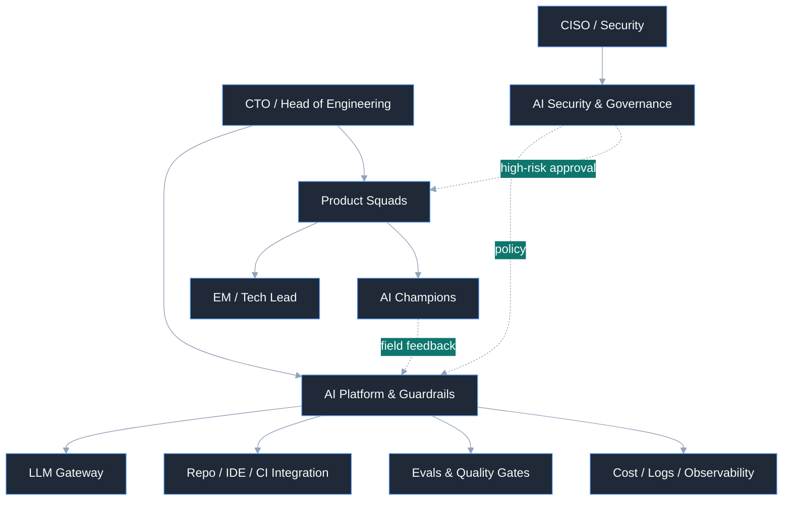
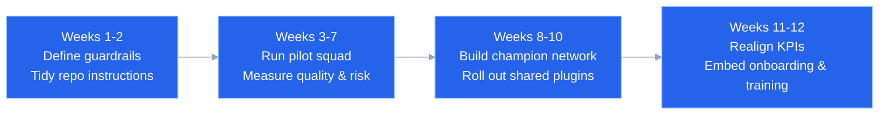

> Whether vibe coding succeeds or fails comes down to organizational design: whether the team can verify and ship AI-generated changes in a repeatable, safe way.



Many organizations understand vibe coding as little more than "a way for developers to produce code faster." So the adoption conversation usually starts with tooling. But what actually decides success or failure in the field is organizational structure, not the tool or the model's performance.

Vibe coding is less like autocomplete and more like a redesign of how work gets done. Productivity grows when each member of the organization covers a wider surface and when handoff and communication costs between teams go down. That does not mean the goal is headcount reduction. The point is to make the same organization deliver more, faster, and more safely. Doing that requires designing how requirements get decomposed, which changes get delegated to AI and which ones humans judge directly, and what tests and approvals a change must clear before shipping. Without that design, AI amplifies confusion rather than productivity.

This post distills organizational design principles for landing vibe coding inside a real product development organization, drawing on lessons that show up consistently in the OpenClaw case and in recent enterprise AI adoption efforts.

## TL;DR

- The success of a vibe coding rollout depends less on tooling and more on the organizational structure and accountability system that verifies and ships AI-generated changes.
- Repository-level instructions are not enough. Shared plugins, guardrails, and approval conditions need central management, with field champions tuning them to each team's context.
- Design the operating model as a Research → Plan → Implement → Auto Review → Monitor flow, and focus humans on exceptions and high-risk judgment rather than on every review.

## Not Writing Less Code, but Designing the System That Generates Code

The human role does not disappear in a vibe coding environment. Its center of gravity simply moves. Time spent typing code directly goes down, and these activities grow in proportion:

- Decomposing work into small units
- Documenting the constraints and rules agents must follow
- Designing approval policies and blocking thresholds
- Automating test, review, and deployment gates
- Feeding incidents and failures back into guidelines and rules

This shift cannot be absorbed by an individual developer's prompting skill alone. It requires an operating contract at the organizational level. Keeping an agent instruction file such as `CLAUDE.md`/`AGENTS.md` in every repository — machine-readable, covering build methods, test commands, forbidden areas, review criteria, and security boundaries — is now closer to table stakes than to an option.

Ultimately, the important question is: "Under what discipline and what accountability structure will our organization handle the changes AI produces?"

## Repository Instructions Are Not Enough. You Need a Company-Wide Shared Plugin System

A repository-level `AGENTS.md` is useful for pinning down local context. But organizational adoption does not end there. Once each team starts copying its own prompts and tool connections, the same work gets defined many times over, permission control scatters, and good workflows survive only as the know-how of a few individuals.

That is why organization-level vibe coding needs a shared plugin system. Here, a plugin is not merely a collection of prompts. It is an operational package that bundles the memory (rules), skills, hooks, connectors, and approval conditions required for a specific role or task into a single deployable unit. In other words, shared skills are not standalone artifacts but parts of a shared plugin, and real guardrails are only enforced when the rules inside the plugin, the executable skills, and the auto-invoked hooks work together. The Claude Cowork update Anthropic announced on February 24, 2026 points in the same direction. Administrators can now build an internal plugin marketplace, bundle approved connectors, connect private GitHub repositories as plugin sources, and control automatic installation and access at the team or user level.[^1]

Individual prompts raise individual productivity. Shared plugins create organizational consistency. The operating unit that matters is not "who uses it well" but "whether the same boundaries and quality standards apply no matter who uses it."

An organization-level plugin system should, at minimum, do the following:

- Distribute proven workflows in a reusable form
- Centrally control approved connectors and data access scope
- Absorb per-team context differences through plugin versions and settings
- Observe usage, cost, and tool calls to measure which automations actually work

In the end, repository instructions define "how to work in this codebase," and shared plugins define "how AI works in our organization." If the former is a local operating contract, the latter is a shared operational product for the whole company.

## Why So Many AI Rollouts Underdeliver

The reasons vibe coding adoption underdelivers are usually similar: teams look only at generation speed and bolt on the control structure later. Early on, everyone feels fast. PRs go up quickly, document drafts appear in an instant, and test code gets written more easily than before. But a few months in, review fatigue rises, accountability blurs, and operational stability starts to wobble.

This is not strange. The weaker an organization's engineering fundamentals, the more AI amplifies noise before it amplifies speed. If there is no habit of shipping frequently in small batches, if test reliability is low, and if code review standards are fuzzy, AI does not resolve the bottleneck — it pushes more changes into it.

So a vibe coding rollout should be treated as an operations design project, not a productivity project. Speed is an outcome, not a starting point. Four questions have to be answered first:

- Which changes may AI perform autonomously?
- Which changes must pass through human approval?
- What evidence must exist for a reviewer to approve with confidence?
- Where will lessons from failures accumulate?

Deploy tools without answering these, and the organization soon arrives at "we do use AI, but we're more tired than before."

## Recommended Organizational Model: Central Platform + Field Champions + Final Ownership

For most organizations, the most realistic answer is a hybrid model. Having a central platform team control everything becomes a bottleneck; letting every product team use its own tools fragments quickly.

The hybrid model has three layers.

First, a central AI platform and guardrails team provides shared infrastructure. Foundational capabilities belong here: model routing, access control, the shared plugin marketplace, approved connectors, common prompt and skill templates, repository integration, log and cost observability, and policy automation.

Second, each product squad has an AI champion or AI specialist. This role is not someone who uses the tools on the team's behalf. It is the connective tissue that tunes guidelines and plugins to the team's actual workflow, judges which tasks to delegate to AI, and feeds failure patterns back to the platform team.

Third, final accountability still rests with the product team. Operational responsibility must not shift to the platform team just because AI wrote the code. The ultimate owner of service outages, security issues, and quality problems has to be the team that runs the service.

Sketched simply, the structure looks like this:

The point is clear: standardization and shared distribution live at the center, context adaptation happens in the field, and accountability sits with the product team.

## The Standard Operating Model Should Be Research → Plan → Implement → Auto Review → Monitor

Teams that do vibe coding well do not jump straight into implementation. They research first, reduce ambiguity through a deep interview, plan, and then implement. Enforcing that order is what cuts the cost of early misunderstandings.

The recommended baseline flow is as follows:

1. Intake the requirement or issue.
2. Research the existing code and constraints.
3. During research and planning, run the deep interview skill included in the company-wide or team-wide plugin, and use a plugin hook to always invoke it first so that requirements, approval boundaries, data access, and exception conditions are confirmed.
4. Document the change plan based on the deep interview results.
5. Implement and test.
6. Run static analysis, security scans, tests, and AI review automatically.
7. Once the gates pass, land the change via auto-merge or a direct commit path.
8. After deployment, monitor operational metrics and anomaly signals automatically.
9. Feed incidents and exceptions back into the instruction files and gate rules.

The deep interview here is not an optional checklist. It should be embedded inside the organization-wide or team-wide plugin in the form of memory (rules), skills, and hooks, and always be invoked first during research and planning. That way, independent of any repository's local instructions, company-level guardrails for security, approval, and separation of duties get applied the same way every time. In other words, the interview itself is the execution surface of operating policy, and the plugin hook is the mechanism that keeps that policy from being skipped.

Steps 3 and 4 are the critical ones. A plan document should contain at least the following:

- Which files change
- What the intent of the change is
- Which shared guardrails and exception approval conditions were confirmed in the deep interview
- Which tests will verify it
- How to roll back on failure
- Whether there is any impact on security or data access

Skip the deep interview and the plan documentation, and implementation may look fast while review slows down, so total lead time grows again. Conversely, when the initial questions and the plan are sharp, AI becomes a far more useful execution engine.

## Human-in-the-Loop Should Be an Exception Path, Not the Default

There is one important shift here. In a vibe coding organization, humans should not intervene at every step of the default path. If you automate only code generation while humans still read every review, the bottleneck merely moves downstream. Speed rises at the generation stage and collapses again at the review stage.

In such an environment, traditional metrics like PR cycle time or review participation rate are also poor candidates for core KPIs. When PRs are mostly self-merged or dominated by bot comments, the mere fact that "a review exists" is no longer evidence of quality assurance. What is needed is not more human review but better automated quality gates.

That is, the default path should look more like Machine-in-the-Loop than Human-in-the-Loop. The ideal flow:

- Generate the commit or proposed change
- Automatically run lint, type check, tests, secret scanning, and SAST
- Automatically run LLM-based code review
- Decide via multi-model consensus or a rule-based score threshold
- Auto-merge or land directly on pass
- Automatically watch for anomaly signals after deployment

Humans do not enter this flow every time. They design the thresholds, handle exceptions, and step in only when models disagree sharply or when security risk is high. Put differently, the human role is closer to "designer of the automated verification system and escalation owner" than to "reviewer who reads every line of code."

Exception boundaries are still necessary, of course. Human approval may still be involved in areas such as:

- Authentication and authorization
- Payments and settlement
- Personal data processing
- Database schema changes
- External system permission integrations
- Infrastructure security configuration

Even here, the goal is not exhaustive manual review. Humans should focus on setting the guardrails while verification runs automatically. That is what makes it possible to automate code generation and review together.

## Operating Metrics Should Center on Automated Quality Gates, Not PRs

At this point, the perspective on operating metrics has to change too. If a vibe coding organization keeps PR review time, review participation rate, and merge rate as core KPIs, the measurement system starts to distort reality. In an organization where direct commits and automated review have become the norm, these metrics are easily contaminated or simply obsolete.

Operating metrics should therefore be designed around how well the automation system is holding quality, rather than around traces of human collaboration.

First, team-level delivery trends. What matters is not per-person LOC competition but how steadily the whole team produces changes before and after the transition. Code change volume should be used only as a team-level trend indicator, never as an individual performance metric.

Second, team engineering health. Bundle signals such as commit granularity, focus of work area, deletion ratio, and message discipline to track engineering practice, and you can catch quality degradation fairly early even without PRs. A falling deletion ratio in particular can signal that AI-generated code is piling up without cleanup.

Third, the performance of the automated review system. For example: AI gate block rate, recurring failure types, security scan detection rate, missing-test detection rate, and inter-model disagreement rate. When using multi-model consensus in particular, the standard deviation can matter more than the average score, because changes with large model disagreement are the candidates for human intervention.

Fourth, post-deployment service health. Change failure rate, MTTR, rollback ratio, and the number of user-impacting incidents still matter. If problems in production increase even after review is automated, that automation has failed.

Fifth, anomaly signals in knowledge concentration and work patterns. Looking at whether changes cluster excessively on a small number of people, whether the team's activity pattern is wobbling, and whether quality gate failures concentrate in specific areas lets you detect organizational risk earlier than people can. Knowledge distribution measures and outlier-based monitoring are useful in this context.

To summarize: the KPI of a vibe coding organization is no longer "how hard did people review." It is "how accurately do the automated quality gates filter problems, and how steadily is the team shipping customer value."

## Automated Review Should Be Reasoned Automation, Not a Black Box

Automating review must not make the verification logic opaque. An automated review system should follow at least these principles:

- AI review results must record the reason for blocking along with the supporting evidence
- For important judgments, multiple models should vote to add stability, and if disagreement between models is large, escalate instead of auto-approving
- Do not show only a score — reveal which file, which pattern, and which missing test is the problem
- Use anomaly signals as input for system improvement rather than for punishing individuals

The goal of automation is not to exclude humans but to make them intervene only when they are genuinely needed. For that, automated review must be an evidence system that both machines can read and humans can understand — not a silent black box.

## The Adoption Roadmap Should Start Small and Solidify the Operating System First

Company-wide big-bang adoption almost always fails. Validate with one small team first. The best pilot candidate is a product team that is open to change and also carries clear operational responsibility.

A realistic three-month roadmap generally follows this sequence:

The principles to hold to during this process are clear: do not wait until the platform is perfect, but equally, do not dump the entire cost of experimentation on the delivery teams — and set your success criteria and stop criteria in advance.

For instance, eight weeks into the pilot you should be able to confirm three things:

- Are the AI gate block rate and recurring failure types stabilizing?
- Has the change failure rate not gotten worse?
- Has the team started updating the guidelines and automation rules on its own?

If you do not see these three, fixing the operations design comes before spreading the tools.

## What You Ultimately Need Is Not an AI Team but an AI-Native Operating System

What the vibe coding era calls for is not "a few star players who are good with AI." It is an operating system that lets anyone use AI safely above a certain baseline. The central platform provides standards, guardrails, and the shared plugin system; champions in the field translate context; and product teams own the outcome end to end. Only when those three interlock does vibe coding become an organizational capability rather than a passing fad.

To put it plainly, the core of adopting vibe coding is not replacing developers with AI. It is redesigning the organizational interfaces around writing, verifying, and shipping code. Repository instructions create local discipline; a shared plugin system creates reusability and control across the whole organization. What you need is not a vague race for speed but clearer accountability, better evidence, and stronger operational discipline.

AI can produce code. But turning that code into organizational results is still the job of organizational design.

## Glossary

Some of the terms used in this post go by slightly different names in different products. The links below point to the official documentation that explains each concept most directly.

- `AGENTS.md`: In OpenAI Codex, a working-instruction file placed in a repository or subdirectory. It tells the agent which rules, commands, and constraints to follow. Official docs: [Custom instructions with AGENTS.md](https://developers.openai.com/codex/guides/agents-md)
- `CLAUDE.md` / memory (rules): In Claude Code, a memory file that hierarchically loads persistent rules at the organization, project, and user levels. Company-wide rules can be distributed as global policy and team rules as project memory. Official docs: [How Claude remembers your project](https://docs.claude.com/en/docs/claude-code/memory)
- `Shared plugin`: A unit in which an organization bundles common rules and automation for distribution. In this post it means an operational package that ships memory, skills, hooks, and MCP/connector settings together. Official docs: [Plugins](https://docs.claude.com/en/docs/claude-code/plugins), [Plugins reference](https://docs.claude.com/en/docs/claude-code/plugins-reference)
- `Skill`: An execution unit that defines a repeatable way of working in reusable form. It can be included inside a plugin or placed directly at the project or organization level. Official docs: [Agent Skills](https://docs.claude.com/en/docs/claude-code/skills), [Agent Skills for Codex](https://developers.openai.com/codex/skills)
- `Hook`: A policy and verification mechanism that attaches automatically to events such as session start, instruction load, and before/after tool execution. It can be used to block dangerous commands, force a deep interview to run first, and automate follow-up verification. Official docs: [Hooks reference](https://docs.claude.com/en/docs/claude-code/hooks)
- `MCP` / connectors: The standard connection layer through which a model accesses external tools and data context. It often surfaces as a connector in product UIs and as an MCP server in development runtimes. Official docs: [Model Context Protocol](https://developers.openai.com/codex/mcp), [Get started with custom connectors using remote MCP](https://support.claude.com/en/articles/11175166-get-started-with-custom-connectors-using-remote-mcp)
- `Deep interview`: The deep interview referred to in this post is not a specific vendor's product name but an organizational operating pattern for structurally confirming requirement ambiguity, approval boundaries, data access, and exception handling during the research and planning stages. In practice it is usually built by combining memory, skills, and hooks. Official docs for the implementation building blocks: [How Claude remembers your project](https://docs.claude.com/en/docs/claude-code/memory), [Agent Skills](https://docs.claude.com/en/docs/claude-code/skills), [Hooks reference](https://docs.claude.com/en/docs/claude-code/hooks)

[^1]: Anthropic, "Cowork and plugins for teams across the enterprise" (February 24, 2026): https://claude.com/blog/cowork-plugins-across-enterprise
