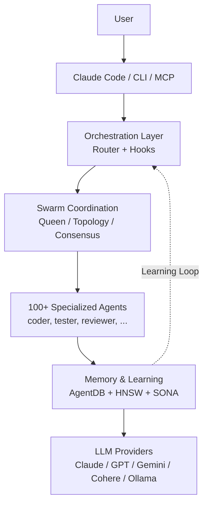
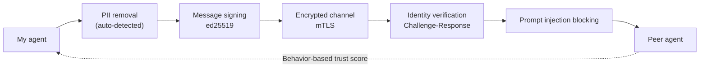

> How to design Claude Code workflows that learn from a team's insights, not just a single project.



---

Use Claude Code for a month and the limits become clear. Context disappears along with the session, and breaking work apart and putting it back together is ultimately a human job. The bigger problem surfaces the moment you have multiple projects and multiple developers. The testing strategy learned on project A, the refactoring pattern discovered by developer B, the architectural judgment validated in repository C — none of it flows well between them. `ruvnet/ruflo` (formerly Claude Flow) targets exactly this gap. As of May 4, 2026, it has 39.4k stars and 4.5k forks on GitHub, with v3.6.27 as the latest release.[^ruflo-github][^ruflo-release] Ruflo aims to be an orchestration layer on top of Claude Code that adds roughly 100 specialized agents, HNSW vector memory, a plugin system, and Zero-Trust federation. This post lays out what Ruflo actually solves and what it does not, particularly from the standpoint of **how to organically reuse the insights that multiple projects and multiple developers acquire**.

## TL;DR

- **Ruflo** is an MIT-licensed orchestration platform that extends Claude Code into a multi-agent collaboration system.[^ruflo-github]
- The core is three things: **swarm coordination + persistent memory + Zero-Trust federation**. Whether you can build a structure in which insights flow between projects and developers matters more than a list of 314 MCP tools.
- Given its release cadence and self-promotional tone, it suits **personal learning and team PoCs** but is **not recommended for immediate, org-wide enterprise adoption**.

## The Limits of Claude Code Alone, and Where Ruflo Sits

Claude Code is already powerful. It reads repositories, edits files, runs tests, and executes shell commands with the user's approval. The problem is a work model centered on a single session, a single repository, and a single user. On a long project, the open question becomes "why did we make this decision last time?" Across multiple projects, it becomes "how do we bring what we learned over there into this project?" At team scale, an even more important question emerges: "how do we get the insight from developer A's Claude Code session into developer B's next task?"

Ruflo is less a tool trying to replace Claude Code than one that bolts a work-coordination layer around it. You keep using Claude Code, and behind it Ruflo handles agent routing, memory, swarm coordination, background workers, and plugin execution.

| Capability | Claude Code alone | + Ruflo |
|---|---|---|
| Agent collaboration | Per session, limited shared context | Shared memory + consensus-based swarm |
| Coordination | User splits and merges the work | Queen-led hierarchy, topology, consensus |
| Memory | Session-centric | AgentDB, HNSW-based vector memory |
| Learning | Easily trapped inside a personal session | SONA, pattern matching, trajectory learning |
| Insight reuse | Humans have to document it | Memory transfer across projects and agents |
| Task routing | User decides | Intelligent routing, though the quantitative figures are self-reported |
| Background workers | None | 12 auto-triggered workers |
| LLM providers | Mainly Anthropic | Claude, GPT, Gemini, Cohere, Ollama, and others |

What matters in this table is not "more features." Ruflo's value lies in getting multiple agents to take on different facets of the same task, leave the results in memory, and reuse them on the next task. In other words, the key question is whether you can move from a personal productivity tool to a team learning system.

## The Real Question: How Do You Reuse Insight?

Vibe coding pays off quickly at the individual level. The longer a single developer works with Claude Code, the more prompting habits, testing sequences, review criteria, and failure patterns accumulate. From an organizational standpoint, however, this knowledge evaporates easily. Session logs scatter, good prompts stay in personal notes, and design judgments earned in one repository never migrate to another.

So the most important lens for looking at Ruflo is not "does it automate Claude Code further?" but "can it turn the insight generated during development into a shareable asset?" For example: a failure-reproduction pattern learned in a payments system gets used for test generation in a settlement system; security review criteria created by one developer are reflected in another developer's PR analysis; an architectural decision made for one client becomes the initial design guardrail for the next PoC.

Seen this way, AgentDB, RAG memory, knowledge graph, and federation are not a list of separate features. They are a pipeline for storing, retrieving, transmitting, and reusing insight across multiple projects and multiple developers within a trust boundary. Ruflo's adoption value materializes when that pipeline works in real day-to-day work.

## What Ruflo Does

The Ruflo README leads with "314 MCP tools" and "32 plugins."[^ruflo-github] The numbers are large, but the structure compresses into a single diagram.



There are five core components. First, entry points via a Claude Code plugin, CLI, and MCP server. Second, a router and hooks that detect work and send it down the appropriate flow. Third, a swarm layer that deploys multiple agents. Fourth, AgentDB and RAG memory that store and retrieve results and the reasoning behind decisions. Fifth, provider routing that allows models other than Claude to be used on some paths. When this structure works properly, the output of one session becomes the starting point for the next session, the next repository, and the next developer.

There are three installation paths. For Claude Code users, the plugin route is the most natural.

```bash
# 1) Claude Code plugin
/plugin marketplace add ruvnet/ruflo
/plugin install ruflo-core@ruflo

# 2) CLI
npx ruflo@latest init --wizard
# or
npm install -g ruflo@latest

# 3) MCP server
claude mcp add ruflo -- npx -y @claude-flow/cli@latest
```

In a production environment you should not use `latest` from the examples above as-is. Ruflo ships releases very quickly. Experimenting with `latest` is fine, but at team-PoC scale and beyond you must pin versions.

## The Key Differentiator: Agent Federation

The most interesting part of Ruflo is not the plugin count but Agent Federation. Tools that coordinate multiple agents within a single machine will only become more common. But letting agents on different machines, teams, and trust boundaries collaborate safely is a different story.

Through the `ruflo-federation` plugin, Ruflo attempts to treat inter-agent communication under a Zero-Trust model. Per the README, this layer includes agent discovery, authentication, task exchange, PII detection, mTLS, signing, and trust scoring.[^ruflo-github]



Suppose team A has an agent that analyzes payment anomalies and team B has one that analyzes operational logs. If the two teams can exchange only PII-stripped task requests and summarized signals without directly sharing raw customer data, the scope of collaboration widens. More practically, you can imagine handing a migration checklist validated on one project over to a DB change on another project, or a security agent on another team immediately making use of prompt injection patterns that one developer keeps uncovering. The value Ruflo proposes here is less "spin up lots of agents" and more "let insights earned by different projects and developers be exchanged within a trust boundary."

```bash
# Initialize federation and generate a keypair
npx claude-flow@latest federation init

# Join another team's federation endpoint
npx claude-flow@latest federation join wss://team-b.example.com:8443

# Send a message with PII automatically stripped
npx claude-flow@latest federation send --to team-b --type task-request \
  --message "Analyze transaction patterns for account anomalies"

# Check peer trust ratings and session health
npx claude-flow@latest federation status
```

That said, this area especially needs verification. A security model on paper and operational security in practice are different things. To use it in a regulated industry, you have to separately test network boundaries, log retention, key management, PII removal accuracy, and the failure scenarios for prompt injection blocking.

## How to Choose Among 32 Plugins

The breadth of Ruflo's plugin list is daunting at first glance, so it helps to reduce it to categories.

| Category | Representative plugins | In one line |
|---|---|---|
| Core/Orchestration | `ruflo-core`, `ruflo-swarm`, `ruflo-federation` | Foundation, multi-agent coordination, cross-machine collaboration |
| Memory/Knowledge | `ruflo-agentdb`, `ruflo-rag-memory`, `ruflo-knowledge-graph` | Vector DB, hybrid search, entity graph |
| Intelligence | `ruflo-intelligence`, `ruflo-ruvllm`, `ruflo-goals` | Learning, local LLM routing, goal decomposition |
| Code Quality | `ruflo-testgen`, `ruflo-browser`, `ruflo-jujutsu`, `ruflo-docs` | Test generation, Playwright, risk scoring |
| Security | `ruflo-security-audit`, `ruflo-aidefence` | CVE scanning, prompt injection blocking, PII detection |
| Architecture | `ruflo-adr`, `ruflo-ddd`, `ruflo-sparc` | ADR, DDD, five-stage methodology |
| DevOps | `ruflo-migrations`, `ruflo-observability`, `ruflo-cost-tracker` | Schema changes, logging/tracing, token budgets |
| Extensibility | `ruflo-wasm`, `ruflo-plugin-creator` | WASM sandbox, plugin scaffolding |
| Domain-Specific | `ruflo-iot-cognitum`, `ruflo-neural-trader` | IoT fleets, AI trading |

If it were our team, here is how we would pick the starting combinations.

| Scenario | Recommended plugin combination | Why |
|---|---|---|
| Personal learning / side project | `core` + `swarm` + `cost-tracker` | Experience the core value with the smallest surface area, make token costs visible |
| Two-week team PoC | + `rag-memory` + `testgen` + `observability` | Reuse internal docs and task insights on the next task while measuring ROI |
| Multi-site / multi-client | + `federation` + `aidefence` + `security-audit` | Share patterns across projects while keeping data bulkheads intact |

Turning on all 32 from the start is not a good strategy. 314 MCP tools also means 314 units of operational surface area. It is better to enable only the 5 to 10 you will actually use and start with the rest disabled.

## Three Practical Adoption Scenarios

The first is the individual developer's learning scenario. If you already use Claude Code, have a lot of repetitive work, and work in the same repository across several days, Ruflo's memory and swarm coordination are easy to feel. At this stage, validating usability matters more than security. Start with roughly `core`, `swarm`, and `cost-tracker` and watch for two things: "has the time I spent splitting up work myself gone down?" and "do judgments from past work actually carry into the next task?"

The second is a team PoC. Set a period of about two weeks and pick concrete workflows — test generation, document search, PR risk analysis — targeting one existing repository, or two repositories of similar character. What you measure here is not star counts or plugin counts but task turnaround time, failure rate, retry counts, token cost, and the quality of the output a human has to review. One more thing needs to be added: check whether review criteria or test patterns obtained on the first project get reused on the second. `rag-memory`, `testgen`, and `observability` fit this stage.

The third is an enterprise or multi-client environment. Here the concern is control rather than productivity. You have to decide up front what data moves between agents, where PII removal happens, where failure logs land, and who approves version upgrades. At the same time you have to define the scope of insight reuse. You need boundaries such as: never share a given client's code or data, but do share abstracted patterns like incident response procedures, security review criteria, and migration verification sequences. Rather than adopting Ruflo wholesale, it is more realistic to validate `federation` and `agentdb` within a narrow scope.

## Pre-Adoption Checklist

First, separate out the unverified quantitative claims. Ruflo's documentation cites HNSW search speed, routing accuracy, and performance improvement figures. Some release notes even mention that past exaggerated metrics were cleaned up.[^ruflo-release-3610] These numbers are interesting, but they should not be used as a basis for decisions until you have re-measured them on your own repository and your own data.

Second, treat the release cadence as a risk. Even on May 4, 2026, release v3.6.27 went up.[^ruflo-release] That means it is an active project, but in a production environment the rate of change is itself a risk. Lockfiles, version pins, and rollback procedures need to be in place from the PoC onward.

Third, draw the line of responsibility against Anthropic's official features. Skills, Subagents, and Plugins are concepts of the official Claude Code ecosystem. Ruflo is an external layer that sits on top. The better learning order is to master the official features first and then attach Ruflo.

Fourth, do not take the Rust/WASM emphasis at face value. Per GitHub's language statistics, Rust is shown at 0.3%.[^ruflo-github] Whatever policy engine or WASM kernel exists, most of the actual codebase is TypeScript, JavaScript, and Python. That is not a bad thing in itself. It just means you should avoid simplistic conclusions like "it is Rust-based, so it is safe."

## Conclusion

Ruflo is the candidate that most aggressively shows where Claude Code goes next. A hundred agents, consensus algorithms, and Zero-Trust federation attempt answers in territory a single coding assistant struggles to reach. More precisely, Ruflo's question does not stop at "can we finish one project faster?" It goes all the way to "can we make the insights earned by multiple projects and multiple developers the default for the next task?" But a tool's ambition and its operational stability are separate matters.

For personal learning and team PoCs, it is worth starting now. For enterprise adoption, the safe path is to follow the changelog for at least a quarter, measure the stability of the core plugins yourself, and then begin with partial adoption limited to the two axes of `federation` and `agentdb`. Peel back a layer of marketing copy and Ruflo's real value is not "314 tools" but "a protocol that lets an agent work safely with an agent on another machine."

ROBOCO supports adoption assessments and PoCs for agent orchestration tools including Ruflo. If **how to embed it into operations** is the harder problem than which tool to choose, feel free to reach out. → [Contact ROBOCO consulting](/en/contact/)

---

[^ruflo-github]: [ruvnet/ruflo GitHub repository](https://github.com/ruvnet/ruflo). Checked May 4, 2026. The GitHub page shows 39.4k stars, 4.5k forks, MIT license, 32 plugins, 314 MCP tools, and Rust at 0.3%.
[^ruflo-release]: [Ruflo v3.6.27 release](https://github.com/ruvnet/ruflo/releases/tag/v3.6.27). Confirmed as the latest release, published May 4, 2026.
[^ruflo-release-3610]: [Ruflo v3.6.10 release notes](https://github.com/ruvnet/ruflo/releases). The release notes include items related to a README honesty audit and the cleanup of exaggerated metrics.
