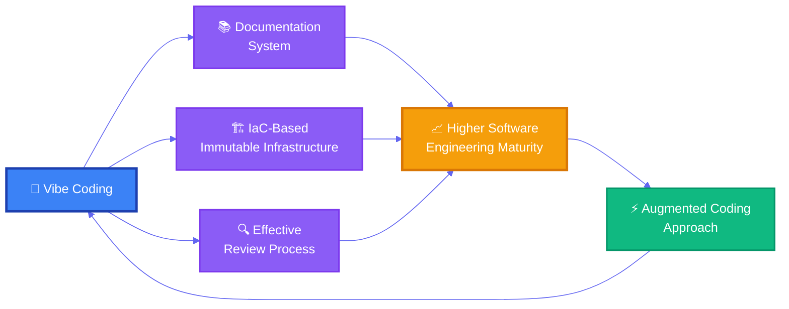



A lot of developers think of vibe coding as nothing more than "a way to generate code automatically." Give the tool an instruction, wait a moment, and beautiful code pops out. Reality is not that simple. In an environment with no automated tests, no solid design, and not even a functioning review process, vibe coding just churns out garbage code faster.

This is not a tooling problem. It is an engineering maturity problem. Software engineering maturity and vibe coding complement each other, and only in an environment with high engineering maturity can vibe coding show what it is really capable of.

## TL;DR

- In organizations weak on engineering fundamentals such as testing, design, and review, vibe coding can actually magnify quality problems faster.
- Conversely, once documentation, test automation, IaC, and a review process are in place, AI tools lift development speed and quality together.
- Vibe coding is a tool that works well only in mature organizations, and at the same time a tool that raises an organization's maturity.

Paradoxically, vibe coding tools are enormously useful for raising engineering maturity. With vibe coding techniques you can organize specification documents, analyze existing code to generate tests automatically, and quickly verify whether those tests satisfy the spec. Implementing infrastructure quickly and accurately as IaC (Infrastructure as Code) is likewise possible without human intervention. Tools like SuperClaude, for example, make it easy to carry out a range of activities including code analysis, documentation, implementation, testing, and security scanning.

The relationship between vibe coding and engineering maturity can be expressed like this.

Here is my advice to anyone about to start with vibe coding. First put your existing project's documentation in order, build test automation, and set up a fully automated CI/CD pipeline along with IaC-based immutable infrastructure. Raising your engineering maturity is the first step toward using vibe coding properly. With software engineering maturity behind you, Kent Beck's [augmented coding approach](https://tidyfirst.substack.com/p/augmented-coding-beyond-the-vibes) can then take the quality and speed that vibe coding delivers to their maximum.
