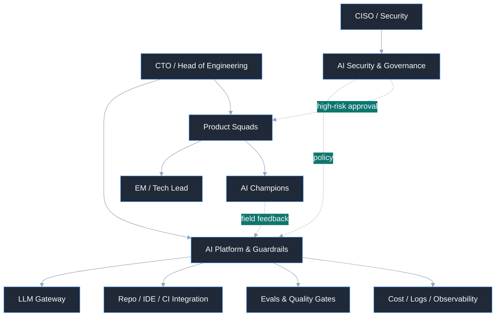

> バイブコーディングの成否は、AIがつくった変更をチームが反復可能で安全な方法で検証し、デプロイできるようにする組織設計にかかっています。



多くの組織は、バイブコーディングを「開発者がコードをより速くつくる方法」程度に理解しています。だからこそ導入の議論も、たいていツールの導入から始まります。しかし実際の現場で成否を分けるのは、ツールやモデルの性能よりも組織の構造です。

バイブコーディングはオートコンプリートではなく、働き方の再設計に近いものです。組織のメンバー一人ひとりがより広い領域をカバーし、チーム間のハンドオフとコミュニケーションのコストを減らせるとき、生産性は大きくなります。とはいえ、目標が人員削減だというわけではありません。核心は、同じ組織がより多くのことを、より速く、より安全に届けられるようにすることにあります。そのためには、要求をどう分解するか、どの変更をAIに任せてどの変更を人が直接判断するか、どんなテストと承認の手続きを通過すればデプロイするのかを設計しなければなりません。その設計がなければ、AIは生産性を高めるどころか混乱を大きくします。

この記事は、OpenClawの事例と最近のエンタープライズAI導入の流れに共通して現れた教訓をもとに、バイブコーディングを実際の製品開発組織に定着させるための組織設計の原則を整理したものです。

## TL;DR

- バイブコーディング導入の成否は、ツールよりも、AIがつくった変更を検証しデプロイする組織構造と責任体系にかかっています。
- リポジトリの指針だけでは足りず、共用プラグイン・ガードレール・承認条件を中央で管理し、現場のチャンピオンがチームの文脈に合わせて調整する必要があります。
- 運用モデルは Research → Plan → Implement → Auto Review → Monitor の流れで設計し、人はすべてのレビューではなく、例外と高リスクの判断に集中すべきです。

## コードを減らして書くのではなく、コードを生成するシステムを設計すること

バイブコーディングの環境で、人間の役割がなくなるわけではありません。役割の中心が変わるだけです。直接コードをタイピングする時間は減り、代わりに次の活動の比重が大きくなります。

- 作業を小さな単位に分解すること
- エージェントが従うべき制約とルールを文書化すること
- 承認ポリシーと遮断のしきい値を設計すること
- テスト、レビュー、デプロイのゲートを自動化すること
- 事故と失敗を、ふたたび指針とルールへ還元すること

この変化は、開発者個人のプロンプティングスキルだけでは支えきれません。組織レベルの運用契約が必要です。たとえばリポジトリごとに`CLAUDE.md`/`AGENTS.md`のようなエージェント指針ファイルを置き、ビルド方法、テストコマンド、禁止領域、レビュー基準、セキュリティ境界を機械が読める形で維持しておくことは、いまや選択ではなく基本に近いものです。

結局、重要な問いは「私たちの組織は、AIが生み出した変更をどんな規律とどんな責任構造のなかで扱うのか」です。

## リポジトリの指針だけでは足りない。全社共用のプラグインシステムが必要だ

リポジトリ単位の`AGENTS.md`は、ローカルな文脈を固定するのに有用です。しかし組織への導入はここで終わりません。チームごとにプロンプトやツール接続をばらばらにコピーして使い始めると、同じ業務を何度も定義することになり、権限統制は散らばり、良いワークフローは一部の個人のノウハウとしてしか残らなくなります。

だからこそ、組織レベルのバイブコーディングには共用プラグインシステムが必要です。ここでいうプラグインとは、単なるプロンプトの寄せ集めではなく、特定の役割や業務に必要なメモリ（ルール）、スキル、フック、コネクター、承認条件を1つの配布単位にまとめた運用パッケージです。言い換えれば、共通スキルは独立した配布物ではなく共通プラグインの一部であり、実際のガードレールは、プラグイン内のルール、実行スキル、自動呼び出しフックが一緒に働いてはじめて強制されます。Anthropicが2026年2月24日に発表したClaude Coworkのアップデートも、同じ方向を示しています。管理者は社内専用のプラグインマーケットプレイスをつくり、承認されたコネクターをバンドルし、非公開のGitHubリポジトリをプラグインのソースとして接続し、チームまたはユーザー単位で自動インストールとアクセスを制御できるようになりました。[^1]

個人のプロンプトは個人の生産性を高めます。共用プラグインは組織の一貫性をつくります。重要な運用単位は「誰がうまく使うか」ではなく、「誰が使っても同じ境界と品質基準が適用されるか」でなければなりません。

組織レベルのプラグインシステムは、少なくとも次のことを行うべきです。

- 検証済みのワークフローを再利用可能な形で配布すること
- 承認されたコネクターとデータアクセス範囲を中央で統制すること
- チームごとの文脈の違いを、プラグインのバージョンと設定で吸収すること
- 使用量、コスト、ツール呼び出しを観測し、どの自動化が実際に効果的かを測定すること

結局のところ、リポジトリの指針は「このコードベースでどう働くか」を定義し、共用プラグインは「私たちの組織でAIがどんなやり方で働くか」を定義します。前者がローカルな運用契約なら、後者は組織共通の運用プロダクトです。

## なぜ多くのAI導入は思ったほど効果を出さないのか

バイブコーディングの導入が期待ほど効果を出さない理由は、たいてい似ています。生成の速さだけを見て、統制の構造を後から付け足すからです。序盤は誰もが速いと感じます。PRが速く上がり、ドキュメントの草案もあっという間にでき、テストコードも以前より簡単につくれます。ところが数か月が経つと、レビューの疲労度が上がり、誰が何に責任を持つのかが曖昧になり、運用の安定性が揺らぎ始めます。

こうした現象は不思議なことではありません。エンジニアリングの基礎が弱い組織ほど、AIは速度を上げる前にノイズを先に大きくします。小さなバッチで頻繁にデプロイする習慣がなく、テストの信頼度が低く、コードレビューの基準が曖昧な状態なら、AIはボトルネックを解決するどころか、ボトルネックにより多くの変更を押し込みます。

ですからバイブコーディングの導入は、生産性プロジェクトではなく運用設計プロジェクトとして扱うべきです。速度は結果であって出発点ではありません。まず答えるべき問いは、次の4つです。

- どの変更はAIが自律的に実行してよいのか
- どの変更は必ず人間の承認を経なければならないのか
- どんな証跡があればレビュアーは安心して承認できるのか
- 失敗から得た教訓をどこに蓄積するのか

この問いに答えられないままツールだけを配布すれば、組織はほどなく「AIを使ってはいるが、かえって疲れた」という状態に到達します。

## 推奨する組織モデル：中央プラットフォーム + 現場チャンピオン + 最終オーナーシップ

ほとんどの組織にとって最も現実的な答えは、ハイブリッドモデルです。中央のプラットフォームチームだけがすべてを統制する方式はボトルネックになり、各プロダクトチームがばらばらにツールを使う方式は速く断片化します。

ハイブリッドモデルは3つの層で構成されます。

第一に、中央のAIプラットフォーム・ガードレールチームが共通インフラを提供します。モデルルーティング、アクセス制御、共用プラグインマーケットプレイス、承認されたコネクター、共通のプロンプト・スキルテンプレート、リポジトリ統合、ログとコストの観測、ポリシーの自動化といった基盤機能は、ここが担うべきです。

第二に、各プロダクトスクワッドにAIチャンピオン、あるいはAIスペシャリストを置きます。この役割はツールを代わりに使ってあげる人ではなく、チームの実際の業務フローに合わせて指針とプラグインを整え、どの作業をAIに委譲するかを判断し、失敗パターンをプラットフォームチームへ返す結節点です。

第三に、最終的な責任は依然としてプロダクトチームが負います。AIがコードをつくったからといって、運用責任がプラットフォームチームへ移ってはいけません。サービス障害、セキュリティ問題、品質問題の最終オーナーは、そのサービスを運用しているチームであるべきです。

この構造を簡単に描くと、次のようになります。

核心は明確です。標準化と共用配布は中央で、文脈の反映は現場で、責任はプロダクトチームが担います。

## 標準の運用モデルは Research → Plan → Implement → Auto Review → Monitor であるべきだ

バイブコーディングが上手なチームは、いきなり実装から始めません。まず調査し、ディープインタビューで曖昧さを減らし、計画してから実装します。この順序を強制してこそ、初期の誤解のコストを減らせます。

推奨する基本の流れは次のとおりです。

1. 要求やイシューを受け付ける。
2. 既存のコードと制約条件を調査する。
3. 調査と計画の段階で、会社共通またはチーム共通のプラグインに含まれるディープインタビュースキルを実行し、プラグインのフックでこれを常に最初に呼び出して、要求、承認境界、データアクセス、例外条件を確認する。
4. ディープインタビューの結果をもとに、変更計画を文書化する。
5. 実装とテストを進める。
6. 静的検査、セキュリティスキャン、テスト、AIレビューを自動で実行する。
7. ゲートを通過したら、自動マージまたは直接コミットの経路で反映する。
8. デプロイ後、運用指標と異常シグナルを自動でモニタリングする。
9. 事故と例外を、ふたたび指針ファイルとゲートのルールへ反映する。

ここでのディープインタビューは、任意のチェックリストではありません。組織共通またはチーム共通のプラグインのなかに、メモリ（ルール）、スキル、フックの形で含まれ、調査と計画の段階で常に最初に呼び出されなければなりません。そうしてはじめて、リポジトリごとのローカルな指針とは別に、会社レベルのセキュリティ、承認、責任分離のガードレールが毎回同じやり方で適用されます。つまりインタビューそのものが運用ポリシーの実行表面であり、プラグインのフックは、そのポリシーが抜け落ちないように強制する装置であるべきです。

ここで重要なのは3番目と4番目のステップです。計画文書には、少なくとも次の内容が入っている必要があります。

- どのファイルが変わるのか
- 変更の意図は何か
- ディープインタビューで確認した共通ガードレールと例外承認の条件は何か
- どのテストで検証するのか
- 失敗したときにどうロールバックするのか
- セキュリティやデータアクセスに影響があるのか

このディープインタビューと計画の文書化の過程を省くと、実装は速く見えてもレビューが遅くなり、結局は全体のリードタイムがふたたび伸びます。逆に、初期の問いと計画が鮮明であれば、AIははるかに有用な実行エンジンになります。

## Human-in-the-Loopはデフォルトではなく、例外処理の経路であるべきだ

ここに1つ重要な転換があります。バイブコーディングの組織では、人がデフォルト経路の毎ステップに介入してはいけません。コード生成だけを自動化し、レビューは依然として人がすべて読む構造なら、ボトルネックは後ろへずれるだけです。速度は生成の段階で上がり、レビューの段階でふたたび崩れます。

このような環境では、PRサイクルタイムやレビュー参加率といった従来の指標も、中核のKPIになりにくいものです。PRのほとんどがセルフマージされたり、ボットのコメントが中心になったりすれば、「レビューが存在する」という事実そのものが品質保証の証拠ではなくなるからです。必要なのは、より多くの人によるレビューではなく、より良い自動品質ゲートです。

つまりデフォルトの経路は、Human-in-the-LoopよりMachine-in-the-Loopに近くあるべきです。理想的な流れは次のとおりです。

- コミットまたは変更案の生成
- リント、型チェック、テスト、シークレットスキャン、SASTの自動実行
- LLMベースのコードレビューの自動実行
- 複数モデルの合意、あるいはルールベースのスコアしきい値による判定
- 通過時に自動マージ、または直接反映
- デプロイ後の異常シグナルの自動監視

人はこの流れに毎回入ってきません。人はしきい値を設計し、例外を処理し、モデル間の意見の相違が大きい場合やセキュリティリスクが高い場合にのみ介入します。言い換えれば、人の役割は「すべてのコードを自分で読むレビュアー」よりも「自動化された検証システムの設計者であり、エスカレーション担当者」に近いのです。

もちろん、例外の境界は必要です。たとえば次の領域には、依然として人の承認が介在しうるでしょう。

- 認証と権限
- 決済と精算
- 個人情報の処理
- データベーススキーマの変更
- 外部システムの権限連携
- インフラのセキュリティ設定

ここでも目標は、全件の手動レビューではありません。人はガードレールの設定に集中し、検証は自動で回すべきです。そうしてはじめて、コード生成とレビューをともに自動化できます。

## 運用指標はPR中心ではなく、自動化された品質ゲート中心であるべきだ

この点で、運用指標の観点も変わらなければなりません。バイブコーディングの組織で、いまだにPRレビュー時間、レビュー参加率、マージ率といった指標を中核のKPIに置くと、測定体系が現実を歪め始めます。こうした指標は、直接コミットと自動レビューが一般化した組織では簡単に汚染され、あるいは廃棄の対象になります。

したがって運用指標は、人の協業の痕跡よりも、自動化システムが品質をどれだけよく守っているかを中心に設計すべきです。

第一に、チームレベルのデリバリーの推移です。重要なのは個人別のLOC競争ではなく、チーム全体が転換の前後でどれだけ安定して変更を生み出しているかです。コードの変更量は個人の評価指標ではなく、チームレベルのトレンド指標としてのみ使うべきです。

第二に、チームのエンジニアリング健全度です。コミットの粒度、作業領域の集中度、削除比率、メッセージの規律といったシグナルを束ねてエンジニアリングプラクティスを追跡すれば、PRがなくても品質の低下をかなり早い段階で捉えられます。とくに削除比率の低下は、AIが生成したコードを整理せずに積み上げ続けているというシグナルになりえます。

第三に、自動レビューシステムの性能です。たとえばAIゲートの遮断率、繰り返し引っかかる失敗の類型、セキュリティスキャンの検出率、テスト漏れの検知率、モデル間の意見相違の比率といった指標です。とくに複数モデルの合意を使う場合は、平均スコアより標準偏差のほうが重要なことがあります。モデル間の意見の相違が大きい変更は、人が介入すべき候補だからです。

第四に、デプロイ後のサービス健全度です。Change Failure Rate、MTTR、ロールバック比率、ユーザーに影響した障害の件数は、依然として重要です。レビューが自動化されても運用上の問題が増えるのであれば、その自動化は失敗です。

第五に、知識の集中と業務パターンの異常シグナルです。特定の少数に変更が過度に偏っていないか、チームの活動パターンが揺らいでいないか、品質ゲートの失敗が特定の領域に集中していないかを見れば、組織リスクを人より先に検知できます。知識の分散度や外れ値ベースのモニタリングは、この文脈で有用です。

まとめると、バイブコーディング組織のKPIはもはや「人がどれだけ熱心にレビューしたか」ではありません。「自動化された品質ゲートがどれだけ正確に問題をふるい落とし、チームがどれだけ安定して顧客価値をデプロイしているか」です。

## 自動レビューはブラックボックスではなく、根拠を持った自動化であるべきだ

レビューを自動化するからといって、検証のロジックが不透明になってはいけません。自動レビューシステムは、少なくとも次の原則に従うべきです。

- AIレビューの結果には、遮断の理由と根拠をあわせて残すこと
- 重要な判断の場合は複数のモデルが投票によって追加の安定性を確保し、もしモデル間の意見の相違が大きければ、自動承認ではなくエスカレーションすること
- スコアだけを見せるのではなく、どのファイル、どのパターン、どのテスト漏れが問題なのかを明らかにすること
- 異常シグナルは個人の処罰ではなく、システム改善の入力として使うこと

自動化の目標は人を排除することではなく、人が本当に必要な瞬間にだけ介入するようにすることです。そのためには、自動レビューは沈黙するブラックボックスではなく、機械も読めて人も理解できる証跡システムでなければなりません。

## 導入ロードマップは小さく始め、運用体系から固めるべきだ

全社一括の導入は、ほぼ必ず失敗します。まずは小さなチーム1つで検証すべきです。最良のパイロット対象は、変化に開かれていて、同時に運用責任も明確なプロダクトチームです。

現実的な3か月のロードマップは、おおむね次の順序をたどります。

この過程で守るべき原則は明確です。プラットフォームを完璧にするまで待たないこと、逆に現業チームに実験のコストをすべて押し付けないこと、そして成功基準と中止基準をあらかじめ決めておくこと。

たとえばパイロットの8週後には、次の3つを確認できるようになっているべきです。

- AIゲートの遮断率と繰り返し発生する失敗の類型が安定してきているか
- 変更失敗率が悪化していないか
- チームが自ら指針と自動化のルールを更新し始めているか

この3つが見えないなら、ツールの拡散よりも運用設計の補強が先です。

## 結局必要なのはAIチームではなく、AIネイティブな運用体系だ

バイブコーディングの時代に必要なのは、「AIをうまく使う数人のスタープレイヤー」ではありません。誰もが一定水準以上に安全にAIを活用できるようにする運用体系です。中央プラットフォームは標準とガードレール、共用プラグインシステムを提供し、現場のチャンピオンは文脈を翻訳し、プロダクトチームは最後まで責任を持つ。この3つが噛み合ってはじめて、バイブコーディングは一時的な流行ではなく組織の能力になります。

まとめると、バイブコーディング導入の核心は、開発者をAIで置き換えることではありません。コードの作成と検証、デプロイを取り巻く組織のインターフェースを設計し直す仕事です。リポジトリの指針はローカルな規律をつくり、共用プラグインシステムは組織全体の再利用性と統制をつくります。必要なのは漠然とした速度競争ではなく、より明確な責任、より良い証跡、より強い運用規律です。

AIはコードをつくることができます。しかし、そのコードを組織の成果へ変えるのは、依然として組織設計の役目です。

## 用語の整理

この記事で使ういくつかの用語は、製品ごとに名前が少しずつ異なります。以下のリンクは、それぞれの概念を最も直接的に説明している公式ドキュメントです。

- `AGENTS.md`：OpenAI Codexでリポジトリやサブディレクトリに置く作業指針ファイルです。エージェントがどんなルール、コマンド、制約に従うべきかを伝えます。公式ドキュメント：[Custom instructions with AGENTS.md](https://developers.openai.com/codex/guides/agents-md)
- `CLAUDE.md` / メモリ（ルール）：Claude Codeで組織、プロジェクト、ユーザーレベルの持続的なルールを階層的に読み込むメモリファイルです。会社共通のルールをグローバルポリシーとして、チームのルールをプロジェクトメモリとして配布できます。公式ドキュメント：[How Claude remembers your project](https://docs.claude.com/en/docs/claude-code/memory)
- `共通プラグイン`：組織が共通のルールと自動化をまとめて配布する単位です。この記事では、メモリ、スキル、フック、MCP／コネクターの設定を一緒に載せる運用パッケージを指します。公式ドキュメント：[Plugins](https://docs.claude.com/en/docs/claude-code/plugins)、[Plugins reference](https://docs.claude.com/en/docs/claude-code/plugins-reference)
- `スキル`：反復可能な作業のやり方を、再利用可能な形で定義した実行単位です。プラグインのなかに含めることも、プロジェクトや組織レベルに直接配置することもできます。公式ドキュメント：[Agent Skills](https://docs.claude.com/en/docs/claude-code/skills)、[Agent Skills for Codex](https://developers.openai.com/codex/skills)
- `フック`：セッション開始、指針のロード、ツール実行の前後といったイベントに自動で付く、ポリシー・検証の装置です。危険なコマンドの遮断、ディープインタビューの先行実行の強制、後続検証の自動化に使えます。公式ドキュメント：[Hooks reference](https://docs.claude.com/en/docs/claude-code/hooks)
- `MCP` / コネクター：モデルが外部ツールとデータの文脈にアクセスする標準の接続レイヤーです。製品のUIではコネクターとして見え、開発ランタイムではMCPサーバーとして現れることが多いものです。公式ドキュメント：[Model Context Protocol](https://developers.openai.com/codex/mcp)、[Get started with custom connectors using remote MCP](https://support.claude.com/en/articles/11175166-get-started-with-custom-connectors-using-remote-mcp)
- `ディープインタビュー`：本記事でいうディープインタビューは、特定ベンダーの固有の製品名ではなく、調査・計画の段階で要求の曖昧さ、承認境界、データアクセス、例外処理を構造化して確認する組織運用のパターンです。実際の実装は通常、メモリ、スキル、フックを組み合わせてつくります。実装基盤の公式ドキュメント：[How Claude remembers your project](https://docs.claude.com/en/docs/claude-code/memory)、[Agent Skills](https://docs.claude.com/en/docs/claude-code/skills)、[Hooks reference](https://docs.claude.com/en/docs/claude-code/hooks)

[^1]: Anthropic, "Cowork and plugins for teams across the enterprise" (February 24, 2026): https://claude.com/blog/cowork-plugins-across-enterprise
