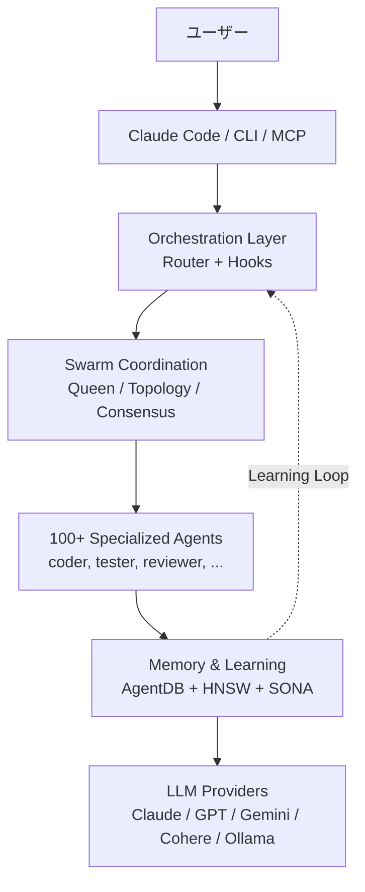
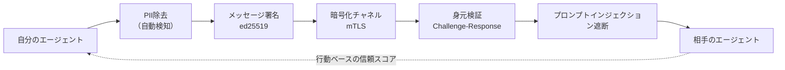

> 単一プロジェクトを超えて、チームの洞察を学習するClaude Codeワークフローの設計法。



---

Claude Codeを1か月も使えば限界がはっきりします。コンテキストはセッションとともに消え、作業を分解してまた統合する仕事は結局のところ人の役目です。より大きな問題は、プロジェクトが複数になり開発者が複数になった瞬間に表れます。Aプロジェクトで得たテスト戦略、B開発者が見つけたリファクタリングのパターン、Cリポジトリで検証されたアーキテクチャ上の判断が、互いにうまく流れていきません。`ruvnet/ruflo`（旧Claude Flow）は、この空白をまさに狙っています。2026年5月4日時点でGitHubにおいて39.4k stars、4.5k forksを記録しており、最新リリースはv3.6.27です。[^ruflo-github][^ruflo-release] Rufloは、Claude Codeの上に100を超える専門エージェント、HNSWベクトルメモリ、プラグインシステム、そしてZero-Trustフェデレーションを載せたオーケストレーション層を目指しています。本稿では、Rufloが実際に何を解決し何を解決しないのかを、とくに**複数のプロジェクトと複数の開発者が獲得した洞察をどう有機的に再利用するか**という観点から整理します。

## TL;DR

- **Ruflo**は、Claude Codeをマルチエージェント協働システムへ拡張するMITライセンスのオーケストレーション・プラットフォームです。[^ruflo-github]
- 核心は**スウォーム調整＋永続メモリ＋Zero-Trustフェデレーション**の三つです。314個のMCPツール一覧よりも、プロジェクトと開発者のあいだに洞察が流れる構造を作れるかどうかのほうが重要です。
- リリース速度と自社マーケティングの語調を考慮すると、**個人の学習やチームのPoC**には適していますが、**エンタープライズでの即時全面導入**は推奨しません。

## Claude Code単体の限界とRufloの位置づけ

Claude Codeはすでに強力です。リポジトリを読み、ファイルを修正し、テストを実行し、ユーザーの承認を得てシェルコマンドを実行します。問題は、単一セッション・単一リポジトリ・単一ユーザーを中心とした作業モデルにあります。長期のプロジェクトでは「前回なぜこの決定をしたのか」が残り、複数プロジェクトでは「あのプロジェクトで学んだことをこのプロジェクトにどう持ち込むか」が残ります。チーム単位になると「A開発者のClaude Codeセッションで得た洞察を、B開発者の次の作業にどう伝えるか」がより重要になります。

Rufloは、Claude Codeを置き換えようとする道具というより、Claude Codeの周辺に作業調整の層を付け足す側に近いものです。ユーザーはClaude Codeを使い続け、Rufloはその背後でエージェントのルーティング、メモリ、スウォーム調整、バックグラウンドワーカー、プラグイン実行を担います。

| 能力 | Claude Code単体 | ＋Ruflo |
|---|---|---|
| エージェント協働 | セッション単位、共有コンテキストは限定的 | 共有メモリ＋合意ベースのスウォーム |
| 調整 | ユーザーが作業を分割し統合する | Queen-led階層、topology、consensus |
| メモリ | セッション中心 | AgentDB、HNSWベースのベクトルメモリ |
| 学習 | 個人セッションの中に閉じこもりやすい | SONA、パターンマッチング、trajectory learning |
| 洞察の再利用 | 人が文書化しなければならない | プロジェクト／エージェント間のメモリ転移が可能 |
| 作業ルーティング | ユーザーが判断 | 知的ルーティング、ただし定量的な数値は自社主張 |
| バックグラウンドワーカー | なし | 12個の自動トリガーワーカー |
| LLMプロバイダー | 主にAnthropic | Claude、GPT、Gemini、Cohere、Ollamaなど |

この表で重要なのは「機能が多い」ということではありません。Rufloの価値は、複数のエージェントが同じ作業の異なる側面を担い、その結果をメモリに残し、次の作業で再利用できるようにする点にあります。つまり、個人の生産性ツールからチームの学習システムへ移行できるかどうかが核心的な問いです。

## 本当の問い：洞察をどう再利用するか

バイブコーディングは個人単位では素早く効果を出します。一人の開発者がClaude Codeと長く働くほど、プロンプトの習慣、テストの順序、レビュー基準、失敗のパターンが積み上がります。しかし組織の観点では、この知識は簡単に蒸発します。セッションログは散らばり、良いプロンプトは個人のノートに残り、特定のリポジトリで得た設計上の判断は別のリポジトリへ移動しません。

だからRufloを見るときに最も重要な観点は、「Claude Codeをさらに自動化してくれるか」ではなく「開発の過程で生まれた洞察を共有可能な資産に変えられるか」です。たとえば、決済システムで得た障害再現のパターンが精算システムのテスト生成に使われ、ある開発者が作ったセキュリティレビュー基準が別の開発者のPR分析に反映され、特定の顧客企業のアーキテクチャ上の決定が次のPoCの初期設計ガードレールになる、といった具合です。

この観点に立てば、AgentDB、RAG memory、knowledge graph、federationは別々の機能一覧ではありません。複数のプロジェクトと複数の開発者のあいだで洞察を保存し、検索し、伝達し、信頼境界の内側で再利用するためのパイプラインです。Ruflo導入の価値は、このパイプラインが実際の業務で機能したときに生まれます。

## Rufloがすること

RufloのREADMEは「314 MCP tools」と「32 plugins」を前面に押し出しています。[^ruflo-github] 数字は大きいものの、構造は次の一枚に圧縮できます。



中核となるコンポーネントは五つです。第一に、Claude Codeプラグイン／CLI／MCPサーバーで入口を作ります。第二に、ルーターとフックが作業を検知して適切なフローへ送ります。第三に、スウォーム層が複数のエージェントを配置します。第四に、AgentDBとRAGメモリが作業結果と判断の根拠を保存・検索します。第五に、プロバイダー・ルーティングを通じてClaude以外のモデルも一部の経路で使えるようにします。この構造がきちんと機能すれば、単一セッションの成果物が次のセッション、次のリポジトリ、次の開発者の出発点になります。

インストールには三つの経路があります。Claude Codeユーザーであればプラグイン方式が最も自然です。

```bash
# 1) Claude Codeプラグイン
/plugin marketplace add ruvnet/ruflo
/plugin install ruflo-core@ruflo

# 2) CLI
npx ruflo@latest init --wizard
# または
npm install -g ruflo@latest

# 3) MCPサーバー
claude mcp add ruflo -- npx -y @claude-flow/cli@latest
```

本番環境では、上の例の`latest`をそのまま使ってはいけません。Rufloはリリース速度が非常に速いのです。実験は`latest`で構いませんが、チームPoC以上では必ずバージョンを固定すべきです。

## 中核的な差別化要素：Agent Federation

Rufloで最も興味深い部分は、プラグインの個数ではなくAgent Federationです。単一マシンの中で複数のエージェントを調整する道具は、今後さらに増えるでしょう。しかし、異なるマシン・チーム・信頼境界にあるエージェントが安全に協働しようとすると話は変わります。

Rufloは`ruflo-federation`プラグインを通じて、エージェント間の通信をZero-Trustモデルで扱おうとしています。README基準で、この層はエージェントのdiscovery、認証、作業交換、PII検知、mTLS、署名、信頼スコアといった要素を含みます。[^ruflo-github]



たとえば、Aチームは決済の異常兆候を分析するエージェントを持ち、Bチームは運用ログを分析するエージェントを持っているとします。二つのチームが元の顧客データを直接共有しなくても、PIIが除去された作業依頼と要約されたシグナルだけを交換できるなら、協働の範囲は広がります。より実務的な例としては、あるプロジェクトで検証されたマイグレーション・チェックリストを別プロジェクトのDB変更作業に渡したり、特定の開発者が繰り返し見つけたプロンプトインジェクションのパターンを他チームのセキュリティエージェントがただちに活用したりする流れが考えられます。このときRufloが提案する価値は「エージェントをたくさん立ち上げる」ことではなく、「異なるプロジェクトと開発者が得た洞察を信頼境界の内側で交換させる」ことに近いのです。

```bash
# フェデレーションの初期化＋キーペア生成
npx claude-flow@latest federation init

# 他チームのフェデレーション・エンドポイントにjoin
npx claude-flow@latest federation join wss://team-b.example.com:8443

# PIIが自動除去された状態でメッセージを送信
npx claude-flow@latest federation send --to team-b --type task-request \
  --message "Analyze transaction patterns for account anomalies"

# ピアの信頼等級＋セッションヘルスを確認
npx claude-flow@latest federation status
```

ただしこの領域はとくに検証が必要です。文書上のセキュリティモデルと実際の運用上のセキュリティは異なります。規制産業で使うには、ネットワーク境界、ログ保存、鍵管理、PII除去の精度、プロンプトインジェクション遮断が失敗したときのシナリオを個別にテストしなければなりません。

## 32個のプラグインをどう選んで使うか

Rufloのプラグイン一覧を最初に見ると、その広さに気圧されます。ですからカテゴリーに縮約して見る必要があります。

| カテゴリー | 代表的なプラグイン | 一言で |
|---|---|---|
| Core/Orchestration | `ruflo-core`, `ruflo-swarm`, `ruflo-federation` | 基盤、多エージェント調整、マシン間の協働 |
| Memory/Knowledge | `ruflo-agentdb`, `ruflo-rag-memory`, `ruflo-knowledge-graph` | ベクトルDB、ハイブリッド検索、エンティティグラフ |
| Intelligence | `ruflo-intelligence`, `ruflo-ruvllm`, `ruflo-goals` | 学習、ローカルLLMルーティング、目標分解 |
| Code Quality | `ruflo-testgen`, `ruflo-browser`, `ruflo-jujutsu`, `ruflo-docs` | テスト生成、Playwright、リスクスコアリング |
| Security | `ruflo-security-audit`, `ruflo-aidefence` | CVEスキャン、プロンプトインジェクション遮断、PII検知 |
| Architecture | `ruflo-adr`, `ruflo-ddd`, `ruflo-sparc` | ADR、DDD、5段階の方法論 |
| DevOps | `ruflo-migrations`, `ruflo-observability`, `ruflo-cost-tracker` | スキーマ変更、ログ／トレース、トークン予算 |
| Extensibility | `ruflo-wasm`, `ruflo-plugin-creator` | WASMサンドボックス、プラグインのスキャフォールディング |
| Domain-Specific | `ruflo-iot-cognitum`, `ruflo-neural-trader` | IoTフリート、AIトレーディング |

私たちのチームなら、開始時の組み合わせは次のように定めます。

| シナリオ | 推奨プラグインの組み合わせ | 理由 |
|---|---|---|
| 個人の学習／サイドプロジェクト | `core` + `swarm` + `cost-tracker` | 最小の表面積で中核的な価値を体験し、トークン費用を可視化する |
| チームPoC 2週間 | ＋ `rag-memory` + `testgen` + `observability` | 社内文書と作業上の洞察を次の作業で再利用しながらROIを測定する |
| マルチサイト／マルチクライアント | ＋ `federation` + `aidefence` + `security-audit` | データの隔壁を維持したままプロジェクト間でパターンを共有する |

最初から32個すべてを有効にするのは良い戦略ではありません。MCPツール314個は、すなわち314個の運用上の表面積でもあります。実際に使う5〜10個だけを有効にし、残りは無効にした状態で始めるほうが良いでしょう。

## 実務適用シナリオ3つ

一つ目は、個人開発者の学習シナリオです。すでにClaude Codeを使っていて、反復作業が多く、同じリポジトリで何日にもわたって作業しているなら、Rufloのメモリとスウォーム調整を体感しやすいでしょう。この段階ではセキュリティよりも使い勝手の検証が重要です。`core`、`swarm`、`cost-tracker`程度から始めて、「自分で作業を分けていた時間が減ったか」と「前の作業で得た判断が次の作業に実際に反映されるか」を見ればよいのです。

二つ目はチームPoCです。2週間ほどの期間を定め、既存のリポジトリ一つ、または性格の似たリポジトリ二つを対象に、テスト生成、文書検索、PRリスク分析といった具体的なワークフローを選びます。ここで測定すべきはstar数やプラグインの個数ではなく、作業の処理時間、失敗率、再試行回数、トークン費用、そして人がレビューしなければならない成果物の品質です。ここにもう一つ加えるべきことがあります。一つ目のプロジェクトで得たレビュー基準やテストパターンが、二つ目のプロジェクトで再利用されるかどうかを見るべきです。`rag-memory`、`testgen`、`observability`がこの段階に適しています。

三つ目はエンタープライズ、あるいはマルチクライアント環境です。このとき関心事は生産性よりも統制力です。どのデータがエージェントのあいだを移動するのか、PII除去はどこで起こるのか、失敗ログはどこに残るのか、バージョンアップグレードは誰が承認するのかを先に決めなければなりません。同時に、洞察の再利用範囲も定める必要があります。特定の顧客企業のコードやデータは共有しないが、障害対応の手順、セキュリティレビュー基準、マイグレーション検証の順序といった抽象化されたパターンだけは共有する、といった境界設定が必要です。Rufloを全面導入するよりも、`federation`と`agentdb`を狭い範囲で検証するほうが現実的です。

## 導入前チェックリスト

第一に、検証されていない定量的な主張を切り分ける必要があります。Rufloの文書にはHNSW検索速度、ルーティング精度、性能改善の数値が登場します。一部のリリースノートには、過去の誇張された指標を整理したという言及もあります。[^ruflo-release-3610] こうした数値は興味深いものの、自分たちのリポジトリと自分たちのデータで測り直すまでは、意思決定の根拠として使ってはいけません。

第二に、リリース速度をリスクとして見るべきです。2026年5月4日にもv3.6.27のリリースが上がりました。[^ruflo-release] 活発なプロジェクトだという意味ですが、本番環境では変更速度そのものがリスクです。PoCの段階からlockfile、バージョンピン、ロールバック手順を備えなければなりません。

第三に、Anthropic公式機能との責任境界を分ける必要があります。Skills、Subagents、PluginsはClaude Code公式エコシステムの概念です。Rufloはその上に載る外部レイヤーです。学習の順序としては、公式機能を先に習得し、そのあとにRufloを付ける側が良いでしょう。

第四に、Rust/WASMの強調をそのまま受け取ってはいけません。GitHubの言語統計を基準にすると、Rustの比率は0.3%と表示されます。[^ruflo-github] ポリシーエンジンやWASMカーネルの存在とは別に、実際のコードベースの大半はTypeScript、JavaScript、Pythonです。これが悪いという意味ではありません。ただ「Rustベースだから安全だ」といった単純な判断は避けるべきです。

## 結論

Rufloは、Claude Codeの次の段階がどこにあるかを最も積極的に示している候補です。100個のエージェント、合意アルゴリズム、Zero-Trustフェデレーションは、単一のコーディングアシスタントでは届きにくい領域に答えを試みています。より正確に言えば、Rufloの問いは「一つのプロジェクトをより速く終えられるか」で止まりません。「複数のプロジェクトと複数の開発者が得た洞察を、次の作業の初期値にできるか」まで進みます。ただし、道具の野心と運用上の安定性は別の問題です。

個人の学習とチームPoCであれば、いま始める価値があります。エンタープライズ導入であれば、少なくとも一四半期はチェンジログを追いながら中核プラグインの安定性を自ら測定したうえで、`federation`と`agentdb`の二軸に限定した部分採用から始めるのが安全です。マーケティングコピーを一枚めくれば、Rufloの本当の価値は「314個のツール」ではなく「エージェントが他のマシンのエージェントと安全に働けるようにするプロトコル」にあります。

ROBOCOは、Rufloをはじめとするエージェント・オーケストレーション・ツールの導入評価とPoCを支援しています。ツール選定よりも**運用にどう溶け込ませるか**のほうが難しい問題であれば、お気軽にお問い合わせください。 → [ROBOCOコンサルティングのお問い合わせ](/ja/contact/)

---

[^ruflo-github]: [ruvnet/ruflo GitHubリポジトリ](https://github.com/ruvnet/ruflo). 2026年5月4日確認。GitHubページ基準で39.4k stars、4.5k forks、MIT license、32 plugins、314 MCP tools、Rust 0.3%と表示。
[^ruflo-release]: [Ruflo v3.6.27リリース](https://github.com/ruvnet/ruflo/releases/tag/v3.6.27). 2026年5月4日に公開された最新リリースとして確認。
[^ruflo-release-3610]: [Ruflo v3.6.10リリースノート](https://github.com/ruvnet/ruflo/releases). リリースノートにREADME honesty audit および誇張された指標の整理に関する項目が含まれています。
