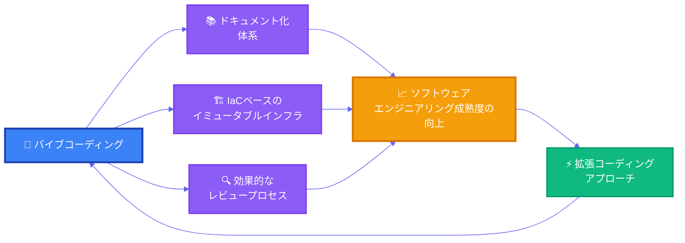



多くの開発者はバイブコーディングを単に「コードを自動的に生成する方法」だと考えています。ツールに指示を出して待っていれば、素晴らしいコードがさっと出来上がるだろうと期待するわけです。しかし現実はそれほど単純ではありません。自動化されたテストがない環境で、堅牢な設計もなく、機能するレビュープロセスさえないのであれば、バイブコーディングは「ゴミコード」を素早く量産するだけです。

これはツールの問題ではなく、エンジニアリング成熟度の問題です。ソフトウェアエンジニアリングの成熟度とバイブコーディングは互いを補完します。エンジニアリング成熟度が高い環境でこそ、バイブコーディングは本来の力を発揮できるのです。

## TL;DR

- バイブコーディングは、テスト・設計・レビューといったエンジニアリングの基礎が弱い組織では、かえって品質問題を急速に拡大させかねません。
- 逆に、ドキュメント化、テスト自動化、IaC、レビュープロセスが整えば、AIツールは開発スピードと品質を同時に引き上げます。
- バイブコーディングは成熟した組織でこそうまく使えるツールであると同時に、組織の成熟度を高めるツールでもあります。

逆説的ですが、バイブコーディングツールはエンジニアリング成熟度を高めるうえで非常に有用です。バイブコーディングの手法を活用すれば、仕様書を整理し、既存コードを分析してテストを自動生成し、そのテストが仕様を満たしているかを素早く検証できます。また、インフラをIaC（Infrastructure as Code）として迅速かつ正確に実装する作業も、人の介入なしに可能です。たとえばSuperClaudeのようなツールを使えば、コード分析、ドキュメント化、実装、テスト、セキュリティスキャンといったさまざまな活動を手軽に実行できます。

バイブコーディングとエンジニアリング成熟度の関係は、次のように表現できます。

これからバイブコーディングを始めようとする方々にお勧めします。まず既存プロジェクトのドキュメント整備から手をつけ、テスト自動化を構築し、完全に自動化されたCI/CDパイプラインとIaCベースのイミュータブルインフラを整えてください。エンジニアリング成熟度を高めることが、バイブコーディングを正しく活用するための第一歩です。ソフトウェアエンジニアリングの成熟度が支えてくれるなら、その後はKent Beckの[拡張コーディング（augmented coding）アプローチ](https://tidyfirst.substack.com/p/augmented-coding-beyond-the-vibes)によって、バイブコーディングがもたらすコードの品質とスピードを最大化できるでしょう。
