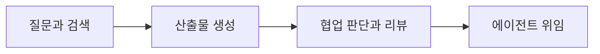

> AI 도입의 본질은 새로운 도구를 붙이는 일이 아니라, 조직이 더 빠르고 더 정확하게 고객 가치를 만드는 방식 자체를 바꾸는 일이다.



---

AI 도입을 논의하는 회의는 대개 비슷한 질문에서 출발한다. “경쟁사는 벌써 쓰고 있다는데, 우리는 언제 시작해야 하지?” 곧이어 도구 비교, 라이선스 예산, 교육 일정이 잡힌다. 여기까지는 쉽다. 진짜 어려운 건 그다음이다. 몇 달이 지나도 일하는 방식이 근본적으로 바뀌지 않거나, 일부만 쓰다 마는 일이 흔하다. 어느 순간 AI는 ‘혁신 프로젝트’가 아니라 ‘또 하나의 구독료’가 된다.

이 글이 다루는 문제는 “어떤 AI 도구를 선택할까”가 아니다. 더 근본적인 질문이다. 왜 어떤 조직은 AI를 도입하자마자 성과가 올라가는데, 어떤 조직은 같은 도구를 써도 아무 일도 일어나지 않는가? 차이는 기술이 아니라 구조에서 나온다. AI는 도구지만, 도구가 만드는 성과는 결국 사람의 행동이 만들어낸다. 행동은 구호로 바뀌지 않는다. 증거가 보일 때바뀌고, 보상이 정렬될 때지속된다.

그래서 AI 도입은 ‘교육’이나 ‘가이드’ 이전에, 측정과 인센티브, 심리적 안전, 최소 거버넌스가 결합된 조직 설계여야 한다.

---

## 1. 실패 패턴: 왜 많은 AI 도입이 효과 없이 끝나는가

AI 도입이 실패하는 이유는 “AI가 별로여서”가 아니라, 조직이 AI를 다루는 방식이 사람의 행동 원리를 거스르기 때문이다. 대부분의 실패는 도구 성능 문제가 아니라, 도입 방식이 현업을 ‘학습’이 아니라 ‘방어’로 몰아넣는 순간 발생한다.

가장 흔한 출발점은 전사 일괄 도입이다. “전원 사용” 선언은 빠른 실행처럼 보이지만, 구성원 입장에서는 통제와 감시로 해석되기 쉽다. 그러면 사람들은 성과를 내기보다 리스크를 줄이려 한다. 겉으로는 도구를 켜지만, 속으로는 기존 방식으로 돌아간다. 조직은 ‘사용률’이라는 허상을 보고 안심하고, 현업은 ‘형식적 준수’로 안전을 확보한다. 결과적으로 남는 것은 라이선스 비용과 “AI는 별 효과 없다”는 집단 기억이다.

두 번째 실패는 측정 없이 시작하는 도입이다. 초기에 “좋아질 것”이라는 기대는 공유되지만, 시간이 지나면 질문이 바뀐다. “그래서 무엇이 얼마나 좋아졌나?” 이 질문에 답할 수 없으면, AI는 전략이 아니라 취향이 되고 예산은 근거를 잃는다. 도입을 지지하던 사람도 방어적으로 변한다. 측정이 없는 도입은 시간이 지날수록 내부 설득 비용만 커지고, 마지막에는 ‘증명 불가능한 투자’로 정리된다.

세 번째는 지표를 잘못 잡는 경우다. 수량 KPI는 만들기 쉽고 설명하기도 쉽다. 하지만 커밋 수, 티켓 수 같은 지표는 사람들이 숫자를 올리는 방법을 찾게 만든다. 의미 없는 변경, 쪼개기, 남발이 발생한다. 조직은 데이터가 늘어났다고 생각하지만 고객 가치와 품질은 그대로거나 오히려 나빠진다. 이 순간 AI는 ‘성과를 올리는 도구’가 아니라 ‘성과를 꾸미는 도구’가 되고, 지표는 학습을 촉진하는 대신 조직을 왜곡시킨다.

네 번째는 개인 경쟁 구도다. “AI 활용 상위 그룹 보상”은 동기부여처럼 보이지만, 실제로는 노하우를 공유할 이유를 없앤다. 정보는 희소해지고, 잘하는 사람은 더 잘하게 되며, 다수는 따라오지 못한다. 조직은 ‘몇 명의 고수’라는 섬을 얻게 되지만, ‘전사의 생산성’이라는 대륙은 얻지 못한다.

이 네 가지 실패를 한 문장으로 요약하면 이렇다. 강제는 형식적 순응을 만들고, 측정 부재는 투자 근거를 없애며, 잘못된 KPI는 행동을 왜곡하고, 경쟁 구도는 학습을 고립시킨다. 
그래서 이 글은 도구 목록을 나열하지 않는다. 대신 성공하는 조직이 공통적으로 갖춘 구조—증거를 만드는 대시보드, 협력을 이득으로 만드는 보상, 불안을 낮추는 심리적 안전, 사고를 막는 최소 거버넌스—를 중심으로 AI 도입을 재설계한다.

---

## 2. 성공 원칙: “강제” 대신 “증거”, “경쟁” 대신 “협력”

AI 도입을 굴리는 힘은 지시가 아니라 관찰에서 나온다. 심리학에서 말하는 사회적 증거(social proof)와 기술적 규범(descriptive norm)때문이다. 사람은 “해야 한다”보다 “다른 사람들이 실제로 하고 있고, 그 결과가 좋다”를 볼 때 행동을 바꾼다. 조직이 해야 할 일은 “AI 쓰세요”를 반복하는 것이 아니라, AI를 잘 활용한 팀/개인의 성과와 과정이 눈에 보이게 만드는 것이다.

대시보드와 사례 공유는 단순한 홍보가 아니라, 구성원에게 “이게 지금 조직에서 통하는 방식”이라는 규범 신호를 보낸다. 특히 비교 기준이 ‘절대 목표’가 아니라 ‘비슷한 역할/비슷한 상황의 동료’일 때(준거집단 효과) 사람들은 더 쉽게 움직인다. “나도 저 정도는 할 수 있겠다”는 자기효능감이 생기기 때문이다.

하지만 증거만으로는 충분하지 않다. 조직이 진짜로 원하는 변화는 ‘몇 명의 고수’가 아니라 ‘집단 학습’인데, 집단 학습은 자동으로 발생하지 않는다. 행동경제학에서 공유는 전형적인 공공재(public goods)다. 모두가 혜택을 보지만, 기여는 개인에게 비용으로 느껴져서 무임승차(free-rider)가 생긴다. 그래서 “공유해 주세요” 같은 도덕적 요청은 오래 못 간다. 협력을 만들려면 선택 설계(Choice architecture)를 바꿔야 한다. 즉, 공유가 선의가 아니라 합리적 선택이 되게 만들어야 한다.

여기서 핵심은 인센티브를 ‘개인 경쟁’으로 설계하지 않는 것이다. “상위 10% 보상”은 단기적으로 동기를 주는 것처럼 보여도, 실제로는 상대평가가 만드는 방어 심리를 자극한다. 사람은 자신의 우위를 유지하려고 정보를 숨기고, 노하우는 사유화된다. 게다가 성과가 비슷한 사람끼리는 작은 격차에도 예민해져 협력이 깨진다(공정성 인식).

협력을 만들려면 보상은 “서열”이 아니라 “전파”를 기준으로 해야 한다. 내가 공유한 팁이 다른 사람에게 적용되어 효과가 확인될 때, 그 효과의 일부가 나에게 돌아오는 구조가 필요하다. 이때 사람들은 호혜성(reciprocity)에 의해 움직인다. “내가 준 만큼 돌아온다”는 감각이 생기면 지식은 교환되기 시작한다.

또 하나 중요한 장치는 즉시성이다. 사람은 미래의 큰 보상보다 지금의 작은 피드백에 더 잘 반응한다(현재편향). 그래서 공유에 대한 인정은 연말 평가의 한 줄이 아니라, 동료의 “적용했다/도움 됐다” 같은 빠른 피드백 루프로 설계되어야 한다. 작은 인정이 자주 반복되면 행동은 습관이 된다. 동시에, 자율성·유능감·관계성을 만족시키는 방향으로 설계해야 한다(자기결정성이론). “공유하라”가 아니라 “네가 발견한 걸 팀이 함께 쓰게 만들면 네 영향력이 커진다”로 메시지가 바뀌면, 공유는 통제가 아니라 정체성(나는 기여하는 사람)의 문제가 된다.

마지막으로, 협력은 ‘좋은 사람들’이 모이면 되는 게 아니라, 기본값(default)과 마찰(friction)을 어떻게 두느냐에 달려 있다. 공유가 번거롭고 성과 인정이 늦으면 누구도 꾸준히 하지 않는다. 반대로 공유 템플릿이 있고(마찰 감소), 팀 회의에 10~15분의 “이번 주 발견”이 기본값으로 들어가고(기본값 설계), 공유가 실제 적용과 연결되어 점수로 반영되면(인센티브 정렬), 조직은 노력하지 않아도 협력 쪽으로 굴러간다. 결국 “협력”은 문화가 아니라 설계의 결과다.

---

## 3. 도입 방식: 권한 부여와 역할별 활용 설계

AI를 도입할 때 가장 흔한 실수는 ‘도구의 평등한 배포’다. 모든 개발자에게 똑같은 Copilot 라이선스를 나눠주고 “알아서 잘 쓰라”고 하면, 시니어는 단순 반복 작업에만 쓰고 주니어는 코드를 복사해 붙여넣느라 바쁘다. 권한(Empowerment)은 도구 지급이 아니라, 그 도구로 무엇을 해결해야 하는지를 정의해줄 때 생긴다.

조직은 역할별로 ‘승리하는 시나리오’를 설계해야 한다. 가령 주니어에게 AI는 ‘24시간 멘토’가 되어야 한다. 모르는 에러 로그를 해석하고, 라이브러리 문서를 요약하며, 삽질 시간을 줄이는 것이 핵심 가치다. 반면 시니어에게 AI는 ‘설계 파트너’다. 복잡한 시스템 아키텍처의 허점을 찾거나, 레거시 코드를 리팩토링할 때의 사이드 이펙트를 예측하는 용도로 쓸 때 생산성이 폭발한다. QA는 테스트 케이스 작성 시간을 0에 가깝게 줄이는 것이 목표가 되어야 하고, PM/PO는 회의록 정리나 요구사항 명세 구체화에서 병목을 없애야 한다.

“그냥 쓰세요”가 아니라 “당신의 역할에서는 이 도구로 시간을 이렇게 아낄 수 있습니다”라는 구체적인 플레이북(Playbook)이 주어질 때, AI는 숙제가 아니라 무기가 된다. 중요한 것은 “AI를 쓰게 하는 것”이 아니라 “AI를 써서 이기게 하는 것”이다.

---

## 4. 성숙도 모델: 조직의 학습 경로 설계

AI 활용 능력은 하루아침에 생기지 않는다. 자전거를 배우듯 단계가 있다. 하지만 많은 조직이 이 단계를 무시하고 처음부터 “코딩 자동화”를 바란다. 걷지도 못하는데 뛰라고 하면 넘어지듯, 성숙도 모델 없이 고도화된 기능을 요구하면 조직은 AI를 포기하게 된다. 우리는 조직의 AI 성숙도를 4단계로 정의하고, 각 단계에 맞는 학습 목표를 제시해야 한다.

1단계는 ‘질문과 검색’이다. 구글링 대신 AI에게 물어보고 기본 개념을 잡는 단계다.  
2단계는 ‘산출물 생성’이다. 단위 테스트 코드, 문서 초안, 간단한 함수를 생성해 시키는 단계다. 여기서 생산성의 맛을 본다.  
3단계는 ‘협업 판단과 리뷰’다. AI가 짠 코드를 내가 리뷰하고, 내 코드를 AI에게 리뷰 맡기는 상호 검증 단계다. 이때부터 품질이 올라간다.  
4단계는 ‘에이전트 위임’이다. “이 기능을 구현해줘”라고 말하면 AI가 계획, 코딩, 테스트, 수정까지 수행하는 단계다.

이 성숙도 모델은 사람을 줄 세우기 위한 성적표가 아니다. 구성원이 “내가 지금 어디에 있고, 다음 단계로 가려면 무엇을 연습해야 하는지”를 보여주는 지도(Map)다. 지도가 있으면 길을 잃지 않고, 학습은 막연한 노력이 아니라 명확한 퀘스트가 된다.

---

## 5\. 성과 측정: “많이”가 아니라 “중요한 것을 잘”

“측정할 수 없으면 관리할 수 없다”는 말은 AI 도입에서도 유효하다. 하지만 “잘못 측정하면 망한다”는 말도 명심해야 한다. AI 도입 초기, 많은 조직이 ‘생성된 코드 라인 수’나 ‘AI 도구 사용 횟수’같은 지표를 본다. 이건 최악이다. 코드를 많이 만드는 게 목표가 되면 시스템은 비대해지고 유지보수 비용은 폭증한다. 사용 횟수에 집착하면 의미 없는 질문만 늘어난다.

올바른 성과 측정은 ‘속도’가 아니라 ‘가치’에 초점을 맞춰야 한다. 우리가 측정해야 할 것은 “얼마나 빨리 코드를 짰나”가 아니라, “고객에게 가치를 전달하는 리드 타임(Lead Time)이 얼마나 줄었나”다. 또한 “배포 후 발생한 장애율(Change Failure Rate)이 얼마나 낮아졌나”를 봐야 한다.

더 정교하게는 ‘고객 영향도’를 가중치로 둬야 한다. 보안 취약점을 AI로 빨리 잡았다면 높은 점수를, 단순 오탈자를 수정했다면 낮은 점수를 줘야 한다. 목표는 “AI로 일을 많이 하는 것”이 아니라, “AI로 중요한 문제를 더 빠르고 안전하게 해결하는 것”이다. 지표가 이렇게 설정되면, 조직은 자연스럽게 쓸데없는 코딩을 줄이고 핵심 문제 해결에 집중하게 된다.

---

## 6\. 대시보드: 상관관계를 조직의 언어로 만들기

데이터가 엑셀 파일 속에만 있으면 의미가 없다. AI 도입의 성패를 가르는 심장은 투명하게 공개된 대시보드다. 다만 대시보드는 경영진의 감시 도구가 되어서는 안 된다. 구성원을 위한 피드백 거울(Mirror)이어야 한다.

대시보드에는 세 가지가 한눈에 보여야 한다. 첫째, 나의 위치다. 내 생산성과 품질 지표가 어디쯤인지 객관적으로 인지해야 한다. 둘째, 상관관계다. 성과가 높은 그룹(Top Performer)의 AI 활용 패턴이 보여야 한다. “어? 저 팀은 AI 리뷰 기능을 많이 쓰는데 장애율이 0%네?” 같은 사실이 데이터로 보일 때, 사람들은 시키지 않아도 그 방식을 따라 한다. 셋째, 조직의 방향이다. 우리 조직 전체가 지금 1단계에서 2단계로 넘어가고 있다는 흐름이 보여야 한다.

이때 대시보드는 설득의 도구가 된다. 백 번의 말보다 “AI를 잘 쓰는 동료가 퇴근도 빠르고 성과도 더 잘 나더라”는 데이터 하나가 더 강력하다. 조직은 데이터를 통해 ‘감’이 아닌 ‘증거’로 소통하고, 학습의 방향을 스스로 교정하게 된다.

---

## 7\. 공유 보상: 노하우를 ‘성과’로 만드는 설계

지식 노동의 세계에서 ‘노하우’는 곧 권력이다. 그래서 본능적으로 나만 알고 싶어 한다. 이 본능을 거스르려면, “공유하는 것이 숨기는 것보다 더 이득이 되는 구조”를 만들어야 한다. 단순히 “공유합시다”라는 캠페인으로는 턱도 없다.

공유를 ‘지식 자산’으로 인정해주는 시스템이 필요하다. 내가 올린 프롬프트 팁을 동료가 사용해 시간을 절약했다면, 그 절약된 가치의 일부를 내 성과로 인정해줘야 한다. 사내 위키에 올린 AI 가이드가 널리 읽히고 팀의 표준 프로세스로 채택된다면, 이는 코드를 짜는 것만큼이나 중요한 기여로 평가받아야 한다.

이런 구조가 잡히면 노하우 공유는 ‘봉사 활동’이 아니라 ‘가장 효율적인 성과 창출 수단’이 된다. “나만 알아야지”라는 생각은 “이걸 공유해서 내 영향력을 키워야지”로 바뀐다. 조직 전체가 거대한 지식 생산 공장이 되는 순간이다. 협력 문화는 착한 마음이 아니라 영리한 보상 설계에서 나온다.

---

## 8\. 심리적 안전: AI가 두려움이 되는 순간 혁신은 멈춘다

AI 도입에 대한 저항은 “귀찮아서”보다 “불안해서”에서 나온다. 특히 “AI를 못 쓰면 내가 밀려나는 건가”, “이게 결국 해고의 근거가 되는 건가” 같은 걱정이 조직에 퍼지면 사람들은 학습하기보다 방어적으로 움직인다. 방어는 실험을 줄이고, 실험이 줄면 학습도 멈춘다. 그래서 조직은 심리적 안전장치를 먼저 세워야 한다.

여기서 중요한 선언은 단순한 위로가 아니라 운영 원칙이다. AI 사용 여부 자체는 해고나 불이익의 근거로 사용하지 않는다.일정 기간은 학습 기간으로 두고, 도구를 익히는 과정에서 생긴 실수는 비난보다 성장의 재료로 다룬다. 또한 시니어가 느끼는 “내 경험이 무의미해지나”라는 불안도 정면으로 다뤄야 한다. 도메인 지식, 아키텍처 판단, 리뷰 역량은 AI가 완전히 대체하기 어렵고, AI는 그 능력을 더 빠르고 더 정확하게 발휘하도록 돕는 증폭 장치에 가깝다.

다만 동시에 조직은 또 하나를 명확히 해야 한다. AI를 쓰느냐 마느냐가 아니라, 결과로 만들어낸 퍼포먼스에 대한 평가는 기존과 동일하게 유지된다는 점이다. 즉 “AI를 안 썼으니 괜찮다”가 아니라, 기존과 같은 기준으로 고객 가치, 품질, 협업 기여를 평가하고 그에 따른 보상·승진·조정은 계속 이루어진다. 조직이 보장하는 것은 ‘AI 사용 강제 없음’이지 ‘성과 책임의 면제’가 아니다. 이 균형이 있을 때 구성원은 안전하게 실험하면서도, 성과를 내는 방향으로 학습을 이어갈 수 있다.

---

## 9\. 최소 거버넌스: 적게, 하지만 명확하게

모든 기술 도입에는 브레이크가 필요하다. 하지만 브레이크의 목적은 차를 멈추기 위함이 아니라 더 빨리 달리기 위함이다. 안전하다는 확신이 있어야 엑셀을 밟을 수 있기 때문이다. AI 거버넌스도 마찬가지다. 규제가 너무 많으면 아무도 안 쓰고, 없으면 대형 사고가 터진다. 그래서 ‘최소한의 안전장치(Minimum Viable Governance)’가 필요하다.

우리는 딱 세 가지만 지키면 된다.  
첫째, 민감 데이터 격리다. 개인정보, 인증키, 미공개 핵심 기술은 절대 외부 AI에 입력하지 않는다. 이는 툴 레벨에서 차단하거나 필터링해야 한다.  
둘째, Human-in-the-loop(인간 개입)다. AI가 생성한 결과물(특히 코드와 문서)은 반드시 사람의 검토를 거쳐야 배포될 수 있다. “AI가 짰어요”는 면죄부가 될 수 없으며, 최종 책임은 항상 리뷰어에게 있다.  
셋째, 블라인드 신뢰 금지다. AI의 출력은 언제나 틀릴 수 있다는 전제하에 교차 검증해야 한다.

이 세 가지 가드레일만 명확하다면, 그 울타리 안에서는 마음껏 뛰어놀게 해야 한다. 모호한 규제는 위축을 부르지만, 명확한 안전장치는 속도를 만든다.

---

## 10\. 실행 단계: 검증에서 정교화까지

성공적인 AI 도입은 “오늘부터 시작!” 하고 선포하는 이벤트가 아니다. 생물처럼 자라나는 진화 과정이다. 우리는 이를 검증(Verify) → 확산(Spread) → 내재화(Embed)의 3단계로 접근해야 한다.

1.  검증 단계(The Pilot): 전체 도입은 위험하다. 변화에 열려 있는 얼리어답터 팀 하나를 선정해 집중 지원한다. 목표는 “AI로 성과가 난다”는 확실한 성공 사례 하나를 만드는 것이다. 이 작은 승리가 전체 확산의 불씨가 된다.
    
2.  확산 단계(The Rollover): 파일럿 팀의 성공 사례를 바탕으로 역할별 플레이북을 만들고 교육을 시작한다. 이때 대시보드를 오픈해 데이터를 보여주면, 관망하던 다수(Early Majority)가 움직이기 시작한다.
    
3.  내재화 단계(The Standard): AI 활용이 특별한 이벤트가 아니라 일상이 되는 단계다. 온보딩 프로세스에 AI 교육이 포함되고, 평가 시스템에 AI 활용 역량이 반영된다.
    

중요한 것은 단계를 건너뛰지 않는 것이다. 검증되지 않은 채 확산하면 혼란만 커지고, 확산되지 않은 채 내재화하려 하면 반발만 산다. 속도보다 중요한 것은 흔들리지 않는 방향성이다. “도입했는가?”를 묻지 말고 “증거가 쌓이고 있는가?”를 물어야 한다.

---

## 맺으며: 리더십의 역할은 ‘환경 조성’이다

AI 도입 프로젝트에서 리더의 역할은 지휘관이 아니라 정원사(Gardener)에 가깝다. 식물을 억지로 잡아당겨서 키울 수 없듯, 구성원에게 “AI를 써라”고 강요해서 성과를 낼 수는 없다. 리더가 해야 할 일은 토양을 만드는 것이다.

사용하기 편한 도구를 쥐여주고(인프라), 어떻게 쓰는지 알려주며(교육), 잘 쓴 사람에게 햇빛을 비춰주고(보상), 잡초나 해충 걱정 없이 자라도록 울타리를 쳐주는 것(안전). 이 환경만 조성되면 조직은 스스로 학습하고 진화한다.

AI는 단순한 자동화 도구가 아니다. 조직의 학습 프로세스를 송두리째 바꿀 수 있는 촉매다. 이 변화를 비용으로 만들지, 아니면 압도적인 경쟁 우위로 만들지는 전적으로 조직 설계에 달려 있다. 이제 질문을 바꾸자. “어떤 AI를 살까?”가 아니라, “어떤 조직을 만들까?”로.
