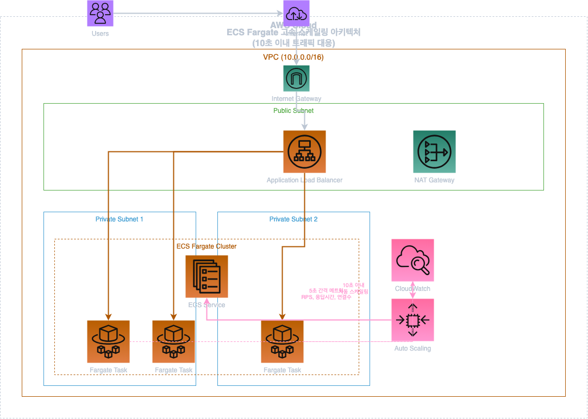



바이브 코딩을 할 때, 사람들은 종종 코드만으로 충분하다고 생각한다. 하지만 현실은 다르다. 문서화 없는 코드는 마치 지도 없이 떠나는 여행과 같다. 목적지가 어딘지, 가는 길이 어떤지 알 수 없다면, 누구도 함께하지 않을 것이다. 바이브 코딩에서 문서화가 특히 중요한 이유는 코드가 단지 작동하기 위한 것이 아니라, 아이디어와 설계의 의도를 다른 사람과 정확히 공유하기 위한 것이기 때문이다. 문서화는 협업을 매끄럽게 하고, 프로젝트의 방향성을 명확히 하며, 나아가 지속 가능한 개발 환경을 구축하는 토대가 된다.

나는 문서화 작업을 코드와 함께 관리하는 방식을 적극 추천한다. 특히 마크다운과 mermaid를 사용하면 간단하고 명확한 다이어그램을 빠르게 작성할 수 있다. 복잡한 구조와 흐름을 긴 말 대신 다이어그램 하나로 나타낼 수 있기에 의사소통이 훨씬 효과적으로 이루어진다.

물론 때때로 mermaid만으로는 부족할 때가 있다. 더 정교하고 복잡한 다이어그램이 필요할 때는 draw.io를 이용할 수 있다. draw.io는 XML 기반의 .drawio 파일 포맷을 사용하기 때문에 AI에게 직접 이 포맷으로 다이어그램을 생성하라고 지시하면 비교적 쉽게 작업이 가능하다. 다만, AWS 아이콘과 같은 특정 아이콘의 ID는 공개되어 있지 않아서 AI가 그대로 활용하기가 쉽지 않다.

그래서 나는 draw.io 클라이언트에서 AWS 아키텍처 아이콘의 ID를 직접 추출해서 별도로 [문서화](https://github.com/serithemage/ecs-fargate-fast-scaleout/blob/main/docs/aws-2025-icons-drawio.md)했다. 이를 통해 AI에게 아이콘 ID를 알려줘서 원하는 아이콘을 정확히 활용할 수 있도록 한 것이다. 이 문서는 다음 깃허브 리포지토리에서 실제 작업한 예제를 통해 확인할 수 있다.

https://github.com/serithemage/ecs-fargate-fast-scaleout/

이렇게 생성된 다이어그램은 VS Code의 drawio preview 확장 기능을 이용하면 편리하게 미리 볼 수 있다. 또한 draw.io 클라이언트를 설치하면 함께 제공되는 CLI 도구로 손쉽게 svg나 png 형태의 이미지로 컨버트하여 문서에 삽입할 수도 있다.

한편, 최근 mermaid의 최신 버전에서는 AWS 아이콘을 비롯해 다양한 아키텍처 아이콘을 기본 지원하기 시작했다. 공식 문서(https://mermaid.js.org/syntax/architecture.html)를 참고하면 바로 활용이 가능하다. 하지만 아직 GitHub에서 이 최신 기능을 지원하는 버전의 mermaid가 제공되지 않는다면, 앞서 내가 설명한 방식이 당분간 가장 유용한 접근법이 될 것이다.

```mermaid
architecture-beta
    group api(logos:aws-lambda)[API]

    service db(logos:aws-aurora)[Database] in api
    service disk1(logos:aws-glacier)[Storage] in api
    service disk2(logos:aws-s3)[Storage] in api
    service server(logos:aws-ec2)[Server] in api

    db:L -- R:server
    disk1:T -- B:server
    disk2:T -- B:db
```

좋은 문서는 단지 설명서를 넘어서, 협업의 질을 높이고 장기적으로 프로젝트의 가치를 지속시킨다. 바이브 코딩에서 문서화는 선택이 아닌 필수다.
