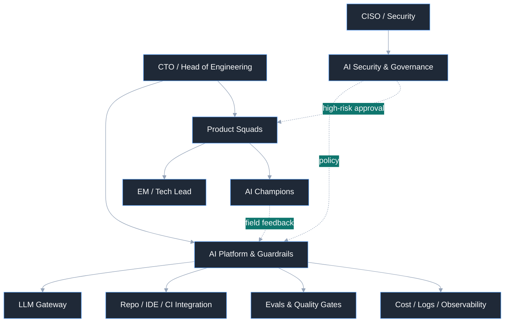
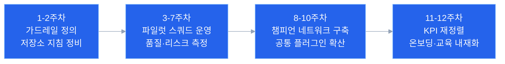

> 바이브 코딩의 성패는 AI가 만든 변경을 팀이 반복 가능하고 안전한 방식으로 검증하고 배포할 수 있게 만드는 조직 설계에 달려 있다.



많은 조직이 바이브 코딩을 "개발자가 코드를 더 빨리 만드는 방식" 정도로 이해한다. 그래서 도입 논의도 대개 도구 도입에서 시작한다. 하지만 실제 현장에서 성패를 가르는 것은 도구나 모델의 성능보다 조직의 구조다.

바이브 코딩은 자동완성이 아니라 업무 방식의 재설계에 가깝다. 조직 구성원 한 사람 한 사람이 더 넓은 영역을 커버하고, 팀 사이의 핸드오프와 커뮤니케이션 비용을 줄일 수 있을 때 생산성이 커진다. 그렇다고 목표가 인원 축소인 것은 아니다. 핵심은 같은 조직이 더 많은 것을 더 빠르게, 그리고 더 안전하게 전달하도록 만드는 데 있다. 그러려면 요구사항을 어떻게 분해할지, 어떤 변경은 AI에 맡기고 어떤 변경은 사람이 직접 판단할지, 어떤 테스트와 승인 절차를 통과해야 배포할지를 설계해야 한다. 그 설계가 없으면 AI는 생산성을 높이기보다 혼란을 키운다.

이 글은 OpenClaw 사례와 최근 엔터프라이즈 AI 도입 흐름에서 공통적으로 드러난 교훈을 바탕으로, 바이브 코딩을 실제 제품 개발 조직에 안착시키기 위한 조직 설계 원칙을 정리한 것이다.

## 코드를 덜 쓰는 것이 아니라, 코드를 생성하는 시스템을 설계하는 것

바이브 코딩 환경에서 인간의 역할이 사라지는 것은 아니다. 역할의 중심이 바뀔 뿐이다. 직접 코드를 타이핑하는 시간은 줄어들고, 대신 다음 활동의 비중이 커진다.

- 작업을 작은 단위로 분해하기
- 에이전트가 따라야 할 제약과 규칙을 문서화하기
- 승인 정책과 차단 임계값을 설계하기
- 테스트, 리뷰, 배포 게이트를 자동화하기
- 사고와 실패를 다시 지침과 규칙으로 환원하기

이 변화는 개발자 개인의 프롬프팅 스킬만으로 감당되지 않는다. 조직 차원의 운영 계약이 필요하다. 예를 들어 저장소마다 `CLAUDE.md/AGENTS.md` 같은 에이전트 지침 파일을 두고, 빌드 방법, 테스트 명령, 금지 영역, 리뷰 기준, 보안 경계를 기계가 읽을 수 있게 유지하는 일은 이제 선택이 아니라 기본기에 가깝다.

결국 중요한 질문은 "우리 조직은 AI가 만들어낸 변경을 어떤 규율과 어떤 책임 구조 안에서 다룰 것인가"이다.

## 저장소 지침만으로는 부족하다. 전사 공용 플러그인 시스템이 필요하다

저장소 단위의 `AGENTS.md`는 로컬 맥락을 고정하는 데 유용하다. 하지만 조직 도입은 여기서 끝나지 않는다. 팀마다 프롬프트와 도구 연결을 제각각 복사해 쓰기 시작하면 같은 업무를 여러 번 정의하게 되고, 권한 통제는 흩어지며, 좋은 워크플로는 몇몇 개인의 노하우로만 남는다.

그래서 조직 차원의 바이브 코딩에는 공용 플러그인 시스템이 필요하다. 여기서 플러그인은 단순한 프롬프트 모음이 아니라, 특정 역할이나 업무에 필요한 메모리(규칙), 스킬, 훅, 커넥터, 승인 조건을 하나의 배포 단위로 묶은 운영 패키지다. 다시 말해 공통 스킬은 독립 배포물이 아니라 공통 플러그인의 일부이며, 실제 가드레일은 플러그인 안의 규칙, 실행 스킬, 자동 호출 훅이 함께 작동할 때 비로소 강제된다. Anthropic이 2026년 2월 24일 발표한 Claude Cowork 업데이트도 같은 방향을 보여준다. 관리자는 사내 전용 플러그인 마켓플레이스를 만들고, 승인된 커넥터를 번들링하고, 비공개 GitHub 저장소를 플러그인 소스로 연결하고, 팀 또는 사용자 단위로 자동 설치와 접근을 제어할 수 있게 됐다.[^1]

개인의 프롬프트는 개인 생산성을 높인다. 공용 플러그인은 조직의 일관성을 만든다. 중요한 운영 단위는 "누가 잘 쓰느냐"가 아니라 "누가 써도 같은 경계와 품질 기준이 적용되느냐"여야 한다.

조직 차원의 플러그인 시스템은 최소한 다음을 해야 한다.

- 검증된 워크플로를 재사용 가능한 형태로 배포하기
- 승인된 커넥터와 데이터 접근 범위를 중앙에서 통제하기
- 팀별 맥락 차이를 플러그인 버전과 설정으로 흡수하기
- 사용량, 비용, 도구 호출을 관측해 어떤 자동화가 실제로 효과적인지 측정하기

결국 저장소 지침은 "이 코드베이스에서 어떻게 일할지"를 정의하고, 공용 플러그인은 "우리 조직에서 AI가 어떤 방식으로 일할지"를 정의한다. 전자가 로컬 운영 계약이라면, 후자는 조직 공통 운영 제품이다.

## 왜 많은 AI 도입이 생각만큼 효과를 내지 못하는가

바이브 코딩 도입이 기대만큼 효과를 내지 못하는 이유는 대개 비슷하다. 생성 속도만 보고 통제 구조를 나중에 붙이기 때문이다. 초반에는 다들 빠르다고 느낀다. PR이 빨리 올라오고, 문서 초안도 순식간에 생기고, 테스트 코드도 이전보다 쉽게 만들어진다. 그런데 몇 달이 지나면 리뷰 피로도가 올라가고, 누가 무엇을 책임지는지 흐려지며, 운영 안정성이 흔들리기 시작한다.

이런 현상은 이상한 일이 아니다. 엔지니어링 기본기가 약한 조직일수록 AI는 속도를 높이기 전에 노이즈를 먼저 키운다. 작은 배치로 자주 배포하는 습관이 없고, 테스트 신뢰도가 낮고, 코드리뷰 기준이 흐릿한 상태라면, AI는 병목을 해결하는 대신 병목에 더 많은 변경을 밀어 넣는다.

그래서 바이브 코딩 도입은 생산성 프로젝트가 아니라 운영 설계 프로젝트로 다뤄야 한다. 속도는 결과이지 출발점이 아니다. 먼저 답해야 할 질문은 다음 네 가지다.

- 어떤 변경은 AI가 자율적으로 수행해도 되는가
- 어떤 변경은 반드시 인간 승인을 거쳐야 하는가
- 어떤 증적이 있어야 리뷰어가 안심하고 승인할 수 있는가
- 실패에서 얻은 교훈을 어디에 축적할 것인가

이 질문에 답하지 못한 채 도구만 배포하면, 조직은 곧 "AI를 쓰긴 쓰는데 더 피곤해졌다"는 상태에 도달한다.

## 권장 조직 모델: 중앙 플랫폼 + 현장 챔피언 + 최종 오너십

대부분의 조직에 가장 현실적인 답은 하이브리드 모델이다. 중앙 플랫폼 팀만 모든 것을 통제하는 방식은 병목이 되고, 각 제품팀이 제각각 도구를 쓰는 방식은 빠르게 파편화된다.

하이브리드 모델은 세 층으로 구성된다.

첫째, 중앙의 AI 플랫폼·가드레일 팀이 공통 인프라를 제공한다. 모델 라우팅, 접근 제어, 공용 플러그인 마켓플레이스, 승인된 커넥터, 공통 프롬프트·스킬 템플릿, 저장소 통합, 로그와 비용 관측, 정책 자동화 같은 기반 기능은 여기서 맡아야 한다.

둘째, 각 제품 스쿼드에는 AI 챔피언 혹은 AI 스페셜리스트를 둔다. 이 역할은 도구를 대신 써주는 사람이 아니라, 팀의 실제 업무 흐름에 맞게 지침과 플러그인을 다듬고, 어떤 작업을 AI에 위임할지 판단하고, 실패 패턴을 플랫폼 팀에 되돌려주는 연결점이다.

셋째, 최종 책임은 여전히 제품팀이 진다. AI가 코드를 만들었다고 해서 운영 책임이 플랫폼 팀으로 넘어가면 안 된다. 서비스 장애, 보안 이슈, 품질 문제의 최종 오너는 그 서비스를 운영하는 팀이어야 한다.

이 구조를 간단히 그리면 다음과 같다.

핵심은 명확하다. 표준화와 공용 배포는 중앙에서, 맥락 반영은 현장에서, 책임은 제품팀에서 맡는다.

## 표준 운영 모델은 Research → Plan → Implement → Auto Review → Monitor 여야 한다

바이브 코딩을 잘하는 팀은 곧바로 구현부터 시작하지 않는다. 먼저 조사하고, 딥 인터뷰로 모호성을 줄이고, 계획한 뒤 구현한다. 이 순서를 강제해야 초기 오해 비용을 줄일 수 있다.

권장하는 기본 흐름은 다음과 같다.

1. 요구사항이나 이슈를 접수한다.
2. 기존 코드와 제약조건을 조사한다.
3. 조사와 계획 단계에서 회사 공통 또는 팀 공통 플러그인에 포함된 딥 인터뷰 스킬을 실행하고, 플러그인 훅으로 이를 항상 먼저 호출해 요구사항, 승인 경계, 데이터 접근, 예외 조건을 확인한다.
4. 딥 인터뷰 결과를 바탕으로 변경 계획을 문서화한다.
5. 구현과 테스트를 진행한다.
6. 정적 검사, 보안 스캔, 테스트, AI 리뷰를 자동으로 수행한다.
7. 게이트를 통과하면 자동 머지 혹은 직접 커밋 경로로 반영한다.
8. 배포 후 운영 지표와 이상 신호를 자동으로 모니터링한다.
9. 사고와 예외를 다시 지침 파일과 게이트 규칙에 반영한다.

여기서 딥 인터뷰는 선택적 체크리스트가 아니다. 조직 공통 또는 팀 공통 플러그인 안에 메모리(규칙), 스킬, 훅의 형태로 포함되어 조사와 계획 단계에서 항상 먼저 호출돼야 한다. 그래야 저장소별 로컬 지침과 별개로 회사 차원의 보안, 승인, 책임 분리 가드레일이 매번 같은 방식으로 적용된다. 즉 인터뷰 자체가 운영 정책의 실행 표면이고, 플러그인 훅은 그 정책이 빠지지 않게 강제하는 장치여야 한다.

여기서 중요한 것은 3단계와 4단계다. 계획 문서에는 최소한 다음이 들어가야 한다.

- 어떤 파일이 바뀌는가
- 변경 의도는 무엇인가
- 딥 인터뷰에서 확인한 공통 가드레일과 예외 승인 조건은 무엇인가
- 어떤 테스트로 검증할 것인가
- 실패 시 어떻게 롤백할 것인가
- 보안이나 데이터 접근에 영향이 있는가

이 딥 인터뷰와 계획 문서화 과정을 생략하면 구현은 빨라 보여도 리뷰가 느려지고, 결국 전체 리드타임은 다시 늘어난다. 반대로 초기 질문과 계획이 선명하면 AI는 훨씬 유용한 실행 엔진이 된다.

## Human-in-the-Loop는 기본값이 아니라 예외 처리 경로여야 한다

여기서 중요한 전환이 하나 있다. 바이브 코딩 조직에서는 사람이 기본 경로의 매 단계에 개입하면 안 된다. 코드 생성만 자동화하고 리뷰는 여전히 사람이 모두 읽는 구조라면, 병목은 뒤로 밀릴 뿐이다. 속도는 생성 단계에서 올라가고 리뷰 단계에서 다시 무너진다.

이런 환경에서는 PR 사이클 타임이나 리뷰 참여율 같은 전통 지표도 핵심 KPI가 되기 어렵다. PR이 대부분 셀프 머지되거나 봇 코멘트가 중심이 되면, "리뷰가 존재한다"는 사실 자체가 품질 보장의 증거가 아니기 때문이다. 필요한 것은 더 많은 사람 리뷰가 아니라 더 좋은 자동 품질 관문이다.

즉 기본 경로는 Human-in-the-Loop보다 Machine-in-the-Loop에 더 가까워야 한다. 이상적인 흐름은 다음과 같다.

- 커밋 또는 변경안 생성
- 린트, 타입체크, 테스트, 시크릿 스캔, SAST 자동 실행
- LLM 기반 코드 리뷰 자동 실행
- 다중 모델 합의 혹은 규칙 기반 스코어 임계치 판정
- 통과 시 자동 머지 또는 직접 반영
- 배포 후 이상 신호 자동 감시

사람은 이 흐름에 매번 들어오지 않는다. 사람은 임계치를 설계하고, 예외를 처리하고, 모델 이견이 크거나 보안 위험이 높은 경우에만 개입한다. 다시 말해 사람의 역할은 "모든 코드를 직접 읽는 리뷰어"보다 "자동화된 검증 시스템의 설계자이자 에스컬레이션 담당자"에 가깝다.

물론 예외 경계는 필요하다. 예를 들어 다음 영역은 여전히 사람 승인이 개입할 수 있다.

- 인증과 권한
- 결제와 정산
- 개인정보 처리
- 데이터베이스 스키마 변경
- 외부 시스템 권한 연동
- 인프라 보안 설정

여기서도 목표는 전수 수동 리뷰가 아니다. 사람은 가드레일 설정에 집중하고, 검증은 자동으로 돌려야 한다. 그래야 코드 생성과 리뷰를 함께 자동화할 수 있다.

## 운영 지표는 PR 중심이 아니라 자동화된 품질 관문 중심이어야 한다

이 지점에서 운영 지표의 관점도 바뀌어야 한다. 바이브 코딩 조직에서 여전히 PR 리뷰 시간, 리뷰 참여율, 머지율 같은 지표를 핵심 KPI로 두면 측정 체계가 현실을 왜곡하기 시작한다. 이런 지표들은 직접 커밋과 자동 리뷰가 보편화된 조직에서는 쉽게 오염되거나 폐기 대상이 된다.

따라서 운영 지표는 사람 협업의 흔적보다 자동화 시스템이 품질을 얼마나 잘 지키고 있는지를 중심으로 설계해야 한다.

첫째, 팀 수준의 딜리버리 추이다. 중요한 것은 개인별 LOC 경쟁이 아니라, 팀 전체가 전환 전후에 얼마나 안정적으로 변경을 생산하고 있는지다. 코드 변경량은 개인 평가 지표가 아니라 팀 수준의 추세 지표로만 써야 한다.

둘째, 팀 엔지니어링 건강도다. 커밋 세분성, 작업 영역 집중도, 삭제 비율, 메시지 규율 같은 신호를 묶어 엔지니어링 프랙티스를 추적하면, PR이 없어도 품질 저하를 꽤 일찍 포착할 수 있다. 특히 삭제 비율 저하는 AI가 생성한 코드를 정리 없이 계속 누적하고 있다는 신호가 될 수 있다.

셋째, 자동 리뷰 시스템의 성능이다. 예를 들면 AI 게이트 차단율, 반복적으로 걸리는 실패 유형, 보안 스캔 적발률, 테스트 누락 탐지율, 모델 간 이견 비율 같은 지표다. 특히 다중 모델 합의를 쓰는 경우에는 평균 점수보다 표준편차가 더 중요할 때가 있다. 모델 간 이견이 큰 변경은 사람이 개입해야 하는 후보이기 때문이다.

넷째, 배포 이후의 서비스 건강도다. Change Failure Rate, MTTR, 롤백 비율, 사용자 영향 장애 수는 여전히 중요하다. 리뷰가 자동화되더라도 운영에서 문제가 늘어난다면 그 자동화는 실패한 것이다.

다섯째, 지식 집중과 업무 패턴의 이상 신호다. 특정 소수에게 변경이 과도하게 몰리는지, 팀의 활동 패턴이 흔들리는지, 품질 게이트 실패가 특정 영역에 집중되는지를 보면 조직 리스크를 사람보다 먼저 감지할 수 있다. 지식 분산도나 이상치 기반 모니터링은 이 맥락에서 유용하다.

정리하면 바이브 코딩 조직의 KPI는 이제 "사람이 얼마나 열심히 리뷰했는가"가 아니다. "자동화된 품질 관문이 얼마나 정확하게 문제를 걸러내고, 팀이 얼마나 안정적으로 고객 가치를 배포하고 있는가"다.

## 자동 리뷰는 블랙박스가 아니라 근거를 가진 자동화여야 한다

리뷰를 자동화한다고 해서 검증 로직이 불투명해져서는 안 된다. 자동 리뷰 시스템은 최소한 다음 원칙을 따라야 한다.

- AI 리뷰 결과는 차단 사유와 근거를 함께 남길 것
- 중요한 판단의 경우 복수의 모델이 투표를 통해 추가적인 안정성을 확보하고 만약 모델 간 이견이 크면 자동 승인 대신 에스컬레이션할 것
- 점수만 보여주지 말고 어떤 파일, 어떤 패턴, 어떤 테스트 누락이 문제인지 드러낼 것
- 이상 신호는 개인 처벌보다 시스템 개선의 입력으로 사용할 것

자동화의 목표는 사람을 배제하는 것이 아니라, 사람이 정말 필요한 순간에만 개입하도록 만드는 것이다. 그러려면 자동 리뷰는 침묵하는 블랙박스가 아니라, 기계도 읽고 사람도 이해할 수 있는 증적 시스템이어야 한다.

## 도입 로드맵은 작게 시작하고, 운영체계부터 굳혀야 한다

전사 일괄 도입은 거의 항상 실패한다. 먼저 작은 팀 하나에서 검증해야 한다. 가장 좋은 파일럿 대상은 변화에 열려 있고, 동시에 운영 책임도 분명한 제품팀이다.

현실적인 3개월 로드맵은 대체로 이런 순서를 따른다.

이 과정에서 지켜야 할 원칙은 분명하다. 플랫폼을 완벽하게 만들 때까지 기다리지 말 것, 반대로 현업 팀에 실험 비용을 모두 떠넘기지도 말 것, 그리고 성공 기준과 중단 기준을 미리 정해둘 것.

예를 들어 파일럿 8주 뒤에는 다음 세 가지를 확인할 수 있어야 한다.

- AI 게이트 차단율과 반복 실패 유형이 안정화되고 있는가
- 변경 실패율이 악화되지 않았는가
- 팀이 스스로 지침과 자동화 규칙을 업데이트하기 시작했는가

이 세 가지가 보이지 않는다면, 도구 확산보다 운영 설계 보완이 먼저다.

## 결국 필요한 것은 AI 팀이 아니라 AI 네이티브 운영체계다

바이브 코딩 시대에 필요한 것은 "AI를 잘 쓰는 몇 명의 스타 플레이어"가 아니다. 누구나 일정 수준 이상으로 안전하게 AI를 활용할 수 있게 만드는 운영체계다. 중앙 플랫폼은 표준과 가드레일, 공용 플러그인 시스템을 제공하고, 현장의 챔피언은 맥락을 번역하며, 제품팀은 끝까지 책임진다. 이 세 가지가 맞물릴 때 비로소 바이브 코딩은 일시적인 유행이 아니라 조직 역량이 된다.

정리하면, 바이브 코딩 도입의 핵심은 개발자를 AI로 대체하는 것이 아니다. 코드 작성과 검증, 배포를 둘러싼 조직의 인터페이스를 다시 설계하는 일이다. 저장소 지침은 로컬 규율을 만들고, 공용 플러그인 시스템은 조직 전체의 재사용성과 통제를 만든다. 필요한 것은 막연한 속도 경쟁이 아니라, 더 명확한 책임, 더 좋은 증적, 더 강한 운영 규율이다.

AI는 코드를 만들 수 있다. 하지만 그 코드를 조직의 성과로 바꾸는 것은 여전히 조직 설계의 몫이다.

## 용어 정리

이 글에서 쓰는 몇몇 용어는 제품마다 이름이 조금씩 다르다. 아래 링크는 각 개념을 가장 직접적으로 설명하는 공식 문서다.

- `AGENTS.md`: OpenAI Codex에서 저장소나 하위 디렉터리에 두는 작업 지침 파일이다. 에이전트가 어떤 규칙, 명령, 제약을 따라야 하는지 전달한다. 공식 문서: [Custom instructions with AGENTS.md](https://developers.openai.com/codex/guides/agents-md)
- `CLAUDE.md` / 메모리(규칙): Claude Code에서 조직, 프로젝트, 사용자 수준의 지속 규칙을 계층적으로 불러오는 메모리 파일이다. 회사 공통 규칙을 전역 정책으로, 팀 규칙을 프로젝트 메모리로 배포할 수 있다. 공식 문서: [How Claude remembers your project](https://docs.claude.com/en/docs/claude-code/memory)
- `공통 플러그인`: 조직이 공통 규칙과 자동화를 묶어 배포하는 단위다. 이 글에서는 메모리, 스킬, 훅, MCP/커넥터 설정을 함께 싣는 운영 패키지를 뜻한다. 공식 문서: [Plugins](https://docs.claude.com/en/docs/claude-code/plugins), [Plugins reference](https://docs.claude.com/en/docs/claude-code/plugins-reference)
- `스킬`: 반복 가능한 작업 방식을 재사용 가능한 형태로 정의한 실행 단위다. 플러그인 안에 포함될 수도 있고, 프로젝트나 조직 레벨에 직접 배치될 수도 있다. 공식 문서: [Agent Skills](https://docs.claude.com/en/docs/claude-code/skills), [Agent Skills for Codex](https://developers.openai.com/codex/skills)
- `훅`: 세션 시작, 지침 로드, 도구 실행 전후 같은 이벤트에 자동으로 붙는 정책·검증 장치다. 위험한 명령 차단, 딥 인터뷰 선행 강제, 후속 검증 자동화에 쓸 수 있다. 공식 문서: [Hooks reference](https://docs.claude.com/en/docs/claude-code/hooks)
- `MCP` / 커넥터: 모델이 외부 도구와 데이터 문맥에 접근하는 표준 연결 계층이다. 제품 UI에서는 커넥터로 보이고, 개발 런타임에서는 MCP 서버로 드러나는 경우가 많다. 공식 문서: [Model Context Protocol](https://developers.openai.com/codex/mcp), [Get started with custom connectors using remote MCP](https://support.claude.com/en/articles/11175166-get-started-with-custom-connectors-using-remote-mcp)
- `딥 인터뷰`: 본 글에서 말하는 딥 인터뷰는 특정 벤더의 고유 제품명이 아니라, 조사·계획 단계에서 요구사항 모호성, 승인 경계, 데이터 접근, 예외 처리를 구조화해 확인하는 조직 운영 패턴이다. 실제 구현은 보통 메모리, 스킬, 훅을 조합해 만든다. 구현 기반 공식 문서: [How Claude remembers your project](https://docs.claude.com/en/docs/claude-code/memory), [Agent Skills](https://docs.claude.com/en/docs/claude-code/skills), [Hooks reference](https://docs.claude.com/en/docs/claude-code/hooks)

[^1]: Anthropic, "Cowork and plugins for teams across the enterprise" (February 24, 2026): https://claude.com/blog/cowork-plugins-across-enterprise
