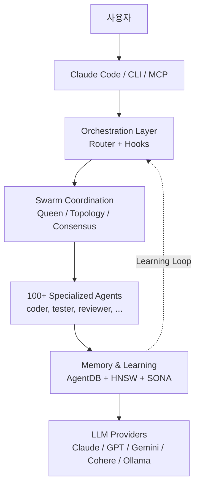
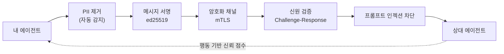

> 단일 프로젝트를 넘어 팀의 통찰을 학습하는 Claude Code 워크플로 설계법.



---

Claude Code를 한 달만 써보면 한계가 명확해진다. 컨텍스트는 세션과 함께 사라지고, 작업을 분해하고 다시 합치는 일은 결국 사람 몫이다. 더 큰 문제는 프로젝트가 여러 개가 되고 개발자가 여러 명이 되는 순간 드러난다. A 프로젝트에서 얻은 테스트 전략, B 개발자가 발견한 리팩터링 패턴, C 저장소에서 검증된 아키텍처 판단이 서로에게 잘 흘러가지 않는다. `ruvnet/ruflo`(구 Claude Flow)는 이 빈자리를 정확히 노린다. 2026년 5월 4일 기준 GitHub에서 39.4k stars, 4.5k forks를 기록하고 있고, 최신 릴리스는 v3.6.27이다.[^ruflo-github][^ruflo-release] Ruflo는 Claude Code 위에 100여 개의 전문 에이전트, HNSW 벡터 메모리, 플러그인 시스템, 그리고 Zero-Trust 페더레이션을 얹은 오케스트레이션 레이어를 지향한다. 이 글은 Ruflo가 실제로 무엇을 해결하고 무엇은 해결하지 않는지를, 특히 **여러 프로젝트와 여러 개발자가 획득한 통찰을 어떻게 유기적으로 재사용할 것인가**라는 관점에서 정리한다.

## TL;DR

- **Ruflo**는 Claude Code를 멀티 에이전트 협업 시스템으로 확장하는 MIT 라이선스 오케스트레이션 플랫폼이다.[^ruflo-github]
- 핵심은 **스웜 조율 + 영속 메모리 + Zero-Trust 페더레이션** 세 가지다. 314개 MCP 도구 목록보다, 프로젝트와 개발자 사이에 통찰이 흐르는 구조를 만들 수 있는지가 더 중요하다.
- 릴리스 속도와 자체 마케팅 톤을 감안하면 **개인 학습/팀 PoC**에는 적합하지만, **엔터프라이즈 즉시 전면 도입**은 권장하지 않는다.

## Claude Code 단독의 한계와 Ruflo의 위치

Claude Code는 이미 강력하다. 저장소를 읽고, 파일을 수정하고, 테스트를 실행하고, 사용자의 승인을 받아 셸 명령을 수행한다. 문제는 단일 세션, 단일 저장소, 단일 사용자 중심의 작업 모델이다. 긴 프로젝트에서는 "지난번에 왜 이 결정을 했는가"가 남고, 여러 프로젝트에서는 "저 프로젝트에서 배운 것을 이 프로젝트에 어떻게 가져올 것인가"가 남는다. 팀 단위로 가면 "A 개발자의 Claude Code 세션에서 얻은 통찰을 B 개발자의 다음 작업에 어떻게 전달할 것인가"가 더 중요해진다.

Ruflo는 Claude Code를 대체하려는 도구라기보다, Claude Code 주변에 작업 조율 계층을 덧붙이는 쪽에 가깝다. 사용자는 Claude Code를 계속 쓰고, Ruflo는 그 뒤에서 에이전트 라우팅, 메모리, 스웜 조율, 백그라운드 워커, 플러그인 실행을 담당한다.

| 역량 | Claude Code 단독 | + Ruflo |
|---|---|---|
| 에이전트 협업 | 세션 단위, 공유 컨텍스트 제한 | 공유 메모리 + 합의 기반 스웜 |
| 조율 | 사용자가 작업을 나누고 합침 | Queen-led 계층, topology, consensus |
| 메모리 | 세션 중심 | AgentDB, HNSW 기반 벡터 메모리 |
| 학습 | 개인 세션 안에 갇히기 쉬움 | SONA, 패턴 매칭, trajectory learning |
| 통찰 재사용 | 사람이 문서화해야 함 | 프로젝트/에이전트 간 메모리 전이 가능 |
| 작업 라우팅 | 사용자가 판단 | 지능형 라우팅, 단 정량 수치는 자체 주장 |
| 백그라운드 워커 | 없음 | 12개 자동 트리거 워커 |
| LLM 공급자 | 주로 Anthropic | Claude, GPT, Gemini, Cohere, Ollama 등 |

이 표에서 중요한 건 "기능이 더 많다"가 아니다. Ruflo의 가치는 여러 에이전트가 같은 작업의 다른 면을 맡고, 그 결과를 메모리에 남기며, 다음 작업에 재사용하도록 만드는 데 있다. 즉 개인 생산성 도구에서 팀 학습 시스템으로 넘어갈 수 있느냐가 핵심 질문이다.

## 진짜 질문: 통찰을 어떻게 재사용할 것인가

바이브 코딩이 개인 단위에서는 빠르게 효과를 낸다. 한 명의 개발자가 Claude Code와 오래 일할수록 프롬프트 습관, 테스트 순서, 리뷰 기준, 실패 패턴이 쌓인다. 하지만 조직 관점에서는 이 지식이 쉽게 증발한다. 세션 로그는 흩어지고, 좋은 프롬프트는 개인 노트에 남고, 특정 저장소에서 얻은 설계 판단은 다른 저장소로 이동하지 않는다.

Ruflo를 볼 때 가장 중요한 관점은 그래서 "Claude Code를 더 자동화해 주는가"가 아니라 "개발 과정에서 생긴 통찰을 공유 가능한 자산으로 바꿀 수 있는가"다. 예를 들어 결제 시스템에서 얻은 장애 재현 패턴이 정산 시스템의 테스트 생성에 쓰이고, 한 개발자가 만든 보안 리뷰 기준이 다른 개발자의 PR 분석에 반영되며, 특정 고객사의 아키텍처 결정이 다음 PoC의 초기 설계 가드레일이 되는 식이다.

이 관점에서 AgentDB, RAG memory, knowledge graph, federation은 별개의 기능 목록이 아니다. 여러 프로젝트와 여러 개발자 사이에 통찰을 저장하고, 검색하고, 전달하고, 신뢰 경계 안에서 재사용하기 위한 파이프라인이다. Ruflo의 도입 가치는 이 파이프라인이 실제 업무에서 작동할 때 생긴다.

## Ruflo가 하는 일

Ruflo README는 "314 MCP tools"와 "32 plugins"를 전면에 내세운다.[^ruflo-github] 숫자는 크지만, 구조는 다음 한 장으로 압축할 수 있다.



핵심 컴포넌트는 다섯 가지다. 첫째, Claude Code 플러그인/CLI/MCP 서버로 진입점을 만든다. 둘째, 라우터와 훅이 작업을 감지하고 적절한 흐름으로 보낸다. 셋째, 스웜 계층이 여러 에이전트를 배치한다. 넷째, AgentDB와 RAG 메모리가 작업 결과와 판단 근거를 저장하고 검색한다. 다섯째, 공급자 라우팅을 통해 Claude 외의 모델도 일부 경로에 사용할 수 있게 한다. 이 구조가 제대로 작동하면 단일 세션의 결과물이 다음 세션, 다음 저장소, 다음 개발자의 출발점이 된다.

설치는 세 경로가 있다. Claude Code 사용자라면 플러그인 방식이 가장 자연스럽다.

```bash
# 1) Claude Code 플러그인
/plugin marketplace add ruvnet/ruflo
/plugin install ruflo-core@ruflo

# 2) CLI
npx ruflo@latest init --wizard
# 또는
npm install -g ruflo@latest

# 3) MCP 서버
claude mcp add ruflo -- npx -y @claude-flow/cli@latest
```

운영 환경에서는 위 예시의 `latest`를 그대로 쓰면 안 된다. Ruflo는 릴리스 속도가 매우 빠르다. 실험은 `latest`로 해도 되지만, 팀 PoC 이상에서는 반드시 버전을 고정해야 한다.

## 핵심 차별화: Agent Federation

Ruflo에서 가장 흥미로운 부분은 플러그인 개수가 아니라 Agent Federation이다. 단일 머신 안에서 여러 에이전트를 조율하는 도구는 앞으로 더 많아질 것이다. 하지만 서로 다른 머신, 팀, 신뢰 경계에 있는 에이전트가 안전하게 협업하려면 이야기가 달라진다.

Ruflo는 `ruflo-federation` 플러그인을 통해 에이전트 간 통신을 Zero-Trust 모델로 다루려 한다. README 기준으로 이 계층은 에이전트 discovery, 인증, 작업 교환, PII 감지, mTLS, 서명, 신뢰 점수 같은 요소를 포함한다.[^ruflo-github]



예를 들어 A팀은 결제 이상 징후 분석 에이전트를 갖고 있고, B팀은 운영 로그 분석 에이전트를 갖고 있다고 하자. 두 팀이 원본 고객 데이터를 직접 공유하지 않고도, PII가 제거된 작업 요청과 요약된 시그널만 교환할 수 있다면 협업의 범위가 넓어진다. 더 실무적인 예로는 한 프로젝트에서 검증된 마이그레이션 체크리스트를 다른 프로젝트의 DB 변경 작업에 넘기거나, 특정 개발자가 반복해서 찾아낸 프롬프트 인젝션 패턴을 다른 팀의 보안 에이전트가 즉시 활용하는 흐름을 생각할 수 있다. 이때 Ruflo가 제안하는 가치는 "에이전트를 많이 띄운다"가 아니라 "서로 다른 프로젝트와 개발자가 얻은 통찰을 신뢰 경계 안에서 교환하게 한다"에 가깝다.

```bash
# 페더레이션 초기화 + 키페어 생성
npx claude-flow@latest federation init

# 다른 팀의 페더레이션 엔드포인트에 join
npx claude-flow@latest federation join wss://team-b.example.com:8443

# PII가 자동 제거된 채로 메시지 송신
npx claude-flow@latest federation send --to team-b --type task-request \
  --message "Analyze transaction patterns for account anomalies"

# 피어 신뢰 등급 + 세션 헬스 확인
npx claude-flow@latest federation status
```

다만 이 영역은 특히 검증이 필요하다. 문서상 보안 모델과 실제 운영 보안은 다르다. 규제 산업에서 쓰려면 네트워크 경계, 로그 보존, 키 관리, PII 제거 정확도, 프롬프트 인젝션 차단 실패 시나리오를 별도로 테스트해야 한다.

## 32개 플러그인을 어떻게 골라 쓸 것인가

Ruflo의 플러그인 목록을 처음 보면 넓이가 부담스럽다. 그래서 카테고리로 줄여 봐야 한다.

| 카테고리 | 대표 플러그인 | 한 줄 |
|---|---|---|
| Core/Orchestration | `ruflo-core`, `ruflo-swarm`, `ruflo-federation` | 기반, 다중 에이전트 조율, 머신 간 협업 |
| Memory/Knowledge | `ruflo-agentdb`, `ruflo-rag-memory`, `ruflo-knowledge-graph` | 벡터 DB, 하이브리드 검색, 엔티티 그래프 |
| Intelligence | `ruflo-intelligence`, `ruflo-ruvllm`, `ruflo-goals` | 학습, 로컬 LLM 라우팅, 목표 분해 |
| Code Quality | `ruflo-testgen`, `ruflo-browser`, `ruflo-jujutsu`, `ruflo-docs` | 테스트 생성, Playwright, 리스크 스코어링 |
| Security | `ruflo-security-audit`, `ruflo-aidefence` | CVE 스캔, 프롬프트 인젝션 차단, PII 감지 |
| Architecture | `ruflo-adr`, `ruflo-ddd`, `ruflo-sparc` | ADR, DDD, 5단계 방법론 |
| DevOps | `ruflo-migrations`, `ruflo-observability`, `ruflo-cost-tracker` | 스키마 변경, 로그/추적, 토큰 예산 |
| Extensibility | `ruflo-wasm`, `ruflo-plugin-creator` | WASM 샌드박스, 플러그인 스캐폴딩 |
| Domain-Specific | `ruflo-iot-cognitum`, `ruflo-neural-trader` | IoT 플릿, AI 트레이딩 |

우리 팀이라면 시작 조합을 이렇게 잡는다.

| 시나리오 | 추천 플러그인 조합 | 이유 |
|---|---|---|
| 개인 학습 / 사이드 프로젝트 | `core` + `swarm` + `cost-tracker` | 가장 작은 표면적으로 핵심 가치 체험, 토큰 비용 가시화 |
| 팀 PoC 2주 | + `rag-memory` + `testgen` + `observability` | 사내 문서와 작업 통찰을 다음 작업에 재사용하며 ROI 측정 |
| 멀티 사이트 / 멀티 클라이언트 | + `federation` + `aidefence` + `security-audit` | 데이터 격벽을 유지한 채 프로젝트 간 패턴 공유 |

처음부터 32개를 다 켜는 것은 좋은 전략이 아니다. MCP 도구 314개는 곧 314개의 운영 표면적이기도 하다. 실제로 쓸 5~10개만 켜고, 나머지는 비활성화한 상태에서 시작하는 편이 낫다.

## 실무 적용 시나리오 3가지

첫 번째는 개인 개발자의 학습 시나리오다. Claude Code를 이미 쓰고 있고, 반복 작업이 많으며, 같은 저장소에서 여러 날에 걸쳐 작업한다면 Ruflo의 메모리와 스웜 조율을 체감하기 쉽다. 이 단계에서는 보안보다 사용성 검증이 중요하다. `core`, `swarm`, `cost-tracker` 정도로 시작해 "내가 직접 작업을 나누던 시간이 줄었는가"와 "지난 작업에서 얻은 판단이 다음 작업에 실제로 반영되는가"를 보면 된다.

두 번째는 팀 PoC다. 2주 정도 기간을 정하고, 기존 저장소 하나 또는 성격이 비슷한 저장소 두 개를 대상으로 테스트 생성, 문서 검색, PR 리스크 분석 같은 구체적 워크플로를 고른다. 여기서 측정할 것은 star 수나 플러그인 개수가 아니라 작업 처리 시간, 실패율, 재시도 횟수, 토큰 비용, 사람이 리뷰해야 하는 결과물의 품질이다. 여기에 하나를 더 추가해야 한다. 첫 번째 프로젝트에서 얻은 리뷰 기준이나 테스트 패턴이 두 번째 프로젝트에서 재사용되는지 봐야 한다. `rag-memory`, `testgen`, `observability`가 이 단계에 맞다.

세 번째는 엔터프라이즈 또는 멀티 클라이언트 환경이다. 이때 관심사는 생산성보다 통제력이다. 어떤 데이터가 에이전트 사이를 이동하는가, PII 제거가 어디서 일어나는가, 실패 로그는 어디에 남는가, 버전 업그레이드는 누가 승인하는가를 먼저 정해야 한다. 동시에 통찰의 재사용 범위도 정해야 한다. 특정 고객사의 코드나 데이터는 공유하지 않되, 장애 대응 절차, 보안 리뷰 기준, 마이그레이션 검증 순서 같은 추상화된 패턴만 공유하는 식의 경계 설정이 필요하다. Ruflo를 전면 도입하기보다 `federation`과 `agentdb`를 좁은 범위에서 검증하는 편이 현실적이다.

## 도입 전 체크리스트

첫째, 검증되지 않은 정량 주장을 분리해야 한다. Ruflo 문서에는 HNSW 검색 속도, 라우팅 정확도, 성능 개선 수치가 등장한다. 일부 릴리스 노트에는 과거 과장 지표를 정리했다는 언급도 있다.[^ruflo-release-3610] 이런 수치는 흥미롭지만, 우리 저장소와 우리 데이터에서 다시 측정하기 전까지는 의사결정 근거로 쓰면 안 된다.

둘째, 릴리스 속도를 리스크로 봐야 한다. 2026년 5월 4일에도 v3.6.27 릴리스가 올라왔다.[^ruflo-release] 활발한 프로젝트라는 뜻이지만, 운영 환경에서는 변경 속도 자체가 리스크다. PoC부터 lockfile, 버전 핀, 롤백 절차를 갖춰야 한다.

셋째, Anthropic 공식 기능과의 책임 경계를 나눠야 한다. Skills, Subagents, Plugins는 Claude Code 공식 생태계의 개념이다. Ruflo는 그 위에 얹히는 외부 레이어다. 학습 순서는 공식 기능을 먼저 익히고, 그다음 Ruflo를 붙이는 쪽이 낫다.

넷째, Rust/WASM 강조를 있는 그대로 받아들이지 말아야 한다. GitHub 언어 통계 기준 Rust 비중은 0.3%로 표시된다.[^ruflo-github] 정책 엔진이나 WASM 커널의 존재와 별개로, 실제 코드베이스 대부분은 TypeScript, JavaScript, Python이다. 이 점이 나쁘다는 뜻은 아니다. 다만 "Rust 기반이라 안전하다" 같은 단순한 판단은 피해야 한다.

## 결론

Ruflo는 Claude Code의 다음 단계가 어디인지 가장 적극적으로 보여주는 후보다. 100개 에이전트, 합의 알고리즘, Zero-Trust 페더레이션은 단일 코딩 어시스턴트로는 닿기 어려운 영역에 답을 시도한다. 더 정확히 말하면 Ruflo의 질문은 "한 프로젝트를 더 빨리 끝낼 수 있는가"에서 멈추지 않는다. "여러 프로젝트와 여러 개발자가 얻은 통찰을 다음 작업의 기본값으로 만들 수 있는가"까지 간다. 다만 도구의 야심과 운영 안정성은 다른 문제다.

개인 학습과 팀 PoC라면 지금 시작할 만하다. 엔터프라이즈 도입이라면 적어도 한 분기는 변경 로그를 따라가며 핵심 플러그인의 안정성을 직접 측정한 뒤, `federation`과 `agentdb` 두 축에 한정한 부분 채택부터 시작하는 것이 안전하다. 마케팅 카피를 한 꺼풀 벗기면, Ruflo의 진짜 가치는 "314개 도구"가 아니라 "에이전트가 다른 머신의 에이전트와 안전하게 일할 수 있게 만드는 프로토콜"에 있다.

ROBOCO는 Ruflo를 비롯한 에이전트 오케스트레이션 도구의 도입 평가와 PoC를 지원합니다. 도구 선택보다 **운영에 어떻게 녹일지**가 더 어려운 문제라면, 부담 없이 문의 주세요. → [ROBOCO 컨설팅 문의](/contact/)

---

[^ruflo-github]: [ruvnet/ruflo GitHub 저장소](https://github.com/ruvnet/ruflo). 2026년 5월 4일 확인. GitHub 페이지 기준 39.4k stars, 4.5k forks, MIT license, 32 plugins, 314 MCP tools, Rust 0.3%로 표시됨.
[^ruflo-release]: [Ruflo v3.6.27 릴리스](https://github.com/ruvnet/ruflo/releases/tag/v3.6.27). 2026년 5월 4일 공개된 최신 릴리스로 확인.
[^ruflo-release-3610]: [Ruflo v3.6.10 릴리스 노트](https://github.com/ruvnet/ruflo/releases). 릴리스 노트에 README honesty audit 및 과장 지표 정리 관련 항목이 포함되어 있음.
