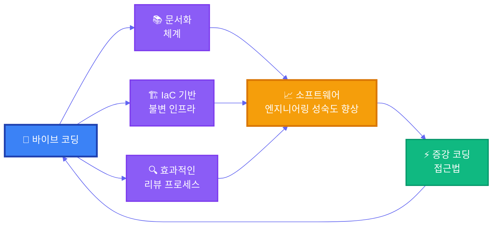



많은 개발자들이 바이브 코딩을 그저 "코드를 자동으로 생성하는 방법"으로 생각한다. 도구에 명령을 내리고 기다리면 멋진 코드가 뚝딱 만들어질 거라 기대한다. 하지만 현실은 그리 간단하지 않다. 자동화된 테스트가 없는 환경에서, 견고한 설계 없이, 동작하는 리뷰 프로세스조차 없다면, 바이브 코딩은 "쓰레기 코드"를 빠르게 찍어낼 뿐이다.

이것은 도구의 문제가 아니라, 엔지니어링 성숙도의 문제다. 소프트웨어 엔지니어링의 성숙도와 바이브 코딩은 서로를 보완한다. 엔지니어링 성숙도가 높은 환경에서만 바이브 코딩은 제대로 힘을 발휘할 수 있다.

역설적으로 바이브 코딩 도구는 엔지니어링 성숙도를 높이는 데 무척 유용하다. 바이브 코딩 기법을 활용하면 사양 문서를 정리하고, 기존 코드를 분석하여 테스트를 자동으로 생성하며, 그 테스트가 사양을 만족하는지를 빠르게 검증할 수 있다. 또한, 인프라를 IaC(Infrastructure as Code)로 빠르고 정확하게 구현하는 작업 역시 사람의 개입 없이 가능하다. 예를 들어 SuperClaude와 같은 도구를 사용하면 코드 분석, 문서화, 구현, 테스트, 보안 스캔과 같은 다양한 활동을 손쉽게 수행할 수 있다.

바이브 코딩과 엔지니어링 성숙도의 관계는 다음과 같이 표현할 수 있다.

바이브 코딩을 시작하려는 이들에게 권한다. 먼저 기존 프로젝트의 문서화부터 정비하고, 테스트 자동화를 구축하며, 완전 자동화된 CI/CD 파이프라인과 IaC 기반의 불변 인프라를 마련하라. 엔지니어링 성숙도를 높이는 것이 바이브 코딩을 제대로 활용하는 첫걸음이다. 소프트웨어 엔지니어링 성숙도가 받쳐준다면, 이후는 Kent Beck의 [증강 코딩 접근법](https://tidyfirst.substack.com/p/augmented-coding-beyond-the-vibes)으로 바이브 코딩이 제공하는 코드의 품질과 속도를 극대화 할 수 있을것이다.
